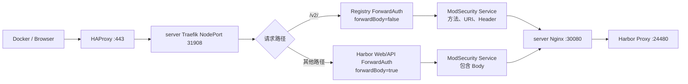

> **声明**：本文档记录的方案已不再是作者当前在生产环境中使用的方案。本文仅作历史演进参考。

本文记录一次看似简单、实际跨越 Harbor、Docker Registry、Traefik、ModSecurity、K3s Helm Controller 和 etcd 的部署与排障过程。

目标是把单机 Harbor 发布到 `harbor.hyperbola.cc`，创建 `k3s` 项目并推送 `nginx:latest`。最终不仅完成了镜像推送，还把 Harbor Web/API 与 Registry 数据面拆成两条 WAF 路由：管理接口继续检查请求 Body，Registry `/v2/` 只检查方法、URI 和请求头，不再让大镜像层经过 ForwardAuth Body 缓冲。

这次最重要的教训是：**Harbor 部署在一台机器上，并不代表镜像上传只消耗这一台机器的资源**。只要前置 WAF 是集群 Service，上传请求就可能被分发到所有 WAF 节点。

# 最终架构

环境如下：

| 节点           |          IP | 角色            | 主要职责                      |
| -------------- | ----------: | --------------- | ----------------------------- |
| `hyqaq-server` | `10.0.0.10` | K3s server/etcd | Harbor、HAProxy、Traefik、WAF |
| `hyqaq-txy`    | `10.0.0.30` | K3s server/etcd | Traefik、WAF                  |
| `hyqaq-aly`    | `10.0.0.40` | K3s server/etcd | Traefik、WAF                  |
| `hyqaq-wsl`    | `10.0.0.20` | K3s agent       | 普通工作负载，不运行 WAF      |

Harbor 使用 Docker Compose 运行在 `server`，宿主机 Nginx 监听 `30080` 并反向代理到 Harbor 内部端口 `24480`。公网入口由 HAProxy 和 K3s Traefik 承担。



Traefik Service 使用固定 NodePort：

```text
HTTP  30486
HTTPS 31908
externalTrafficPolicy: Local
```

# 安装 Harbor v2.15.2

下载在线安装包：

```bash
wget https://github.com/goharbor/harbor/releases/download/v2.15.2/harbor-online-installer-v2.15.2.tgz
tar -zxvf harbor-online-installer-v2.15.2.tgz
cd harbor
cp harbor.yml.tmpl harbor.yml
```

网络不稳定时，可以为 Docker 配置镜像代理并关闭 IPv6：

```json
{
	"ipv6": false,
	"fixed-cidr-v6": "",
	"registry-mirrors": [
		"https://docker.m.daocloud.io",
		"https://dockerproxy.com",
		"https://docker.mirrors.ustc.edu.cn"
	]
}
```

修改后重启 Docker，再执行：

```bash
sudo ./install.sh
```

## Harbor 外部地址必须写公网域名

最初配置错误地使用了：

```yaml
hostname: 0.0.0.0
```

生成后的 Harbor `EXT_ENDPOINT` 也变成了内部 HTTP 地址。Web 页面可能偶尔能打开，但 Registry 返回的 Token Realm、重定向和 Docker 登录地址都会错误。

正确配置是：

```yaml
hostname: harbor.hyperbola.cc
external_url: https://harbor.hyperbola.cc

http:
  port: 24480
```

`external_url` 是客户端看到的地址，内部仍可使用 HTTP 24480，由 Traefik 统一终止 TLS。

修改 `harbor.yml` 后不能只重启容器，必须重新生成配置：

```bash
sudo ./prepare
sudo docker compose up -d
docker compose ps
```

验证时应满足：

```bash
curl -skI https://harbor.hyperbola.cc/
curl -skI https://harbor.hyperbola.cc/v2/
```

预期 Web 返回 `200`，未认证的 `/v2/` 返回 `401`，并且 `WWW-Authenticate` 中的 Realm 使用 `https://harbor.hyperbola.cc`。

# 通过宿主机 Nginx 接入 K3s

Harbor Proxy 监听 `24480`，宿主机 Nginx 提供统一的 `30080` 后端：

```nginx
server {
    listen 30080;
    listen [::]:30080;
    server_name harbor.hyperbola.cc;

    client_max_body_size 200m;

    location / {
        proxy_pass http://127.0.0.1:24480;
        proxy_set_header Host $host;
        proxy_set_header X-Real-IP $remote_addr;
        proxy_set_header X-Forwarded-For $proxy_add_x_forwarded_for;
        proxy_set_header X-Forwarded-Proto $http_x_forwarded_proto;
    }
}
```

这里记录的是当前宿主机 Nginx 的实际值。若后续单个镜像层超过 200 MiB，还需要同步评估并调整这一层的限制；Registry 不向 ForwardAuth 复制 Body，并不等于所有反向代理都自动取消大小限制。

Kubernetes 中使用无 Selector Service 配合 EndpointSlice 指向宿主机：

```yaml
apiVersion: v1
kind: Service
metadata:
  name: host-nginx-server
  namespace: default
spec:
  ports:
    - name: http
      port: 30080
      targetPort: 30080
---
apiVersion: discovery.k8s.io/v1
kind: EndpointSlice
metadata:
  name: host-nginx-server
  namespace: default
  labels:
    kubernetes.io/service-name: host-nginx-server
addressType: IPv4
ports:
  - name: http
    port: 30080
endpoints:
  - addresses: ["10.0.0.10"]
```

# 第一版方案：Harbor 整站 ForwardAuth 放宽到 2 GiB

普通站点的 ForwardAuth Body 上限为 10 MiB。为了支持镜像上传，最初给 Harbor 创建了专用 Middleware：

```yaml
apiVersion: traefik.io/v1alpha1
kind: Middleware
metadata:
  name: waf-auth-harbor
  namespace: waf-system
spec:
  forwardAuth:
    address: http://modsecurity-svc.waf-system.svc.cluster.local:8080/
    trustForwardHeader: true
    preserveRequestMethod: true
    forwardBody: true
    maxBodySize: 2147483648
    maxResponseBodySize: 1048576
```

再用高优先级 Ingress 只匹配 Harbor：

```yaml
apiVersion: networking.k8s.io/v1
kind: Ingress
metadata:
  name: harbor-waf
  namespace: default
  annotations:
    traefik.ingress.kubernetes.io/router.entrypoints: websecure
    traefik.ingress.kubernetes.io/router.middlewares: waf-system-waf-auth-harbor@kubernetescrd
    traefik.ingress.kubernetes.io/router.priority: "2000"
    traefik.ingress.kubernetes.io/router.tls: "true"
spec:
  ingressClassName: traefik
  rules:
    - host: harbor.hyperbola.cc
      http:
        paths:
          - path: /
            pathType: Prefix
            backend:
              service:
                name: host-nginx-server
                port:
                  name: http
```

从功能上看，这允许最大 2 GiB 请求进入 ForwardAuth。但它有严重的架构问题：`forwardBody` 会让 Traefik 读取并缓冲 Body，再把 Body 发送给 WAF。Docker 又会并发上传多个 layer，实际资源压力可能远高于单个文件大小。

ModSecurity v3 的单请求检查上限还只有 1 GiB。即使配置 `ProcessPartial`，也只是检查前 1 GiB，并不能消除 Traefik 和 WAF 的缓冲成本。

# Docker Registry 被 CRS 误判

Docker Registry 协议会合法使用 `PATCH`、`PUT` 和 `application/octet-stream`。OWASP CRS 默认策略会命中：

- `911100`：Method is not allowed by policy；
- `920420`：Content-Type 不符合默认策略；
- `949110`：入站异常分数达到阈值后的最终阻断规则。

`949110` 不是根因，只是汇总执行 403 的规则。排障时必须从审计日志中继续向前找具体命中规则。

最终增加窄范围排除：

```apache
SecRule REQUEST_HEADERS:Host "@streq harbor.hyperbola.cc" \
  "id:1001003,phase:1,pass,nolog,chain"
  SecRule REQUEST_METHOD "@rx ^(?:PATCH|PUT)$" "chain"
    SecRule REQUEST_URI "@rx ^/v2/[^/]+(?:/[^/]+)*/(?:blobs/uploads/[0-9A-Fa-f-]+|manifests/[^/?]+)(?:\?.*)?$" \
      "ctl:ruleRemoveById=911100,ctl:ruleRemoveById=920420"
```

这条规则同时约束域名、方法和 Registry 精确路径，不会为其他站点全局开放 PUT/PATCH。

## Harbor 管理 API 的 PUT 误判

在 Web 页面授予系统管理员权限时，WAF 拦截了：

```text
PUT /api/v2.0/users/3/sysadmin
```

审计日志显示具体规则仍是 `911100`。因此再增加一条独立排除：

```apache
SecRule REQUEST_HEADERS:Host "@streq harbor.hyperbola.cc" \
  "id:1001004,phase:1,pass,nolog,chain"
  SecRule REQUEST_METHOD "@streq PUT" "chain"
    SecRule REQUEST_URI "@rx ^/api/v2\.0/users/[0-9]+/sysadmin$" \
      "ctl:ruleRemoveById=911100"
```

规则加载链路是：

```text
waf-stack.yaml
-> ConfigMap/waf-system/modsecurity-config
-> REQUEST-900-EXCLUSION-RULES-BEFORE-CRS.conf
-> ModSecurity 在 CRS 主规则之前执行
```

该文件通过 `subPath` 挂载，因此更新 ConfigMap 后必须滚动重启 WAF：

```bash
kubectl apply -f waf-stack.yaml
kubectl -n waf-system rollout restart deployment/modsecurity
kubectl -n waf-system rollout status deployment/modsecurity --timeout=300s
```

# 关键事故：推送镜像时两个云节点反复卡死

Harbor 只部署在 `server`，但 WAF Deployment 有 3 个副本，分别运行在三个 server/etcd 节点。实际链路为：

```text
Docker push
-> server HAProxy
-> server Traefik
-> modsecurity-svc
-> server/txy/aly 中任意 WAF Pod
-> server Harbor
```

因此 Docker 并发上传会把 ForwardAuth 请求分发到 `txy` 和 `aly`。两台云主机只有约 4 GiB 内存，WAF 单 Pod 的资源配置为：

```yaml
requests:
  cpu: 500m
  memory: 512Mi
limits:
  cpu: "2"
  memory: 2Gi
```

当多个 layer 同时经过 2 GiB ForwardAuth Body 路径时，两台云主机出现了系统级不可登录，甚至云控制台 TTY 也无法进入。由于机器已硬卡死，无法在事故现场读取完整 OOM 日志，不能把根因绝对归为 OOM；但“Docker 并发上传 + ForwardAuth 大 Body + 三节点 WAF”与事故高度相关。

更麻烦的是，`txy` 和 `aly` 同时还是 etcd 成员。两台失联后，`server` 日志持续出现：

```text
dial tcp 10.0.0.30:2380: no route to host
dial tcp 10.0.0.40:2380: i/o timeout
```

三成员 etcd 同时丢失两个成员后没有 quorum，Kubernetes API 间歇返回 `ServiceUnavailable`，Traefik CRD、Service Endpoint 和 rollout 都变得不稳定。此时继续重试 `docker push` 只会看到大量：

```text
Unavailable
timeout awaiting response headers
```

# 最终方案：Registry 不再转发 Body 给 WAF

正确思路不是继续扩大内存，而是区分控制面请求和数据面请求：

- Harbor Web/API 继续检查 Body；
- Registry `/v2/` 检查 Host、方法、URI 和请求头；
- blob/manifest Body 直接流向 Harbor，不进入 ForwardAuth。

新增 Registry 专用 Middleware：

```yaml
apiVersion: traefik.io/v1alpha1
kind: Middleware
metadata:
  name: waf-auth-harbor-registry
  namespace: waf-system
spec:
  forwardAuth:
    address: http://modsecurity-svc.waf-system.svc.cluster.local:8080/
    trustForwardHeader: true
    preserveRequestMethod: true
    forwardBody: false
    maxResponseBodySize: 1048576
    authResponseHeaders:
      - X-WAF-Checked
```

再新增优先级更高的 `/v2/` Ingress：

```yaml
apiVersion: networking.k8s.io/v1
kind: Ingress
metadata:
  name: harbor-registry-waf
  namespace: default
  annotations:
    traefik.ingress.kubernetes.io/router.entrypoints: websecure
    traefik.ingress.kubernetes.io/router.middlewares: waf-system-waf-auth-harbor-registry@kubernetescrd
    traefik.ingress.kubernetes.io/router.priority: "3000"
    traefik.ingress.kubernetes.io/router.tls: "true"
spec:
  ingressClassName: traefik
  rules:
    - host: harbor.hyperbola.cc
      http:
        paths:
          - path: /v2/
            pathType: Prefix
            backend:
              service:
                name: host-nginx-server
                port:
                  name: http
```

因为它的优先级为 3000，高于 Harbor 整站路由的 2000，所以 `/v2/` 会稳定命中无 Body Middleware；其他 Harbor 请求仍使用原来的 Body 检查。

> 这里不是完全绕过 WAF。Registry 请求仍经过 ForwardAuth 和 ModSecurity，只是不再复制上传数据。方法、路径、Header 及前面的 CRS 精确排除仍然有效。

# 控制面恢复后的入口检查

这次事故还暴露了一个入口基础设施问题：控制面恢复后，Harbor 直连 `24480` 和宿主机 Nginx `30080` 都是 200，但 Traefik 日志提示 Middleware 不存在，HTTPS 路由因此返回 404。根因是 Traefik CRD 没有恢复，而不是 Harbor 或 WAF 配置错误。

Traefik CRD 的持久化兼容配置、DaemonSet 拓扑和 PodDisruptionBudget 属于所有入口路由共享的基础设施，已移至同系列《K3s Traefik 接管 Nginx 公网入口迁移实战》。Harbor 变更后的最小恢复顺序是：确认 `middlewares.traefik.io` 存在，等待 Traefik Ready，重应用 WAF Middleware，然后重新执行本节的 Web 200、Registry 401 与 SQLi 403 验证。

# 推送 nginx 镜像

在 Harbor 创建 `k3s` 项目后登录：

```bash
docker login harbor.hyperbola.cc
```

登录成功后，Docker 会提示认证信息以未加密形式保存在 `~/.docker/config.json`。生产环境应配置 credential helper，本文不记录任何账号密码或认证内容。

拉取、打标签并推送：

```bash
docker pull nginx:latest
docker tag nginx:latest harbor.hyperbola.cc/k3s/nginx:latest
docker push harbor.hyperbola.cc/k3s/nginx:latest
```

切换到 Registry 无 Body 路由后，各 layer 逐步显示 `Pushed`，最终成功：

```text
latest: digest: sha256:c2e305ef468149bdc3297621cea453b47b095816fec4fc7be6ff837bce8deb7d size: 2290
```

Docker 同时提示只推送了当前平台镜像，没有保留完整多架构索引。这不影响当前架构拉取；若需要正式发布多架构镜像，应使用 Buildx：

```bash
docker buildx build \
  --platform linux/amd64,linux/arm64 \
  -t harbor.hyperbola.cc/k3s/example:latest \
  --push .
```

# 验证矩阵

部署不能只看 `kubectl apply` 是否成功，最终至少验证以下项目：

```bash
kubectl get nodes
kubectl -n kube-system get daemonset traefik
kubectl -n kube-system get pdb traefik -o wide
kubectl -n waf-system get deployment modsecurity
kubectl -n waf-system get middleware.traefik.io
```

外部 HTTP 验证：

```bash
# Harbor Web
curl -skS -o /dev/null -w '%{http_code}\n' \
  https://harbor.hyperbola.cc/

# Registry 未认证时应为 401
curl -skS -o /dev/null -w '%{http_code}\n' \
  https://harbor.hyperbola.cc/v2/

# SQL 注入仍应被 WAF 阻断为 403
curl -skS -o /dev/null -w '%{http_code}\n' \
  'https://harbor.hyperbola.cc/?id=1%27%20OR%20%271%27=%271'
```

最终结果：

| 检查项                     |                结果 |
| -------------------------- | ------------------: |
| Harbor Web                 |                 200 |
| Registry `/v2/` 未认证     |                 401 |
| Harbor sysadmin PUT 未认证 | 401，说明已穿过 WAF |
| 相邻未排除 PUT 路径        |                 403 |
| SQL 注入                   |                 403 |
| Traefik                    |                 3/3 |
| ModSecurity                |                 3/3 |
| Traefik PDB                |          允许中断 1 |
| nginx 镜像推送             |                成功 |

推送完成后的节点资源观察值约为：

```text
hyqaq-aly    memory 69%
hyqaq-txy    memory 41%
hyqaq-server memory 38%
```

节点没有再次因镜像层上传出现同时卡死。

# 完整踩坑复盘

## 1. `hostname` 不能写监听地址

`0.0.0.0` 是监听语义，不是 Harbor 对外身份。Harbor 的 Token Realm、重定向和 Registry 认证都依赖 `external_url`。外部发布必须使用真实 HTTPS 域名。

## 2. 默认密码和重置脚本不能替代配置核对

登录失败时不要不断猜测默认密码，更不能从日志、数据库或配置中输出凭据。应先确认 Harbor 实际使用的配置、数据库状态和外部地址，再通过受控流程重置。重置失败并不自动意味着必须删除 `/data`；销毁数据前必须明确确认 registry、database、redis 和 secret 的范围。

## 3. `949110` 不是误判根因

它只是异常分数汇总规则。真正需要排除的是前面的 `911100` 或 `920420`。排除必须限制到域名、方法和精确路径，不能全局关闭规则。

## 4. 把 Body 上限调大不等于支持大文件

`forwardBody: true` 会改变数据路径。2 GiB 上限意味着入口可能缓冲巨大请求，并将其复制到 WAF。Docker 多 layer 并发后，实际压力会乘以并发数和副本数。

## 5. Harbor 单机不代表只消耗单机资源

只要 ForwardAuth 指向 ClusterIP，WAF 请求就会分发到所有 Endpoint。定位资源问题时必须画出完整调用链，不能只看最终业务部署位置。

## 6. etcd 节点不适合无节制承载大 Body 检查

两台小内存云节点既运行 etcd/control-plane，又运行 Traefik 和 WAF。数据面压力导致节点卡死时，会同时破坏控制面 quorum，把局部上传故障升级为全局 API 故障。

## 7. `kubectl apply` 成功不代表动态路由已加载

Middleware CRD 缺失时，Ingress 对象仍可能存在，但 Traefik 会直接丢弃引用不存在 Middleware 的路由并返回 404。必须同时检查 CRD、Middleware 对象和 Traefik 日志。

## 8. K3s packaged manifest 会在重启时重新生成

直接修改自动生成的 `traefik.yaml` 只能临时生效。需要用独立持久清单或受支持的 K3s 配置机制表达最终状态，并验证重启后的资源仍存在。

## 9. PDB 不是高可用万能开关

PDB 能阻止第二个 Traefik Pod被主动驱逐，却无法阻止两台云主机同时硬宕机。真正的高可用仍依赖节点资源、网络、etcd quorum 和入口健康检查。

## 10. 推送失败要区分 HTTP 策略、认证和基础设施

- WAF 误判常表现为稳定的 403；
- 未登录或 Token 问题常表现为 401；
- 后端不可达可能是 502/504；
- etcd、Service Endpoint 或节点抖动常表现为 `Unavailable` 和请求头超时。

只有把状态码、WAF Request ID、Traefik 日志、EndpointSlice 和节点状态放在一起，才能避免反复修改错误的层。

# 总结

最终可用方案不是“把 WAF 限制从 10 MiB 粗暴调到 2 GiB”，而是按协议职责拆分：

1. Harbor Web/API 保持 Body 检查；
2. Registry `/v2/` 不向 ForwardAuth 复制 Body；
3. Registry 方法与 Content-Type 误判使用精确 CRS 排除；
4. Traefik CRD 使用可重启恢复的持久化清单；
5. Traefik 3 节点 DaemonSet 配合 `minAvailable: 2` PDB；
6. 每次变更后同时执行正常请求和攻击请求验证；
7. 镜像推送完成后继续观察节点资源与 etcd quorum。

对于 Harbor、Git LFS、制品库和对象存储这类大文件服务，ForwardAuth 最适合做轻量授权和元数据检查，不适合承载完整数据流。真正需要扫描镜像内容时，应使用 Harbor 自身的镜像扫描、签名和制品安全能力，而不是让 HTTP WAF 读取每个 blob 的全部字节。
