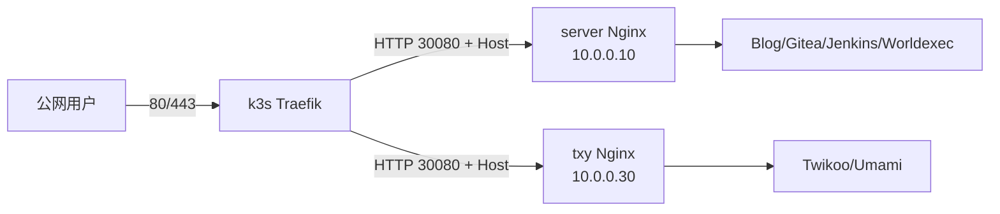

> **声明**：本文档记录的方案已不再是作者当前在生产环境中使用的方案。本文仅作历史演进参考。

本文是系列第一篇：让 k3s 默认 Traefik 接管公网 80/443，把宿主机 Nginx 临时迁移为 HTTP 30080 后端，同时保留原有静态网站和反向代理。

这是一套过渡架构，不是最终形态。后续会把大部分通用静态文件迁入 k3s，由 Deployment 配合镜像、ConfigMap 或持久卷托管；少数只属于某台节点的静态页面仍留在该节点，并继续通过本文的 Service + EndpointSlice 方式接入 Traefik。

# 环境和目标

- `server`：10.0.0.10，承载 Blog、Gitea、Jenkins、Worldexec；
- `wsl`：10.0.0.20，k3s agent；
- `txy`：10.0.0.30，承载 Twikoo、Umami；
- `aly`：10.0.0.40，k3s control-plane/etcd；
- Traefik：统一监听 80/443、终止 TLS、执行 Host 路由；
- Nginx：统一监听 30080，只提供纯 HTTP 服务。



# 分步实施

## 修正 Ansible 基础环境

实际 inventory 位于 `~/.config/ansible/inventory.yml`。远端解释器应使用通用路径：

```ini
[defaults]
interpreter_python = /usr/bin/python3
inventory = /home/hyperbola/.config/ansible/inventory.yml
```

部分主机的 sudo PATH 没有 `/usr/sbin`，所以：

- play 显式设置标准 root PATH；
- Nginx 校验使用 `/usr/sbin/nginx -t`；
- 部署前用 `setup` 模块确认远端 Python。

## 安装 Nginx，但禁止 postinst 抢占 80

```yaml
- name: Install Nginx
  ansible.builtin.apt:
    name: nginx
    state: present
    update_cache: true
    cache_valid_time: 3600
    policy_rc_d: 101
  notify: Restart nginx
```

`policy_rc_d: 101` 会阻止新安装的 Nginx 使用默认配置立即启动。完整顺序是：

1. 安装软件包；
2. 渲染 30080 虚拟主机；
3. 删除默认 80 站点；
4. 执行 `/usr/sbin/nginx -t`；
5. 校验通过后 restart。

## 把旧 TLS 站点降为纯 HTTP 后端

```nginx
server {
    listen 30080;
    listen [::]:30080;
    server_name gitea.hyperbola.cc;

    location / {
        proxy_pass http://[::1]:30000;
        proxy_set_header Host $host;
        proxy_set_header X-Real-IP $remote_addr;
        proxy_set_header X-Forwarded-For $proxy_add_x_forwarded_for;
        proxy_set_header X-Forwarded-Proto $http_x_forwarded_proto;
    }
}
```

需要删除：

- `listen 80` 和 `listen 443 ssl`；
- 证书、TLS cipher/session/protocol；
- Nginx 内部 80→443 重定向；
- `/etc/nginx/sites-enabled/default`。

Traefik 会保留 Host，Nginx 的 name-based virtual host 仍然有效。

## 审计遗漏的 Nginx 配置

最终检查发现 `txy` 还有 Twikoo/Umami 占用 80/443。定位命令：

```bash
/usr/sbin/nginx -T 2>&1 | awk '
  /^# configuration file / { file=$4; sub(/:$/, "", file) }
  /^[[:space:]]*listen[[:space:]]/ { print file ": " $0 }
'
```

额外站点需要按主机过滤：

- Twikoo：仅部署到 `txy`，回源 `10.0.0.10:28080`；
- Umami：仅部署到 `txy`，回源 `10.0.0.10:23000`。

## 恢复 k3s 默认 Traefik

k3s 原配置包含：

```yaml
disable:
  - traefik
```

只删除 `- traefik`，不能重写整个 `config.yaml`，否则可能破坏 token、节点地址、Flannel、TLS SAN 和 etcd 设置。生产环境还应在 `server`、`aly`、`txy` 三台 Server 的 `/etc/rancher/k3s/config.yaml` 中持久化 `disable: traefik`，避免 K3s 重启后重新生成内置清单覆盖兼容配置。之后：

1. 重启 k3s；
2. 等待 `/readyz`；
3. apply k3s 生成的 packaged `traefik.yaml`；
4. 等待 `daemonset/traefik` rollout。

## 持久化 Traefik CRD 兼容配置

Traefik Pod 处于 Running 不代表动态路由已经可用；`Middleware`、`IngressRoute` 等 CRD 缺失时，引用它们的路由会被 Traefik 丢弃。一次控制面恢复中，K3s 自动生成的 `traefik.yaml` 包含当前 Helm Controller 不兼容的字段：

```yaml
forceConflicts: true
failurePolicy: retry
```

结果是 `traefik-crd` HelmChart 没有成功创建，所有引用 Middleware 的 HTTPS 路由返回 404。不要直接修改 K3s 自动生成的清单，因为重启后会被重新生成；应创建独立、持久化的兼容清单，例如 `/var/lib/rancher/k3s/server/manifests/traefik-compatible.yaml`，保留相同 Chart 版本，移除不兼容字段并使用：

```yaml
spec:
  failurePolicy: reinstall
```

恢复顺序是：先等待 `middlewares.traefik.io` CRD 出现，再等待 Traefik DaemonSet 3/3 Ready，随后重应用 WAF Middleware；若 informer 没有恢复，再滚动重启 Traefik。最后同时验证正常 Web 为 200、Registry 未认证为 401、SQLi 为 403。兼容清单应由 Ansible 分发到三台 Server，不能只在单节点手工修改。

## 持久化 K3s kubeconfig 权限

K3s 默认可能将 `/etc/rancher/k3s/k3s.yaml` 写成仅 root 可读。需要在 `server`、`aly`、`txy` 三台 Server 的 `/etc/rancher/k3s/config.yaml` 中加入：

```yaml
write-kubeconfig-mode: "0644"
```

并修正已经存在的文件；只输出权限和属主，不要打印 kubeconfig 内容：

```bash
chmod 0644 /etc/rancher/k3s/k3s.yaml
stat -c '%a %U:%G %n' /etc/rancher/k3s/k3s.yaml
```

以上配置和权限应使用 Ansible 同步到三台 Server。`hyqaq-wsl` 是 Agent，通常没有该文件，不应把它视为失败。

## 在三个入口节点各运行一个 Traefik Pod

入口节点是 `hyqaq-server`、`hyqaq-aly`、`hyqaq-txy`，每个节点都必须运行一个 Traefik Pod；`hyqaq-wsl` 只作为普通 k3s agent 和 IPv6 边缘转发节点。将 Traefik 工作负载改为 DaemonSet，并通过强制 node affinity 设置入口节点白名单：

```yaml
apiVersion: helm.cattle.io/v1
kind: HelmChartConfig
metadata:
  name: traefik
  namespace: kube-system
spec:
  valuesContent: |-
    deployment:
      kind: DaemonSet
    affinity:
      nodeAffinity:
        requiredDuringSchedulingIgnoredDuringExecution:
          nodeSelectorTerms:
            - matchExpressions:
                - key: kubernetes.io/hostname
                  operator: In
                  values:
                    - hyqaq-server
                    - hyqaq-aly
                    - hyqaq-txy
```

DaemonSet 保证每个符合条件的入口节点各有一个 Pod。这里使用 `requiredDuringSchedulingIgnoredDuringExecution` 和 `In` 白名单，而不是仅排除 WSL：这样以后新增普通节点时不会意外运行 Traefik。`preferred` 只是偏好，不能保证入口拓扑。

配置更新后需等待 Helm controller 删除旧 Deployment、生成 DaemonSet 并完成 rollout。自动化最终比较 Running Pod 的节点集合，必须恰好等于 `hyqaq-server`、`hyqaq-aly`、`hyqaq-txy`，不能只检查“不包含 WSL”。

## 为 Traefik 设置 PodDisruptionBudget

DaemonSet 的滚动更新策略不能约束 `kubectl drain` 等主动驱逐，因此需要额外的 PDB 保留至少两个入口 Pod：

```yaml
apiVersion: policy/v1
kind: PodDisruptionBudget
metadata:
  name: traefik
  namespace: kube-system
spec:
  minAvailable: 2
  selector:
    matchLabels:
      app.kubernetes.io/instance: traefik-kube-system
      app.kubernetes.io/name: traefik
```

三节点健康时，预期 `currentHealthy=3`、`desiredHealthy=2`、`disruptionsAllowed=1`。PDB 只保护 Kubernetes Eviction API，不防止节点宕机、OOM、网络中断或进程崩溃；入口高可用仍依赖节点资源、etcd quorum 和健康检查。

## 为入口 WAF 启用同节点优先路由

当 Traefik 通过 ForwardAuth 调用集群内 WAF Service 时，默认 ClusterIP 可能把请求转发到其他节点，每个业务请求都会多一次跨节点往返。入口与 WAF 都已经部署在三个 Server 节点时，可为 WAF Service 启用 Kubernetes 的同节点优先选择：

```yaml
apiVersion: v1
kind: Service
metadata:
  name: modsecurity-svc
  namespace: waf-system
spec:
  type: ClusterIP
  trafficDistribution: PreferSameNode
  selector:
    app.kubernetes.io/name: modsecurity
  ports:
    - name: http
      port: 8080
      targetPort: http
```

`PreferSameNode` 是路由偏好：本节点存在 Ready WAF Endpoint 时优先使用它，不存在时仍可回退到其他节点。因此它适合降低延迟，同时不会因单台 WAF Pod 不可用而断流。验证当前配置：

```bash
kubectl -n waf-system get service modsecurity-svc \
  -o jsonpath='trafficDistribution={.spec.trafficDistribution}{"\n"}'
```

不要直接改为 `internalTrafficPolicy: Local`。后者会在入口节点没有本地 WAF Endpoint 时直接没有可用后端，只有在每个实际入口节点都被严格保证存在 Ready WAF Pod 的情况下才适用。WAF 的具体 ForwardAuth、URI 还原、审计与误报调优见同系列的《K3s Traefik 接入 ModSecurity OWASP CRS 全局 WAF 实战》。

## 在 EntryPoint 层全局跳转 HTTPS

```yaml
apiVersion: helm.cattle.io/v1
kind: HelmChartConfig
metadata:
  name: traefik
  namespace: kube-system
spec:
  valuesContent: |-
    additionalArguments:
      - --entryPoints.web.http.redirections.entryPoint.to=:443
      - --entryPoints.web.http.redirections.entryPoint.scheme=https
      - --entryPoints.web.http.redirections.entryPoint.permanent=true
```

必须使用 `to=:443`。本次故障中，线上参数是 `to=websecure`，而 `websecure` EntryPoint 在 Traefik 容器内监听 `:8443`，因此 Traefik 实际返回了 `Location: https://hyperbola.cc:8443/`。改成显式外部端口 `:443` 后，跳转恢复为 `https://hyperbola.cc/`。自动化还应等待 Deployment 参数出现 `--entryPoints.web.http.redirections.entryPoint.to=:443`，不能只确认 HelmChartConfig 已写入。

## 安装 cert-manager

公网入口统一由 Traefik 终止 TLS，证书管理也属于入口基础设施。使用 k3s `HelmChart` 安装 cert-manager，并等待 controller、cainjector、webhook 全部 Ready：

```yaml
apiVersion: helm.cattle.io/v1
kind: HelmChart
metadata:
  name: cert-manager
  namespace: kube-system
spec:
  chart: cert-manager
  repo: https://charts.jetstack.io
  version: v1.21.1
  targetNamespace: cert-manager
  createNamespace: true
  valuesContent: |-
    crds:
      enabled: true
    prometheus:
      enabled: false
```

## 配置 Cloudflare DNS-01

角色从 `/home/hyperbola/.acme.sh/account.conf` 读取已有 Cloudflare API Token，以 `no_log: true` 写入 `cert-manager` namespace 的 Secret，再由 `ClusterIssuer` 引用。Token 不进入 Git，也不能出现在 Ansible 输出中。

这里踩过的坑是错误是root下~/导致文件读取 `/root/.acme.sh/account.conf`。自动化应先用 `stat` 确认真实路径，并对读取、解析和写 Secret 的全部任务启用 `no_log`。

## 签发 ECDSA 通配符证书并全局使用

证书覆盖根域名和一级子域名，私钥算法使用 ECDSA：

```yaml
apiVersion: cert-manager.io/v1
kind: Certificate
metadata:
  name: hyperbola-cc-wildcard
  namespace: kube-system
spec:
  secretName: hyperbola-cc-wildcard-tls
  privateKey:
    algorithm: ECDSA
    size: 256
  issuerRef:
    name: letsencrypt-prod-cloudflare
    kind: ClusterIssuer
  dnsNames:
    - hyperbola.cc
    - "*.hyperbola.cc"
```

Kubernetes Secret 不能跨 namespace 直接引用，所以这里的“全局共享”发生在 Traefik TLS 终止层，而不是 Secret 层。在 `kube-system` 创建 Traefik 默认 TLSStore：

```yaml
apiVersion: traefik.io/v1alpha1
kind: TLSStore
metadata:
  name: default
  namespace: kube-system
spec:
  defaultCertificate:
    secretName: hyperbola-cc-wildcard-tls
```

工作链路为：cert-manager 签发 `Certificate` → 写入同 namespace 的 `hyperbola-cc-wildcard-tls` Secret → `TLSStore/default` 引用 Secret → Traefik 的 `websecure` EntryPoint 向各 namespace 的 HTTPS 路由提供默认证书。业务 Ingress 不声明 `tls.secretName`，因此 `default` 中的旧 Nginx 路由和 `zabbix` 中的 Web 路由都使用同一张证书，也不会产生多份 Secret 的续期状态漂移。

`*.hyperbola.cc` 只覆盖一级子域名，例如 `zabbix.hyperbola.cc`；它不覆盖 `a.b.hyperbola.cc`。

## 在 IPv4-only 集群外增加 IPv6 边缘

本集群内部使用 IPv4：Traefik Service 只有 IPv4 ClusterIP，Pod CIDR、Service CIDR 和 EndpointSlice 都不改为双栈。公网 IPv6 仅在具有全局 IPv6 地址的 `server`、`wsl` 两个边缘节点终止，再转发到本机 `127.0.0.1:80/443` 的 k3s ServiceLB：

```text
IPv6 client
  -> HAProxy [::]:80/443 on server or wsl
  -> PROXY Protocol v2 over IPv4 loopback
  -> k3s ServiceLB 127.0.0.1:80/443
  -> Traefik
```

这里使用独立 HAProxy 实例，而不是修改集群原有的 VIP HAProxy：

- 独立配置：`/etc/haproxy/k3s-ipv6-edge.cfg`；
- 独立服务：`haproxy-k3s-ipv6-edge.service`；
- 只监听 IPv6，`v6only` 避免抢占 IPv4 ServiceLB；
- 只部署到 `server:wsl`，不在 `txy`、`aly` 开启；
- 原有 VIP HAProxy 的配置、服务和监听端口均不修改。

```haproxy
frontend ipv6_443
    bind [::]:443 v6only
    default_backend ipv4_443

backend ipv4_443
    server local_traefik 127.0.0.1:443 send-proxy-v2 check
```

普通 TCP 代理会让 Traefik 只看到 `127.0.0.1`。HAProxy 使用 `send-proxy-v2` 携带真实客户端 IPv6，Traefik 则只信任来自 IPv4 loopback 的 PROXY 头：

```yaml
additionalArguments:
  - --entryPoints.web.proxyProtocol.trustedIPs=127.0.0.1/32
  - --entryPoints.websecure.proxyProtocol.trustedIPs=127.0.0.1/32
```

`trustedIPs` 不能写成任意网段，否则外部客户端可能伪造 PROXY 头。HAProxy 到 Traefik 的连接固定来自 `127.0.0.1`，因此只放行 `/32` 即可。

实施时曾改用 `systemd-socket-proxyd`，它无需额外软件，也能让 `[::]:80/443` 转发到 IPv4 ServiceLB，但无法传递真实客户端 IP，所以最终换回 HAProxy + PROXY v2。切换过程中还遇到一个隐蔽问题：只停止 `.socket` 并删除 unit 文件后，已经激活的 `systemd-socket-proxyd` `.service` 仍可能以 `not-found active` 状态运行并占用端口。正确清理顺序是先停止实例化的 `.service`，再停止 `.socket`，最后删除 unit 并执行 `daemon-reload`。

## 配置 Docker Hub mirror

Traefik Helm Job、CoreDNS 和 metrics-server 曾因无法拉取 pause 镜像卡在 `ContainerCreating`。四个节点统一配置：

```yaml
---
mirrors:
  docker.io:
    endpoint:
      - "https://docker.m.daocloud.io"
```

文件路径是 `/etc/rancher/k3s/registries.yaml`，使用 `serial: 1` 逐台重启 `k3s`/`k3s-agent`。

## 把集群外 Nginx 注册为 Kubernetes 后端

Nginx 没有 Pod label，所以使用无 selector Service + EndpointSlice。此类过渡资源属于入口迁移层，应放在 `default`，不能塞进 `zabbix` 业务 namespace：

```yaml
apiVersion: v1
kind: Service
metadata:
  name: host-nginx-server
  namespace: default
spec:
  ports:
    - name: http
      port: 30080
      targetPort: 30080
---
apiVersion: discovery.k8s.io/v1
kind: EndpointSlice
metadata:
  name: host-nginx-server
  namespace: default
  labels:
    kubernetes.io/service-name: host-nginx-server
addressType: IPv4
ports:
  - name: http
    protocol: TCP
    port: 30080
endpoints:
  - addresses:
      - 10.0.0.10
```

`addressType/ports/endpoints` 位于 EndpointSlice 顶层，不在 `spec` 下。不同主机必须使用独立 EndpointSlice：Twikoo/Umami 指向 10.0.0.30，不能复用 server 的后端。`host-nginx-aly` 当前仅预留无 selector Service，不设置地址和域名，因此不会接收流量；以后补齐 `address` 与 `hosts` 即可启用。以后迁入 k3s 的站点应删除对应外部 EndpointSlice；节点特有页面则保留独立后端，避免把节点本地文件错误地复制成共享内容。

# 踩坑清单

1. 误以为安装过 ingress-nginx，实际上应直接恢复 k3s Traefik。
2. apt 安装 Nginx 时自动启动，可能抢占 Traefik 的 80。
3. sudo PATH 缺少 `/usr/sbin`，导致已存在的 Nginx 被误判为不存在。
4. 只迁移预想站点会遗漏其他 `sites-enabled` 文件。
5. `to=websecure` 会按容器内 `websecure=:8443` 生成错误跳转；外部 HTTPS 端口应显式写成 `to=:443`。
6. Docker Hub 不通会影响全部系统 Pod，不只是 Traefik。
7. 只 apply HelmChartConfig 不保证主 HelmChart 存在。
8. EndpointSlice 字段误放到 `spec` 会导致 strict decoding error。
9. 多台宿主机后端不能共用同一个 EndpointSlice 地址。
10. Kubernetes Secret 不能跨 namespace 共享，必须由 Traefik 默认 TLSStore 间接提供全局证书。
11. acme.sh 账户文件路径不能想当然；Cloudflare Token 相关任务必须完整使用 `no_log`。
12. Ingress 本身不监听端口；k3s ServiceLB 使用转发表时，`ss` 看不到 IPv4 80/443 socket 也不代表入口失效。
13. `systemd-socket-proxyd` 能完成 IPv6 到 IPv4 转发，但不能保留真实客户端 IPv6。
14. 独立 HAProxy 必须使用 `v6only`、独立配置和独立 systemd 服务，避免干扰 VIP HAProxy。
15. HAProxy 的 `send-proxy-v2` 与 Traefik `proxyProtocol.trustedIPs` 必须同时配置，否则请求无法正确解析或客户端 IP 不可信。
16. 删除 systemd socket unit 前必须先停掉已激活的 proxy service，否则残留进程继续占用 `[::]:80/443`。
17. HelmChartConfig 已更新不代表工作负载切换完成；必须等待 DaemonSet rollout，并检查实际 `spec.nodeName`。
18. 多入口应使用 DaemonSet 配合 required `In` 白名单；只排除 WSL 会让未来新增的普通节点也可能运行 Traefik。

# 验收

```bash
ss -lntp | grep -E ':(80|443|30080) '
k3s kubectl -n kube-system rollout status daemonset/traefik
k3s kubectl -n kube-system get pods \
  -l app.kubernetes.io/name=traefik -o wide
k3s kubectl -n kube-system get daemonset traefik \
  -o jsonpath='{.spec.template.spec.affinity.nodeAffinity}'
k3s kubectl -n kube-system wait --for=condition=Ready \
  certificate/hyperbola-cc-wildcard --timeout=600s
k3s kubectl -n kube-system get tlsstore/default
k3s kubectl -n default get ingress,endpointslices
curl -I -H 'Host: zabbix.hyperbola.cc' http://10.0.0.10/
systemctl is-active haproxy-k3s-ipv6-edge
ss -lntp | grep -E '\[::\]:(80|443)'
curl -6 -I http://hyperbola.cc
curl -6 -I https://hyperbola.cc
```

验收标准：

- Nginx 仅监听 30080；
- Traefik Ready；
- Traefik DaemonSet 在 `hyqaq-server`、`hyqaq-aly`、`hyqaq-txy` 各有一个 Ready Pod，`hyqaq-wsl` 没有 Traefik Pod；
- HTTP Location 不含 `:8443`；
- 每组域名指向正确的宿主机 EndpointSlice。
- 只有 `server`、`wsl` 监听 `[::]:80/443`；
- IPv6 HTTP 正确跳转 HTTPS，IPv6 HTTPS 返回有效通配符证书；
- Traefik Service 仍只有 IPv4 ClusterIP。

建议直接验证重定向头：

```bash
curl -v http://hyperbola.cc -H 'Host: hyperbola.cc' 2>&1 \
  | grep -E '< HTTP|< Location'
# Location: https://hyperbola.cc/
```

# 完整顶层 Playbook

```yaml
---
- name: Move host Nginx away from Traefik ports
  hosts: server:txy:aly
  become: true
  gather_facts: false

  roles:
    - role: host_nginx_high_port

- name: Configure the container registry mirror on k3s nodes
  hosts: servers
  become: true
  gather_facts: false
  serial: 1

  roles:
    - role: k3s_registry_mirror

- name: Restore Traefik and deploy Zabbix Server in k3s
  hosts: server
  become: true
  gather_facts: false
  serial: 1

  roles:
    - role: k3s_traefik
    - role: zabbix_server_k3s

- name: Publish the IPv4 k3s ingress on IPv6 edge addresses
  hosts: server:wsl
  become: true
  gather_facts: false

  roles:
    - role: k3s_ipv6_edge

- name: Install and configure Zabbix Agent 2 on servers
  hosts: servers
  become: true
  gather_facts: true
  environment:
    PATH: /usr/local/sbin:/usr/local/bin:/usr/sbin:/usr/bin:/sbin:/bin

  roles:
    - role: zabbix_agent2
```

```bash
ANSIBLE_CONFIG="$HOME/.config/ansible/ansible.cfg" \
  ansible-playbook --syntax-check playbook.yml

ANSIBLE_CONFIG="$HOME/.config/ansible/ansible.cfg" \
  ansible-playbook playbook.yml
```
