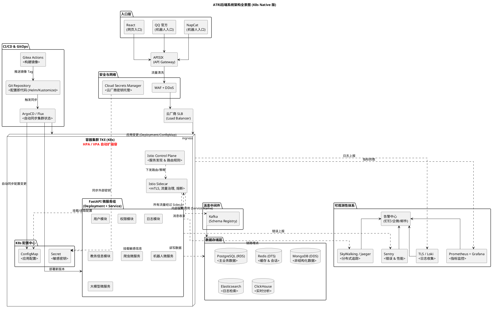

# 前言

在启动“ATRI”聊天机器人大型项目之前，构建一个高效的**可视化架构设计环境**至关重要。传统的绘图工具（如 Visio, Draw.io）在版本控制和代码协作上存在短板。

本系列第一篇将记录如何在 **Arch Linux** 上从零搭建基于 **PlantUML** 的现代化 UML 开发环境。我们将配置 Java 运行时、Graphviz 渲染引擎，并集成 VS Code 实现“所写即所得”的实时预览。同时，本文将正式发布我毕设系统的**初版云原生架构全景图**，该架构采用 K8s Native 设计，摒弃了传统注册中心，全面拥抱 Service Mesh。

# 环境准备

PlantUML 基于 Java 运行，并依赖 Graphviz 进行图形渲染。在 Arch Linux 上，我们可以通过包管理器快速安装。

## 1. 安装核心依赖

打开终端，执行以下命令：

```bash
# 更新源并安装 OpenJDK, Graphviz 和 PlantUML
sudo pacman -S jdk-openjdk graphviz plantuml
```

## 2. 验证安装

检查版本以确保安装成功：

```bash
java -version
plantuml -version
dot -V
```

> **提示**：如果 `plantuml` 命令无法直接调用，可能需要手动下载 `plantuml.jar` 并配置别名，但 Arch 官方源通常已配置好可执行文件。

# 编辑器集成 (推荐方案)

虽然命令行可以生成图片，但在开发过程中，我们需要**实时预览**和**错误高亮**。手动编写脚本监听文件变化已过时，推荐使用 **VS Code** 插件生态。

## 1. 安装 VS Code 及插件

如果你尚未安装 VS Code：
```bash
sudo pacman -S code
# 或者使用 AUR 安装 insiders 版本
# yay -S visual-studio-code-bin
```

在 VS Code 扩展商店中搜索并安装：
*   **PlantUML** (作者: jebbs) - *核心插件，提供预览、导出和语法支持*
*   **PlantUML Server** (可选) - *如果需要更复杂的渲染*

## 2. 配置实时预览

打开 VS Code 设置 (`Ctrl+,`)，搜索 `PlantUML`，确保以下配置项已启用（或直接写入 `settings.json`）：

```json
{
  "plantuml.render": "PlantUMLServer", 
  "plantuml.previewAutoRefresh": true,
  "plantuml.exportFormat": "svg",
  "plantuml.server": "https://www.plantuml.com/plantuml"
}
```

> **体验提升**：配置完成后，打开 `.puml` 文件，按下 `Alt+D` (或 `Cmd+Option+D` on Mac)，右侧将自动分屏显示架构图。修改代码后，图片将**毫秒级自动刷新**，无需任何手动脚本。

# ATRI 系统架构全景图 (初稿)

基于云原生理念，我们设计了 ATRI 的后端架构。该架构移除了冗余的 Nacos 组件，全面利用 Kubernetes 原生能力（Service, ConfigMap, Istio）进行服务治理。

将以下代码保存为 `architecture.puml`，即可在编辑器中查看效果。



### 架构设计要点说明

1.  **原生配置服务**：
    *   利用 **K8s Service + CoreDNS** 替代服务发现。
    *   利用 **ConfigMap/Secret + GitOps** 替代配置中心，实现配置版本化和审计。
2.  **服务网格 (Service Mesh)**：
    *   引入 **Istio Sidecar**，将流量治理（熔断、限流、mTLS）从业务代码中剥离，由基础设施层统一处理。
3.  **可观测性闭环**：
    *   集成了 **Sentry** 用于代码级错误追踪，弥补了传统日志系统（ELK/Loki）在堆栈分析上的不足。
    *   **SkyWalking** 负责全链路追踪，定位跨服务延迟。

# 结语

通过本文，我们不仅在 Arch Linux 上构建了高效的 UML 开发工作流，还确立项目“云原生、可观测、自动化”的技术基调。摒弃手动脚本，拥抱现代工具链，将让我们更专注于业务逻辑的实现。
