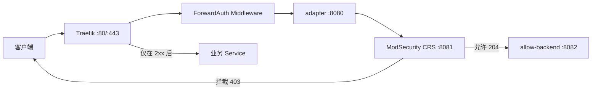

本文在已由 Traefik 统一承接公网 80/443、终止 TLS 的 K3s 集群中，新增一层独立的 ModSecurity OWASP CRS WAF。目标不是「给 Ingress 加一个 Middleware」就结束，而是确保 WAF 实际接收到原始 URI、请求方法和受限大小的 Body，并能通过正常请求、攻击请求与绕过 WAF 的后端对照完成验证。

## 目录

- [架构与前置条件](#架构与前置条件)
- [为什么官方镜像不能直接作为 ForwardAuth](#为什么官方镜像不能直接作为-forwardauth)
- [部署 WAF](#部署-waf)
- [隔离测试与生产接入](#隔离测试与生产接入)
- [同节点优先路由与流量边界](#同节点优先路由与流量边界)
- [审计、调优与回滚](#审计调优与回滚)
- [常见故障与安全边界](#常见故障与安全边界)
- [小结](#小结)

## 架构与前置条件

线上集群有三台 control-plane 节点和一台普通 Agent。Traefik 以 DaemonSet 运行在三个入口节点；WAF 同样部署三个副本，并限制在 control-plane 节点。请求链路如下：



关键组件和原则如下：

| 项目 | 选择 |
| --- | --- |
| WAF 引擎 | ModSecurity v3 + OWASP CRS，paranoia level 1 |
| 接入方式 | Traefik CRD `Middleware` 的 `forwardAuth` |
| 审计日志 | JSON 输出到容器 stdout，按请求 ID 关联 |
| 业务接入 | 标准 Kubernetes Ingress 注解，不要求迁移为 IngressRoute |
| 副本策略 | 三副本，required node affinity + preferred pod anti-affinity |
| 默认 Body 上限 | 10 MiB；上传型业务单独设计，不能无限制放大 |

部署前读取实际版本、CRD schema 与已有入口配置。本文依赖 `preserveRequestMethod`、`forwardBody`、`maxBodySize` 与 `maxResponseBodySize`；不能把针对 Traefik v3 的参数照搬到旧版 v2 控制器。

```bash
kubectl version
kubectl -n kube-system get pods -l app.kubernetes.io/name=traefik -o wide
kubectl get crd middlewares.traefik.io
kubectl -n kube-system get tlsstore/default
```

## 为什么官方镜像不能直接作为 ForwardAuth

ForwardAuth 只请求配置中的固定 `address`，例如 `http://modsecurity-svc:8080/`。原始路径位于 `X-Forwarded-Uri`。而官方 `modsecurity-crs` 镜像本质是由 Nginx/Apache 驱动的反向代理，若直接接到 ForwardAuth，它实际检查的 URL 是 `/`，URL 参数没有进入 CRS 常用的 `ARGS` 集合，SQL 注入检测会留下空洞。

因此每个 WAF Pod 使用三个容器：

1. `forwardauth-adapter` 从可信的 `X-Forwarded-*` 头恢复 URI、Method 和 Body；
2. `modsecurity` 根据恢复后的真实请求执行 CRS；
3. `allow-backend` 仅在检查通过时返回 `204`，Traefik 才会把原请求发送给业务 Service。

适配器的核心配置如下。它也生成内部请求 ID，并覆盖客户端传来的同名头，避免错误页或日志关联被伪造：

```nginx
server {
  listen 8080;
  server_name _;
  client_max_body_size 2g;

  location = /healthz { return 200 "ok\n"; }

  location / {
    set $original_uri $http_x_forwarded_uri;
    if ($original_uri = "") { set $original_uri $request_uri; }
    set $original_method $http_x_forwarded_method;
    if ($original_method = "") { set $original_method $request_method; }

    proxy_method $original_method;
    proxy_pass http://127.0.0.1:8081$original_uri;
    proxy_pass_request_body on;
    proxy_set_header Content-Length $content_length;
    proxy_set_header Host $http_x_forwarded_host;
    proxy_set_header X-Forwarded-For $http_x_forwarded_for;
    proxy_set_header X-Forwarded-Proto $http_x_forwarded_proto;
    proxy_set_header X-WAF-Request-ID $request_id;
    proxy_set_header X-WAF-Checked true;
  }
}
```

`trustForwardHeader: true` 只应在 Traefik 已正确清理不可信客户端 Forwarded 头的前提下启用。手工测试 adapter 时也必须完整模拟 `X-Forwarded-Host`、`X-Forwarded-Uri` 与 Method；少一个 Host 头得到的 `400` 并不表示 CRS 配置错误。

## 部署 WAF

CRS 规则已包含在官方镜像中，不要把整套规则复制进 ConfigMap：Kubernetes 单个 ConfigMap 的数据上限是 1 MiB。ConfigMap 只存放站点例外规则、adapter 配置和可选错误页；官方 entrypoint 仍负责加载 CRS、Unicode 映射和版本相关配置。

以下代码用于说明资源关系；可直接部署的完整清单（含 adapter、探针、站点排除、Harbor 专用路由和测试入口）见文末附录。镜像标签在生产环境应锁定为已验证版本或 digest：

```yaml
apiVersion: v1
kind: Namespace
metadata:
  name: waf-system
---
apiVersion: v1
kind: ConfigMap
metadata:
  name: modsecurity-config
  namespace: waf-system
data:
  adapter.conf: |
    # 使用上一节的 adapter 配置。
  allow-backend.conf: |
    server {
      listen 8082;
      server_name _;
      location / { return 204; }
    }
  REQUEST-900-EXCLUSION-RULES-BEFORE-CRS.conf: |
    # 仅添加由审计日志证实的精确站点例外。
  RESPONSE-999-EXCLUSION-RULES-AFTER-CRS.conf: |
    # 本地的后置规则放在这里。
---
apiVersion: apps/v1
kind: Deployment
metadata:
  name: modsecurity
  namespace: waf-system
spec:
  replicas: 3
  selector:
    matchLabels: { app.kubernetes.io/name: modsecurity }
  template:
    metadata:
      labels: { app.kubernetes.io/name: modsecurity }
    spec:
      affinity:
        nodeAffinity:
          requiredDuringSchedulingIgnoredDuringExecution:
            nodeSelectorTerms:
              - matchExpressions:
                  - key: node-role.kubernetes.io/control-plane
                    operator: Exists
        podAntiAffinity:
          preferredDuringSchedulingIgnoredDuringExecution:
            - weight: 100
              podAffinityTerm:
                labelSelector:
                  matchLabels: { app.kubernetes.io/name: modsecurity }
                topologyKey: kubernetes.io/hostname
      containers:
        - name: forwardauth-adapter
          image: nginx:1.29-alpine
          ports: [{ name: http, containerPort: 8080 }]
          readinessProbe:
            httpGet: { path: /healthz, port: http }
          volumeMounts:
            - { name: config, mountPath: /etc/nginx/conf.d/default.conf, subPath: adapter.conf, readOnly: true }
        - name: modsecurity
          image: ghcr.io/coreruleset/modsecurity-crs:nginx-alpine
          env:
            - { name: PORT, value: "8081" }
            - { name: BACKEND, value: http://127.0.0.1:8082 }
            - { name: MODSEC_RULE_ENGINE, value: "On" }
            - { name: MODSEC_REQ_BODY_ACCESS, value: "On" }
            - { name: MODSEC_AUDIT_ENGINE, value: RelevantOnly }
            - { name: MODSEC_AUDIT_LOG_FORMAT, value: JSON }
            - { name: MODSEC_AUDIT_LOG, value: /dev/stdout }
            - { name: BLOCKING_PARANOIA, value: "1" }
            - { name: DETECTION_PARANOIA, value: "1" }
          resources:
            requests: { cpu: 500m, memory: 512Mi }
            limits: { cpu: "2", memory: 2Gi }
          volumeMounts:
            - { name: config, mountPath: /etc/modsecurity.d/owasp-crs/rules/REQUEST-900-EXCLUSION-RULES-BEFORE-CRS.conf, subPath: REQUEST-900-EXCLUSION-RULES-BEFORE-CRS.conf, readOnly: true }
            - { name: config, mountPath: /etc/modsecurity.d/owasp-crs/rules/RESPONSE-999-EXCLUSION-RULES-AFTER-CRS.conf, subPath: RESPONSE-999-EXCLUSION-RULES-AFTER-CRS.conf, readOnly: true }
        - name: allow-backend
          image: nginx:1.29-alpine
          volumeMounts:
            - { name: config, mountPath: /etc/nginx/conf.d/default.conf, subPath: allow-backend.conf, readOnly: true }
      volumes:
        - name: config
          configMap: { name: modsecurity-config }
---
apiVersion: v1
kind: Service
metadata:
  name: modsecurity-svc
  namespace: waf-system
spec:
  type: ClusterIP
  trafficDistribution: PreferSameNode
  selector: { app.kubernetes.io/name: modsecurity }
  ports:
    - { name: http, port: 8080, targetPort: http }
---
apiVersion: traefik.io/v1alpha1
kind: Middleware
metadata:
  name: waf-auth
  namespace: waf-system
spec:
  forwardAuth:
    address: http://modsecurity-svc.waf-system.svc.cluster.local:8080/
    trustForwardHeader: true
    preserveRequestMethod: true
    forwardBody: true
    maxBodySize: 10485760
    maxResponseBodySize: 1048576
    authResponseHeaders: [X-WAF-Checked]
```

`preferred` 反亲和只是调度偏好，不保证严格的一节点一副本；它与 required node affinity 配合，保证 WAF 不会落到 Agent，同时尽可能分散。若改成 required 反亲和，任意 Server 缺少资源都会让副本 Pending，需权衡可用性与隔离度。

应用前先服务端 dry-run，随后等待 rollout：

```bash
kubectl apply --dry-run=server -f waf-stack.yaml
kubectl apply -f waf-stack.yaml
kubectl -n waf-system rollout status deployment/modsecurity --timeout=10m
kubectl -n waf-system get pods -o wide
```

若 Docker Hub 镜像代理返回 `403 Forbidden`，应以 Pod Event 中的真实镜像 URL 判断问题归属。实测中切换到项目官方 GHCR 地址 `ghcr.io/coreruleset/modsecurity-crs:nginx-alpine` 后可正常拉取；「配置了镜像加速」并不保证所有组织与标签都可用。

## 隔离测试与生产接入

不要把 Middleware 创建后立即标注到所有生产 Ingress。先准备仅匹配 `waf-test.hyperbola.cc` 的独立测试入口，指定 Traefik 节点地址进行测试：

```bash
# 正常请求，预期 204
curl -skS -o /dev/null -w '%{http_code}\n' \
  --resolve waf-test.hyperbola.cc:443:10.0.0.10 \
  'https://waf-test.hyperbola.cc/health-check?id=1'

# URL SQLi，预期 403
curl -skS -o /dev/null -w '%{http_code}\n' \
  --resolve waf-test.hyperbola.cc:443:10.0.0.10 \
  "https://waf-test.hyperbola.cc/?id=1%27%20OR%20%271%27=%271"

# POST Body SQLi，预期 403
curl -skS -o /dev/null -w '%{http_code}\n' \
  -H 'Content-Type: application/x-www-form-urlencoded' \
  --data "id=1%27+OR+%271%27%3D%271" \
  https://waf-test.hyperbola.cc/login
```

安全请求必须返回 `204`，URL SQLi、POST Body SQLi、URL XSS 应返回 `403`。同时检查 JSON 审计日志的 `request.uri` 是完整 URI 而不是 `/`；例如 SQLi 应能在 `ARGS:id` 上命中 CRS `942100`。如果 URI 仍是 `/`，adapter 未生效，不能进入生产接入阶段。

标准 Kubernetes Ingress 可通过注解引用跨命名空间的 Middleware：

```bash
for target in default/host-nginx-server jenkins/jenkins zabbix/zabbix-web; do
  kubectl annotate ingress "$target" \
    traefik.ingress.kubernetes.io/router.middlewares=waf-system-waf-auth@kubernetescrd \
    --overwrite
done
```

每个域名都要执行三类检查：正常页面、预期恶意请求，以及绕过 WAF 直达原后端的对照请求。若后端对照同样是 `502` 或 `403`，问题就是既有后端状态，不能把它归因于 WAF。

## 同节点优先路由与流量边界

`modsecurity-svc` 的 `trafficDistribution: PreferSameNode` 会在本节点存在 Ready Endpoint 时优先选择它，减少入口 Traefik 到 WAF 的跨节点往返；没有本地 Endpoint 时仍可回退到其他节点，不会因为单节点维护而断流。

```bash
kubectl -n waf-system get service modsecurity-svc \
  -o jsonpath='trafficDistribution={.spec.trafficDistribution}{"\n"}'
```

它只是偏好，不等于连接强制固定本机，也不能替代 Traefik/WAF 的副本和健康检查。不要贸然使用 `internalTrafficPolicy: Local`，除非每个实际入口节点始终都有本地 Ready WAF Endpoint；否则请求会直接失去可用 Endpoint。

ForwardAuth 的 `forwardBody` 会先由 Traefik 读取并缓冲请求体。默认 10 MiB 适合普通表单/API，但不适合镜像层、Artifact 与真正流式上传。大文件业务必须按协议拆分控制面与数据面：只让需要检查的元数据请求进入 Body 检查，blob 数据流应采用不复制 Body 的专用路由。即使 `forwardBody: false`，WAF 仍会检查 Host、Method、URI 与 Header；它不是整站绕过。

具体的 Harbor Registry `/v2/` 优先级路由、CRS 排除和推送验证放在 Harbor 专文中，避免通用 WAF 文承载某个业务协议的实施细节。

## 审计、调优与回滚

误报先定位同一事务中真正的前置规则，`949110` 通常只是异常分数汇总后的阻断规则。日志查询应只提取 Host、Method、去 query 的 Path、状态码、ruleId、message 和必要变量名，绝不能输出 Authorization、Cookie、密码、请求 Body 或完整匹配值。

排除规则必须同时限制域名、方法、精确路径和必要参数，只移除已确认的规则或规则目标，不得关闭整站 WAF。Jenkins 的 Pipeline 例外与 Harbor 的 Registry/API 例外分别位于各自业务专文；全局清单仅集中保存最终生效的规则。通过 `subPath` 挂载 ConfigMap 时，更新规则/页面后还必须重启 Deployment：

```bash
kubectl -n waf-system rollout restart deployment/modsecurity
kubectl -n waf-system rollout status deployment/modsecurity --timeout=5m
```

如果出现误拦截或 ForwardAuth 超时，先恢复业务链路，再分析审计日志：

```bash
for target in default/host-nginx-server jenkins/jenkins zabbix/zabbix-web; do
  kubectl annotate ingress "$target" \
    traefik.ingress.kubernetes.io/router.middlewares-
done
```

自定义 403 页可以使用 `error_page 403` 并关闭该内部 location 的 ModSecurity，防止内部重定向再次检查原始恶意参数。页面若显示请求 ID，应只显示 adapter 生成的 ID；具体 CRS 命中列表始终应从受控审计日志查询，静态错误页无法安全渲染完整事务。

## Traefik 持久化修复与 K3s kubeconfig 权限

K3s 会自动生成 `/var/lib/rancher/k3s/server/manifests/traefik.yaml`。如果该清单中的 HelmChart 使用了当前 Helm Controller 不兼容的参数：

```yaml
forceConflicts: true
failurePolicy: retry
```

可能导致 Traefik HelmChart、Traefik DaemonSet 或 `middlewares.traefik.io` CRD 被移除。此时 Ingress 仍可能存在，但 Traefik 无法识别 WAF Middleware，网页通常返回 `404`。

仅手工覆盖自动生成文件并不持久：K3s 重启后可能重新生成坏清单。应先在 `server`、`aly`、`txy` 三台 Server 的 `/etc/rancher/k3s/config.yaml` 中持久化禁用内置 addon，再由 Ansible 分发独立兼容清单 `traefik-compatible.yaml`，保留 `failurePolicy: reinstall` 并移除 `forceConflicts`：

```yaml
apiVersion: helm.cattle.io/v1
kind: HelmChart
metadata:
  name: traefik-crd
  namespace: kube-system
spec:
  failurePolicy: reinstall
  chart: https://%{KUBERNETES_API}%/static/charts/traefik-crd-40.1.4+up40.1.0.tgz
```

Traefik/CRD 恢复顺序：

```bash
kubectl apply -f /var/lib/rancher/k3s/server/manifests/traefik.yaml
kubectl wait --for=condition=Established crd/middlewares.traefik.io --timeout=180s
kubectl -n kube-system rollout status daemonset/traefik --timeout=300s
kubectl apply -f /ABSOLUTE/PATH/waf-stack.yaml
kubectl -n kube-system rollout restart daemonset/traefik
kubectl -n kube-system rollout status daemonset/traefik --timeout=300s
```

确认入口恢复后，至少验证：

```bash
kubectl -n kube-system get daemonset traefik
kubectl get crd middlewares.traefik.io
kubectl -n waf-system get middleware.traefik.io
curl -skS -o /dev/null -w 'www=%{http_code}\n' https://www.hyperbola.cc/
curl -skS -o /dev/null -w 'harbor=%{http_code}\n' https://harbor.hyperbola.cc/
```

如果只重新应用 WAF 清单而不恢复 Traefik CRD，Middleware 可能创建失败；如果 CRD 刚恢复但 Traefik informer 尚未刷新，需重启 Traefik DaemonSet。

当 HAProxy 仍监听 443、但 Traefik DaemonSet 或 CRD 已消失时，浏览器常见表现是 `PR_END_OF_FILE_ERROR`：TLS 连接在后端没有可用接收者时被提前关闭。该现象应按 Traefik/CRD/WAF Middleware 故障处理，不要先修改客户端证书或关闭 TLS 校验。

K3s 默认可能将 kubeconfig 写成仅 root 可读。需要在所有 Server 节点的 `/etc/rancher/k3s/config.yaml` 持久化设置：

```yaml
write-kubeconfig-mode: "0644"
```

随后修正现有文件权限，不要读取或打印 kubeconfig 内容：

```bash
chmod 0644 /etc/rancher/k3s/k3s.yaml
stat -c '%a %U:%G %n' /etc/rancher/k3s/k3s.yaml
```

使用 Ansible 时应覆盖所有 Server 节点，例如 `server`、`aly` 和 `txy`；Agent 节点通常没有该 kubeconfig 文件，不应把缺失文件视为故障。

## 常见故障与安全边界

| 现象 | 优先检查 |
| --- | --- |
| Pod Pending | Server 节点标签、污点、资源 requests、磁盘/inode、镜像连通性 |
| ImagePullBackOff | Pod Event 中的镜像 URL、DNS/TLS/限流/代理策略，不要只看镜像加速配置 |
| 正常请求 400 | 手工测试是否遗漏 `X-Forwarded-Host` 等真实代理头 |
| WAF 更新未生效 | ConfigMap 是否通过 `subPath` 挂载；是否已执行滚动重启 |
| 入口延迟升高 | WAF 副本、同节点优先路由、p95/p99、静态资源/健康检查的精确例外 |
| 客户端 IP 显示为节点 IP | 入口 Service 的 SNAT 与 PROXY Protocol 信任链是否一致 |

这套方案可以检查 Headers、Method、还原后的 Path/Query 和受限大小的 Body，但它不是零成本的全流量开关：Body 缓冲会消耗入口内存，大文件需要专门路由；初次上线必须按站点审计调优；WAF Service 不应通过 NodePort 或 Ingress 对公网暴露。集群失去 etcd quorum 时，也不要持续 `apply`、推送镜像或重启唯一存活成员，应先恢复节点与 quorum。

## 小结

真正可靠的 WAF 不以「Middleware 对象存在」为验收条件，而以 WAF 看到了真实 URI/Body、正常流量可通、攻击流量被拦截、后端对照能区分既有故障、回滚路径可立即执行为验收条件。adapter 解决了 ForwardAuth 固定地址带来的 URI 丢失问题；三副本与同节点优先路由兼顾可用性和延迟；精确排除与审计闭环则让 CRS 能够长期维护，而不是上线后被整站关闭。

## 附录：完整生产清单 `waf-stack.yaml`

以下清单可以作为单个文件应用。它分为两层：`waf-system` 中的 Namespace、ConfigMap、Deployment、Service 和 `waf-auth` 是通用核心；后续 Jenkins/Harbor 规则、Harbor 专用 Middleware 与 Ingress 是当前集群的业务覆盖层。它假定集群已安装 Traefik CRD，且 `default/host-nginx-server` 是 Harbor 的既有后端 Service；若未部署 Harbor，可删除 Harbor 规则、最后两个 `Ingress` 与两个 Harbor 专用 Middleware。

```yaml
apiVersion: v1
kind: Namespace
metadata:
  name: waf-system
---
apiVersion: v1
kind: ConfigMap
metadata:
  name: modsecurity-config
  namespace: waf-system
data:
  adapter.conf: |
    map $http_x_forwarded_for $waf_xff_first {
      ~^\s*(?<first_forwarded_ip>[^,]+) $first_forwarded_ip;
      default $remote_addr;
    }

    map $waf_xff_first $waf_direct_client_ip {
      ~^10\. "Unavailable (source NAT)";
      ~^192\.168\. "Unavailable (source NAT)";
      ~^172\.(1[6-9]|2[0-9]|3[01])\. "Unavailable (source NAT)";
      default $waf_xff_first;
    }

    map $http_cf_connecting_ip $waf_client_ip {
      ~.+ $http_cf_connecting_ip;
      default $waf_direct_client_ip;
    }

    server {
      listen 8080;
      server_name _;
      client_max_body_size 2g;

      location = /healthz {
        access_log off;
        return 200 "ok\n";
      }

      location / {
        set $original_uri $http_x_forwarded_uri;
        if ($original_uri = "") { set $original_uri $request_uri; }
        set $original_method $http_x_forwarded_method;
        if ($original_method = "") { set $original_method $request_method; }

        proxy_method $original_method;
        proxy_pass http://127.0.0.1:8081$original_uri;
        proxy_pass_request_body on;
        proxy_set_header Content-Length $content_length;
        proxy_set_header Host $http_x_forwarded_host;
        proxy_set_header X-Forwarded-For $http_x_forwarded_for;
        proxy_set_header X-Forwarded-Proto $http_x_forwarded_proto;
        proxy_set_header X-WAF-Request-ID $request_id;
        proxy_set_header X-WAF-Client-IP $waf_client_ip;
        proxy_set_header X-WAF-Checked true;
      }
    }

  allow-backend.conf: |
    server {
      listen 8082;
      server_name _;
      location / { return 204; }
    }

  location_common.conf: |
    location /healthz {
      access_log off;
      return 200 "OK";
    }

    error_page 403 =403 /waf-403.html;
    location = /waf-403.html {
      internal;
      modsecurity off;
      ssi on;
      default_type text/html;
      root /usr/share/nginx/html;
    }

  waf-403.html: |
    <!doctype html>
    <html lang="zh-CN">
    <head>
      <meta charset="utf-8">
      <meta name="viewport" content="width=device-width,initial-scale=1">
      <title>请求已被安全系统拦截</title>
      <style>
        body { margin: 0; min-height: 100vh; display: grid; place-items: center; background: #b31b1b; color: #fff; font: 16px/1.6 system-ui, sans-serif; }
        main { width: min(90%, 640px); padding: 2rem; border: 1px solid #ffffff55; border-radius: 1rem; background: #ffffff14; text-align: center; }
        dl { display: grid; grid-template-columns: 1fr 1fr; gap: .75rem; text-align: left; }
        dt { color: #ffffffaa; } dd { margin: 0; overflow-wrap: anywhere; }
        a { display: inline-block; margin-top: 1.5rem; padding: .6rem 1.2rem; border-radius: .5rem; background: #fff; color: #b31b1b; font-weight: 700; text-decoration: none; }
        @media (max-width: 480px) { dl { grid-template-columns: 1fr; } }
      </style>
    </head>
    <body><main role="alert">
      <h1>请求已被安全系统拦截</h1>
      <p>HTTP 403 · OWASP CRS 安全策略</p>
      <dl>
        <div><dt>请求 ID</dt><dd><!--# echo var="http_x_waf_request_id" default="Unavailable" --></dd></div>
        <div><dt>时间</dt><dd><!--# echo var="date_local" default="Unavailable" --></dd></div>
        <div><dt>客户端 IP</dt><dd><!--# echo var="http_x_waf_client_ip" default="Unavailable" --></dd></div>
        <div><dt>阻断规则</dt><dd>OWASP CRS 异常评分 (949110)</dd></div>
      </dl>
      <a href="/">返回首页</a>
    </main></body></html>

  REQUEST-900-EXCLUSION-RULES-BEFORE-CRS.conf: |
    SecRule REQUEST_HEADERS:Host "@streq jenkins.hyperbola.cc" \
      "id:1001001,phase:1,pass,nolog,chain"
      SecRule REQUEST_METHOD "@streq POST" "chain"
        SecRule REQUEST_URI "@rx ^/\$stapler/bound/[0-9A-Fa-f-]+/render$" \
          "ctl:ruleRemoveById=920420"

    # Jenkins Pipeline checkScript only: exclude RCE checks from oldScript and
    # value. 932110/932115 were confirmed by Request ID to cause 949110.
    SecRule REQUEST_HEADERS:Host "@streq jenkins.hyperbola.cc" \
      "id:1001002,phase:1,pass,nolog,chain"
      SecRule REQUEST_METHOD "@streq POST" "chain"
        SecRule REQUEST_URI "@rx ^/job/[^/]+/descriptorByName/org\.jenkinsci\.plugins\.workflow\.cps\.CpsFlowDefinition/checkScript$" \
          "ctl:ruleRemoveTargetById=932100;ARGS:oldScript,ctl:ruleRemoveTargetById=932100;ARGS:value,ctl:ruleRemoveTargetById=932105;ARGS:oldScript,ctl:ruleRemoveTargetById=932105;ARGS:value,ctl:ruleRemoveTargetById=932110;ARGS:oldScript,ctl:ruleRemoveTargetById=932110;ARGS:value,ctl:ruleRemoveTargetById=932115;ARGS:oldScript,ctl:ruleRemoveTargetById=932115;ARGS:value,ctl:ruleRemoveTargetById=932130;ARGS:oldScript,ctl:ruleRemoveTargetById=932130;ARGS:value,ctl:ruleRemoveTargetById=932150;ARGS:oldScript,ctl:ruleRemoveTargetById=932150;ARGS:value"

    SecRule REQUEST_HEADERS:Host "@streq harbor.hyperbola.cc" \
      "id:1001003,phase:1,pass,nolog,chain"
      SecRule REQUEST_METHOD "@rx ^(?:PATCH|PUT)$" "chain"
        SecRule REQUEST_URI "@rx ^/v2/[^/]+(?:/[^/]+)*/(?:blobs/uploads/[0-9A-Fa-f-]+|manifests/[^/?]+)(?:\?.*)?$" \
          "ctl:ruleRemoveById=911100,ctl:ruleRemoveById=920420"

    SecRule REQUEST_HEADERS:Host "@streq harbor.hyperbola.cc" \
      "id:1001004,phase:1,pass,nolog,chain"
      SecRule REQUEST_METHOD "@streq PUT" "chain"
        SecRule REQUEST_URI "@rx ^/api/v2\.0/users/[0-9]+/sysadmin$" \
          "ctl:ruleRemoveById=911100"

  RESPONSE-999-EXCLUSION-RULES-AFTER-CRS.conf: |
    # 在这里放置经验证的本地后置规则。
---
apiVersion: apps/v1
kind: Deployment
metadata:
  name: modsecurity
  namespace: waf-system
  labels:
    app.kubernetes.io/name: modsecurity
spec:
  replicas: 3
  selector:
    matchLabels:
      app.kubernetes.io/name: modsecurity
  template:
    metadata:
      labels:
        app.kubernetes.io/name: modsecurity
    spec:
      affinity:
        nodeAffinity:
          requiredDuringSchedulingIgnoredDuringExecution:
            nodeSelectorTerms:
              - matchExpressions:
                  - key: node-role.kubernetes.io/control-plane
                    operator: Exists
        podAntiAffinity:
          preferredDuringSchedulingIgnoredDuringExecution:
            - weight: 100
              podAffinityTerm:
                labelSelector:
                  matchLabels:
                    app.kubernetes.io/name: modsecurity
                topologyKey: kubernetes.io/hostname
      containers:
        - name: forwardauth-adapter
          image: nginx:1.29-alpine
          imagePullPolicy: IfNotPresent
          ports:
            - name: http
              containerPort: 8080
          readinessProbe:
            httpGet: { path: /healthz, port: http }
            initialDelaySeconds: 2
            periodSeconds: 5
          livenessProbe:
            httpGet: { path: /healthz, port: http }
            initialDelaySeconds: 10
            periodSeconds: 10
          resources:
            requests: { cpu: 10m, memory: 16Mi }
            limits: { cpu: 100m, memory: 64Mi }
          volumeMounts:
            - name: config
              mountPath: /etc/nginx/conf.d/default.conf
              subPath: adapter.conf
              readOnly: true
        - name: modsecurity
          image: ghcr.io/coreruleset/modsecurity-crs:nginx-alpine
          imagePullPolicy: IfNotPresent
          env:
            - { name: TZ, value: CST-8 }
            - { name: PORT, value: "8081" }
            - { name: SSL_PORT, value: "8444" }
            - { name: BACKEND, value: http://127.0.0.1:8082 }
            - { name: MODSEC_RULE_ENGINE, value: "On" }
            - { name: MODSEC_REQ_BODY_ACCESS, value: "On" }
            - { name: MODSEC_REQ_BODY_LIMIT, value: "1073741824" }
            - { name: MODSEC_REQ_BODY_LIMIT_ACTION, value: ProcessPartial }
            - { name: MODSEC_AUDIT_ENGINE, value: RelevantOnly }
            - { name: MODSEC_AUDIT_LOG_FORMAT, value: JSON }
            - { name: MODSEC_AUDIT_LOG_TYPE, value: Serial }
            - { name: MODSEC_AUDIT_LOG, value: /dev/stdout }
            - { name: BLOCKING_PARANOIA, value: "1" }
            - { name: DETECTION_PARANOIA, value: "1" }
            - { name: ANOMALY_INBOUND, value: "5" }
            - { name: ANOMALY_OUTBOUND, value: "4" }
          readinessProbe:
            httpGet: { path: /healthz, port: 8081 }
            initialDelaySeconds: 10
            periodSeconds: 5
            failureThreshold: 12
          livenessProbe:
            httpGet: { path: /healthz, port: 8081 }
            initialDelaySeconds: 30
            periodSeconds: 10
          resources:
            requests: { cpu: 500m, memory: 512Mi }
            limits: { cpu: "2", memory: 2Gi }
          volumeMounts:
            - name: config
              mountPath: /etc/modsecurity.d/owasp-crs/rules/REQUEST-900-EXCLUSION-RULES-BEFORE-CRS.conf
              subPath: REQUEST-900-EXCLUSION-RULES-BEFORE-CRS.conf
              readOnly: true
            - name: config
              mountPath: /etc/modsecurity.d/owasp-crs/rules/RESPONSE-999-EXCLUSION-RULES-AFTER-CRS.conf
              subPath: RESPONSE-999-EXCLUSION-RULES-AFTER-CRS.conf
              readOnly: true
            - name: config
              mountPath: /etc/nginx/templates/includes/location_common.conf.template
              subPath: location_common.conf
              readOnly: true
            - name: config
              mountPath: /usr/share/nginx/html/waf-403.html
              subPath: waf-403.html
              readOnly: true
        - name: allow-backend
          image: nginx:1.29-alpine
          imagePullPolicy: IfNotPresent
          resources:
            requests: { cpu: 5m, memory: 8Mi }
            limits: { cpu: 50m, memory: 32Mi }
          volumeMounts:
            - name: config
              mountPath: /etc/nginx/conf.d/default.conf
              subPath: allow-backend.conf
              readOnly: true
      volumes:
        - name: config
          configMap:
            name: modsecurity-config
---
apiVersion: v1
kind: Service
metadata:
  name: modsecurity-svc
  namespace: waf-system
spec:
  type: ClusterIP
  trafficDistribution: PreferSameNode
  selector:
    app.kubernetes.io/name: modsecurity
  ports:
    - name: http
      port: 8080
      targetPort: http
---
apiVersion: traefik.io/v1alpha1
kind: Middleware
metadata:
  name: waf-auth
  namespace: waf-system
spec:
  forwardAuth:
    address: http://modsecurity-svc.waf-system.svc.cluster.local:8080/
    trustForwardHeader: true
    preserveRequestMethod: true
    forwardBody: true
    maxBodySize: 10485760
    maxResponseBodySize: 1048576
    authResponseHeaders: [X-WAF-Checked]
---
apiVersion: traefik.io/v1alpha1
kind: Middleware
metadata:
  name: waf-auth-harbor
  namespace: waf-system
spec:
  forwardAuth:
    address: http://modsecurity-svc.waf-system.svc.cluster.local:8080/
    trustForwardHeader: true
    preserveRequestMethod: true
    forwardBody: true
    maxBodySize: 2147483648
    maxResponseBodySize: 1048576
    authResponseHeaders: [X-WAF-Checked]
---
apiVersion: traefik.io/v1alpha1
kind: Middleware
metadata:
  name: waf-auth-harbor-registry
  namespace: waf-system
spec:
  forwardAuth:
    address: http://modsecurity-svc.waf-system.svc.cluster.local:8080/
    trustForwardHeader: true
    preserveRequestMethod: true
    forwardBody: false
    maxResponseBodySize: 1048576
    authResponseHeaders: [X-WAF-Checked]
---
apiVersion: networking.k8s.io/v1
kind: Ingress
metadata:
  name: harbor-registry-waf
  namespace: default
  annotations:
    traefik.ingress.kubernetes.io/router.entrypoints: websecure
    traefik.ingress.kubernetes.io/router.middlewares: waf-system-waf-auth-harbor-registry@kubernetescrd
    traefik.ingress.kubernetes.io/router.priority: "3000"
    traefik.ingress.kubernetes.io/router.tls: "true"
spec:
  ingressClassName: traefik
  rules:
    - host: harbor.hyperbola.cc
      http:
        paths:
          - path: /v2/
            pathType: Prefix
            backend:
              service:
                name: host-nginx-server
                port: { name: http }
---
apiVersion: networking.k8s.io/v1
kind: Ingress
metadata:
  name: harbor-waf
  namespace: default
  annotations:
    traefik.ingress.kubernetes.io/router.entrypoints: websecure
    traefik.ingress.kubernetes.io/router.middlewares: waf-system-waf-auth-harbor@kubernetescrd
    traefik.ingress.kubernetes.io/router.priority: "2000"
    traefik.ingress.kubernetes.io/router.tls: "true"
spec:
  ingressClassName: traefik
  rules:
    - host: harbor.hyperbola.cc
      http:
        paths:
          - path: /
            pathType: Prefix
            backend:
              service:
                name: host-nginx-server
                port: { name: http }
```

## 附录：完整隔离测试清单 `waf-smoke-test.yaml`

将此文件与生产清单分开应用。它只匹配测试域名，完成验证后可以安全删除：

```yaml
apiVersion: v1
kind: Service
metadata:
  name: waf-smoke-backend
  namespace: waf-system
spec:
  selector:
    app.kubernetes.io/name: modsecurity
  ports:
    - name: http
      port: 8082
      targetPort: 8082
---
apiVersion: traefik.io/v1alpha1
kind: IngressRoute
metadata:
  name: waf-smoke-test
  namespace: waf-system
spec:
  entryPoints: [websecure]
  routes:
    - kind: Rule
      match: Host(`waf-test.hyperbola.cc`)
      middlewares:
        - name: waf-auth
      services:
        - name: waf-smoke-backend
          port: 8082
  tls: {}
```

```bash
kubectl apply --dry-run=server -f waf-stack.yaml
kubectl apply -f waf-stack.yaml
kubectl apply -f waf-smoke-test.yaml
kubectl -n waf-system rollout status deployment/modsecurity --timeout=10m

# 验证完成后清理测试路由。
kubectl delete -f waf-smoke-test.yaml
```
