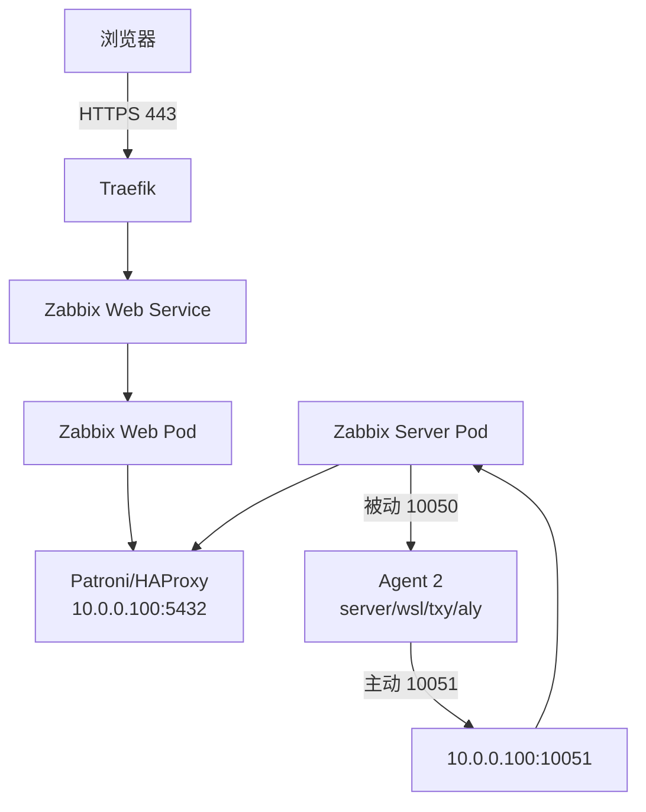

在已经配置好 Traefik、cert-manager、Cloudflare DNS-01 和全局通配符证书的 k3s 上，部署 Zabbix Server、Web、PostgreSQL 数据库和四台 Agent 2。入口与证书基础设施见K3s Traefik 接管 Nginx 公网入口迁移实战。

# 架构与组件



本篇部署内容：

- Zabbix Server 7.4；
- Zabbix Web 7.4；
- Patroni PostgreSQL 数据库；
- 四台 Zabbix Agent 2；
- Traefik HTTPS Ingress。

# 分步部署

## 入口与证书前置条件

开始部署前，确认第一篇中的 Traefik 入口基础设施已经就绪：

```bash
k3s kubectl -n kube-system get certificate/hyperbola-cc-wildcard
k3s kubectl -n kube-system get tlsstore/default
k3s kubectl -n kube-system rollout status deployment/traefik
```

证书 Secret 位于 `kube-system`，由 Traefik `TLSStore/default` 在 TLS 终止层全局使用；Zabbix namespace 不复制、也不跨 namespace 引用该 Secret。

## 初始化 Patroni PostgreSQL

数据库使用写端点 `10.0.0.100:5432`，不能误用只读端口 5433。

自动化流程：

1. 检查 `zabbix-db` Secret；
2. 不存在则生成随机应用密码；
3. 从 Patroni 配置读取 superuser 密码；
4. 幂等创建/更新 `zabbix` role；
5. 幂等创建 `zabbix` database；
6. 确保数据库 owner 正确；
7. 所有凭据任务设置 `no_log: true`。

## 部署 Server 和 Web

镜像：

- `zabbix/zabbix-server-pgsql:alpine-7.4-latest`；
- `zabbix/zabbix-web-nginx-pgsql:alpine-7.4-latest`。

两个 Deployment 都配置：

- 数据库 Secret 引用；
- readiness probe；
- CPU/memory request 与 limit；
- `IfNotPresent` 拉取策略。

## 配置 Traefik Ingress

```yaml
apiVersion: networking.k8s.io/v1
kind: Ingress
metadata:
  name: zabbix-web
  namespace: zabbix
  annotations:
    traefik.ingress.kubernetes.io/router.entrypoints: websecure
spec:
  ingressClassName: traefik
  rules:
    - host: zabbix.hyperbola.cc
      http:
        paths:
          - path: /
            pathType: Prefix
            backend:
              service:
                name: zabbix-web
                port:
                  name: http
```

Ingress 不声明 namespace 本地 `tls.secretName`，HTTPS 由 `websecure` EntryPoint 和 `kube-system/default` TLSStore 提供。HTTP→HTTPS 也已在 Traefik EntryPoint 全局处理，不需要 Zabbix 专属 HTTP Ingress。

Zabbix trapper 暴露到 `10.0.0.100:10051`。当前 Service 使用 `externalIPs`，新 Kubernetes 会产生 deprecated 警告；应规划 kube-vip/MetalLB，但在替代方案上线前不要直接删除。

## 安装 Agent 2

```ini
Server=10.0.0.0/24,10.42.0.0/16
ServerActive=10.0.0.100:10051
Hostname=server
```

- `ServerActive`：主动式，Agent 连接 Server 获取检查项并上报；
- `Server`：被动式，允许节点和 Pod 网段访问 10050；
- `Hostname`：必须与 Zabbix Host name 完全一致。

## 安装仓库后的 apt cache 坑

安装 `zabbix-release` 后必须强制刷新缓存：

```yaml
- name: Install Zabbix Agent 2 and plugins
  ansible.builtin.apt:
    name: "{{ ['zabbix-agent2'] + zabbix_agent2_plugins }}"
    state: present
    update_cache: true
    cache_valid_time: 0
```

否则 apt 会复用添加仓库之前的缓存，并误报 `zabbix-agent2-plugin-postgresql` 不存在。

## Agent 在线但 UI 没数据

四台 Agent 均 active、监听 10050，`agent.ping` 返回 `[s|1]`，Server 也收到 heartbeat，但日志显示：

```text
host [server] not found
host [wsl] not found
host [txy] not found
host [aly] not found
```

Zabbix 不会根据 heartbeat 自动创建 Host。必须在 UI/API 创建：

| Host name |        IP | 模板                         |
| --------- | --------: | ---------------------------- |
| `server`  | 10.0.0.10 | Linux by Zabbix agent active |
| `wsl`     | 10.0.0.20 | Linux by Zabbix agent active |
| `txy`     | 10.0.0.30 | Linux by Zabbix agent active |
| `aly`     | 10.0.0.40 | Linux by Zabbix agent active |

默认 `Zabbix server` Host 与 `Hostname=server` 不一致，应禁用、删除或修改。

# 踩坑清单

1. Patroni 和数据库密码任务必须 `no_log`。
2. 新 apt 仓库安装后必须强制刷新 cache。
3. sudo PATH 缺 `/usr/sbin` 会让 dpkg 找不到系统工具。
4. `externalIPs` 已 deprecated，需要后续替代方案。
5. Agent heartbeat 成功不代表 Host 自动注册。
6. 默认 Host 名称与 Agent Hostname 不一致。

# 验收

```bash
k3s kubectl -n kube-system get certificate,secret,tlsstore
k3s kubectl -n zabbix get deployments,services,ingresses

k3s kubectl get pods -A \
  --field-selector=status.phase!=Running,status.phase!=Succeeded

systemctl is-active zabbix-agent2
/usr/sbin/zabbix_agent2 -t agent.ping

k3s kubectl -n zabbix logs deployment/zabbix-server \
  --since=30m | grep -E 'host .* not found|cannot process heartbeat'
```

# 完整顶层 Playbook

```yaml
---
- name: Move host Nginx away from Traefik ports
  hosts: server:txy:aly
  become: true
  gather_facts: false

  roles:
    - role: host_nginx_high_port

- name: Configure the container registry mirror on k3s nodes
  hosts: servers
  become: true
  gather_facts: false
  serial: 1

  roles:
    - role: k3s_registry_mirror

- name: Restore Traefik and deploy Zabbix Server in k3s
  hosts: server
  become: true
  gather_facts: false
  serial: 1

  roles:
    - role: k3s_traefik
    - role: zabbix_server_k3s

- name: Install and configure Zabbix Agent 2 on servers
  hosts: servers
  become: true
  gather_facts: true
  environment:
    PATH: /usr/local/sbin:/usr/local/bin:/usr/sbin:/usr/bin:/sbin:/bin

  roles:
    - role: zabbix_agent2
```

```bash
ANSIBLE_CONFIG="$HOME/.config/ansible/ansible.cfg" \
  ansible-playbook --syntax-check playbook.yml

ANSIBLE_CONFIG="$HOME/.config/ansible/ansible.cfg" \
  ansible-playbook playbook.yml
```

部署结束后，仍需在 Zabbix UI/API 注册四个 Host，否则主动 Agent 会持续报告 `host not found`。
