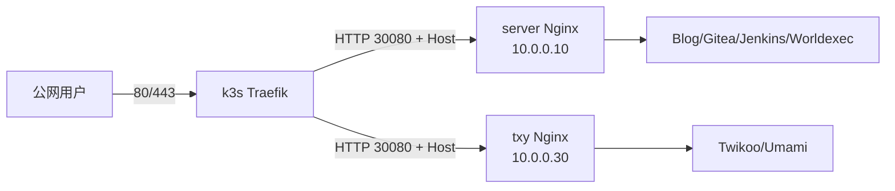

# k3s 配置 Traefik 与旧 Nginx 迁移实战

本文是系列第一篇：让 k3s 默认 Traefik 接管公网 80/443，把宿主机 Nginx 迁移为 HTTP 30080 后端，同时保留原有静态网站和反向代理。

## 1. 环境和目标

- `server`：10.0.0.10，承载 Blog、Gitea、Jenkins、Worldexec；
- `wsl`：10.0.0.20，k3s agent；
- `txy`：10.0.0.30，承载 Twikoo、Umami；
- `aly`：10.0.0.40，k3s control-plane/etcd；
- Traefik：统一监听 80/443、终止 TLS、执行 Host 路由；
- Nginx：统一监听 30080，只提供纯 HTTP 服务。



## 2. 分步实施

### 2.1 修正 Ansible 基础环境

实际 inventory 位于 `~/.config/ansible/inventory.yml`。远端解释器应使用通用路径：

```ini
[defaults]
interpreter_python = /usr/bin/python3
inventory = /home/hyperbola/.config/ansible/inventory.yml
```

部分主机的 sudo PATH 没有 `/usr/sbin`，所以：

- play 显式设置标准 root PATH；
- Nginx 校验使用 `/usr/sbin/nginx -t`；
- 部署前用 `setup` 模块确认远端 Python。

### 2.2 安装 Nginx，但禁止 postinst 抢占 80

```yaml
- name: Install Nginx
  ansible.builtin.apt:
    name: nginx
    state: present
    update_cache: true
    cache_valid_time: 3600
    policy_rc_d: 101
  notify: Restart nginx
```

`policy_rc_d: 101` 会阻止新安装的 Nginx 使用默认配置立即启动。完整顺序是：

1. 安装软件包；
2. 渲染 30080 虚拟主机；
3. 删除默认 80 站点；
4. 执行 `/usr/sbin/nginx -t`；
5. 校验通过后 restart。

### 2.3 把旧 TLS 站点降为纯 HTTP 后端

```nginx
server {
    listen 30080;
    listen [::]:30080;
    server_name gitea.hyperbola.cc;

    location / {
        proxy_pass http://[::1]:30000;
        proxy_set_header Host $host;
        proxy_set_header X-Real-IP $remote_addr;
        proxy_set_header X-Forwarded-For $proxy_add_x_forwarded_for;
        proxy_set_header X-Forwarded-Proto $http_x_forwarded_proto;
    }
}
```

需要删除：

- `listen 80` 和 `listen 443 ssl`；
- 证书、TLS cipher/session/protocol；
- Nginx 内部 80→443 重定向；
- `/etc/nginx/sites-enabled/default`。

Traefik 会保留 Host，Nginx 的 name-based virtual host 仍然有效。

### 2.4 审计遗漏的 Nginx 配置

最终检查发现 `txy` 还有 Twikoo/Umami 占用 80/443。定位命令：

```bash
/usr/sbin/nginx -T 2>&1 | awk '
  /^# configuration file / { file=$4; sub(/:$/, "", file) }
  /^[[:space:]]*listen[[:space:]]/ { print file ": " $0 }
'
```

额外站点需要按主机过滤：

- Twikoo：仅部署到 `txy`，回源 `10.0.0.10:28080`；
- Umami：仅部署到 `txy`，回源 `10.0.0.10:23000`。

### 2.5 恢复 k3s 默认 Traefik

k3s 原配置包含：

```yaml
disable:
  - traefik
```

只删除 `- traefik`，不能重写整个 `config.yaml`，否则可能破坏 token、节点地址、Flannel、TLS SAN 和 etcd 设置。之后：

1. 重启 k3s；
2. 等待 `/readyz`；
3. apply k3s 生成的 packaged `traefik.yaml`；
4. 等待 `deployment/traefik` rollout。

### 2.6 在 EntryPoint 层全局跳转 HTTPS

```yaml
apiVersion: helm.cattle.io/v1
kind: HelmChartConfig
metadata:
  name: traefik
  namespace: kube-system
spec:
  valuesContent: |-
    additionalArguments:
      - --entryPoints.web.http.redirections.entryPoint.to=:443
      - --entryPoints.web.http.redirections.entryPoint.scheme=https
      - --entryPoints.web.http.redirections.entryPoint.permanent=true
```

必须使用 `to=:443`。写成 `to=websecure` 时，Traefik 可能按容器内部端口生成 `https://host:8443/`。

### 2.7 配置 Docker Hub mirror

Traefik Helm Job、CoreDNS 和 metrics-server 曾因无法拉取 pause 镜像卡在 `ContainerCreating`。四个节点统一配置：

```yaml
---
mirrors:
  docker.io:
    endpoint:
      - "https://docker.m.daocloud.io"
```

文件路径是 `/etc/rancher/k3s/registries.yaml`，使用 `serial: 1` 逐台重启 `k3s`/`k3s-agent`。

### 2.8 把集群外 Nginx注册为 Kubernetes 后端

Nginx 没有 Pod label，所以使用无 selector Service + EndpointSlice：

```yaml
apiVersion: v1
kind: Service
metadata:
  name: host-nginx-web
  namespace: zabbix
spec:
  ports:
    - name: http
      port: 30080
      targetPort: 30080
---
apiVersion: discovery.k8s.io/v1
kind: EndpointSlice
metadata:
  name: host-nginx-web
  namespace: zabbix
  labels:
    kubernetes.io/service-name: host-nginx-web
addressType: IPv4
ports:
  - name: http
    protocol: TCP
    port: 30080
endpoints:
  - addresses:
      - 10.0.0.10
```

`addressType/ports/endpoints` 位于 EndpointSlice 顶层，不在 `spec` 下。不同主机必须使用独立 EndpointSlice：Twikoo/Umami 指向 10.0.0.30，不能复用 server 的后端。

## 3. 踩坑清单

1. 误以为安装过 ingress-nginx，实际上应直接恢复 k3s Traefik。
2. apt 安装 Nginx 时自动启动，可能抢占 Traefik 的 80。
3. sudo PATH 缺少 `/usr/sbin`，导致已存在的 Nginx 被误判为不存在。
4. 只迁移预想站点会遗漏其他 `sites-enabled` 文件。
5. `to=websecure` 可能产生错误的 8443 重定向。
6. Docker Hub 不通会影响全部系统 Pod，不只是 Traefik。
7. 只 apply HelmChartConfig 不保证主 HelmChart 存在。
8. EndpointSlice 字段误放到 `spec` 会导致 strict decoding error。
9. 多台宿主机后端不能共用同一个 EndpointSlice 地址。

## 4. 验收

```bash
ss -lntp | grep -E ':(80|443|30080) '
k3s kubectl -n kube-system rollout status deployment/traefik
k3s kubectl -n zabbix get ingress,endpointslices
curl -I -H 'Host: zabbix.hyperbola.cc' http://10.0.0.10/
```

验收标准：

- Nginx 仅监听 30080；
- Traefik Ready；
- HTTP Location 不含 `:8443`；
- 每组域名指向正确的宿主机 EndpointSlice。

## 5. 完整顶层 Playbook

```yaml
---
- name: Move host Nginx away from Traefik ports
  hosts: server:txy:aly
  become: true
  gather_facts: false

  roles:
    - role: host_nginx_high_port

- name: Configure the container registry mirror on k3s nodes
  hosts: servers
  become: true
  gather_facts: false
  serial: 1

  roles:
    - role: k3s_registry_mirror

- name: Restore Traefik and deploy Zabbix Server in k3s
  hosts: server
  become: true
  gather_facts: false
  serial: 1

  roles:
    - role: k3s_traefik
    - role: zabbix_server_k3s

- name: Install and configure Zabbix Agent 2 on servers
  hosts: servers
  become: true
  gather_facts: true
  environment:
    PATH: /usr/local/sbin:/usr/local/bin:/usr/sbin:/usr/bin:/sbin:/bin

  roles:
    - role: zabbix_agent2
```

```bash
ANSIBLE_CONFIG="$HOME/.config/ansible/ansible.cfg" \
  ansible-playbook --syntax-check playbook.yml

ANSIBLE_CONFIG="$HOME/.config/ansible/ansible.cfg" \
  ansible-playbook playbook.yml
```


