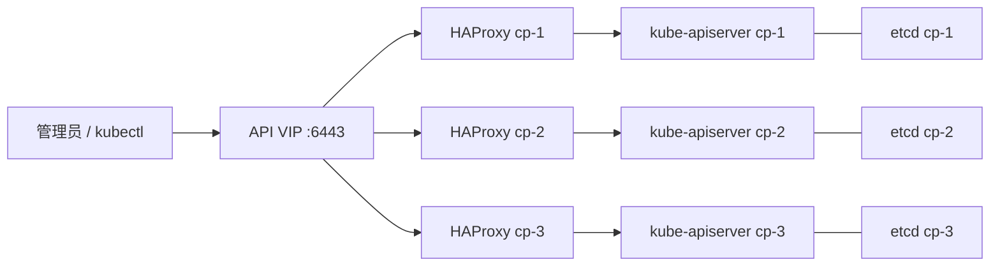

# Debian 三控制面 kubeadm 高可用集群部署复盘

# 目标与最终状态

本文记录一次从零部署、反复修复后完成的 Kubernetes 高可用实践。三台 Debian 控制面节点采用 kubeadm stacked etcd 拓扑，HAProxy 与 Keepalived 提供稳定的 API VIP，网络使用 Calico，公网业务证书由 cert-manager 负责自动续期。

用户名、域名、地址、密码、Cloudflare Token 与证书材料均已脱敏；`192.168.50.0/24` 仅为示例网段，不能直接用于生产网络。

交付时的目标集群为 Kubernetes `v1.36.4`：

```text
cp-1  192.168.50.11  控制面 + 可调度工作负载
cp-2  192.168.50.21  控制面 + 可调度工作负载
cp-3  192.168.50.51  控制面专用

API VIP:     192.168.50.100:6443
Pod CIDR:    10.244.0.0/16
Service CIDR: 10.96.0.0/12
```

验收标准为三个 Node 均处于 `Ready`；三个控制面的 etcd、API Server、controller manager 与 scheduler 静态 Pod 均为 `Running`；Calico、CoreDNS、kube-proxy、cert-manager 均就绪；VIP 同一时刻仅由一个节点持有，且三个节点访问 `/readyz` 都获得 `ok`。`cp-1` 和 `cp-2` 允许调度普通工作负载，`cp-3` 保留控制面污点。

# 架构与关键决策



containerd 的 runc cgroup 驱动固定为 `systemd`，应与 kubelet 保持一致；不一致时常见症状是节点注册或资源管理异常。kubeadm 的 `controlPlaneEndpoint` 指向 VIP，而不是任一控制面 IP，否则首节点失效后，既有 kubeconfig 和新控制面 join 都可能失去入口。

本次使用 `v1.36.4` 和 `kubeadm.k8s.io/v1beta4` 配置 API。升级时应先核对目标 Kubernetes 版本支持的 kubeadm 配置 API，不能只替换二进制版本号。

# 可重入部署顺序

Ansible 将部署拆为以下可单独重试的阶段：

1. 固定小写节点名并写入节点解析。
2. 加载 `overlay`、`br_netfilter`，持久化 sysctl，禁用 swap 与 zram swap。
3. 安装 containerd，生成默认配置后设定 `SystemdCgroup=true` 与 CNI 目录 `/opt/cni/bin`。
4. 安装并校验 kubeadm、kubelet、kubectl、crictl 与匹配版本的 calicoctl。
5. 安装 HAProxy、Keepalived，并先验证 VIP。
6. 初始化首控制面，生成短期 join token 与 upload-certs 证书密钥。
7. 串行加入另外两个 stacked etcd 控制面。
8. 安装 Calico，等待节点和系统 Pod 就绪。
9. 移除临时 containerd 代理 drop-in。

把“期望版本”和“实际集群状态”作为幂等判断条件，比只检查某个路径是否存在更可靠。

# 临时镜像代理的边界

受限网络下，镜像拉取可临时通过 containerd 的 systemd drop-in 配置代理：

```ini
[Service]
Environment="HTTP_PROXY=http://proxy.example:7897"
Environment="HTTPS_PROXY=http://proxy.example:7897"
Environment="NO_PROXY=127.0.0.1,localhost,192.168.50.0/24,10.244.0.0/16,10.96.0.0/12,.svc,.cluster.local"
```

`NO_PROXY` 必须覆盖节点网段、VIP、Pod/Service CIDR 与集群域名，否则 API、etcd 或服务流量可能误经外部代理。代理只应在拉取阶段存在；所有 Pod Ready 后删除 `/etc/systemd/system/containerd.service.d/proxy.conf`，再重载并重启 containerd：

```bash
sudo rm /etc/systemd/system/containerd.service.d/proxy.conf
sudo systemctl daemon-reload
sudo systemctl restart containerd
systemctl show containerd --property=Environment
```

删除前应确认目标路径确实是此次部署创建的 drop-in。最后一条命令应不再显示代理环境变量。

# 踩坑一：旧二进制没有升级

**现象。** 配置已经写为新版本，节点仍报告旧 kubeadm 版本。

**根因。** 安装任务只以 `/usr/local/bin/kubeadm` 是否存在决定是否跳过下载；文件存在不代表其版本满足期望。

**修复。** 下载任务使用固定版本 URL 与上游 SHA256 文件校验，并允许替换旧目标。`crictl` 同样不再只依赖 `creates` 判断。

**结论。** 幂等性应基于期望版本，而非路径存在性。

# 踩坑二：控制面 join 在复制 kubeconfig 时中断

**现象。** 首控制面健康，但待加入节点没有 `/etc/kubernetes/kubelet.conf`，也没有新增 etcd 成员。

**根因。** join 角色在执行 `kubeadm join` 前复制 `/etc/kubernetes/admin.conf` 到 `/root/.kube/config`；这个文件只能在 join 成功后产生。

**修复。** 将 root kubeconfig 安装移动到 join 成功之后：首控制面使用自己的 `admin.conf`，后续控制面仅在本机 join 完成后使用生成的文件。`kubelet.conf` 是否存在可作为更可靠的 join 状态信号。

# 踩坑三：生成 join token 的任务等待

**现象。** `kubectl --kubeconfig=/etc/kubernetes/admin.conf get --raw=/readyz` 已经返回 `ok`，但生成 join token 的 kubeadm 任务仍然等待。

**根因与修复。** kubeadm 执行环境没有显式指定 kubeconfig，可能选择了不适用的默认上下文。对 `kubeadm token create` 与 `kubeadm init phase upload-certs` 明确传入引导节点 kubeconfig：

```yaml
environment:
  KUBECONFIG: /etc/kubernetes/admin.conf
```

该文件权限设为 `0600`。join token 和 upload-certs 密钥属于短期敏感凭据，应只在引导节点使用，并在所有计划中的控制面加入后撤销或清理。

# Calico 节点地址探测

集群所有节点 `Ready` 并不表示 Calico 选择了正确的 BGP 地址。本文曾观察到 Calico 自动选择 VPN 网卡或相邻地址，而非 Kubernetes Node InternalIP。多网卡节点应明确指定自动探测策略：

```yaml
spec:
  calicoNetwork:
    nodeAddressAutodetectionV4:
      kubernetes: NodeInternalIP
```

变更前保留控制台入口；逐节点观察 Calico DaemonSet 和跨节点 Pod 连通性。节点地址变化可能重建网络路径，不应在没有验证窗口的环境中直接应用。

# 三类证书的责任边界

**kubelet 证书** 属于 Kubernetes CSR 体系，确认 kubelet 配置中的 `rotateCertificates: true`，再通过 `kubectl get csr` 检查签发状态。

**kubeadm 控制面 PKI** 位于每个控制面节点的 `/etc/kubernetes/pki`。使用 `sudo kubeadm certs check-expiration` 检查；续期由 kubeadm 的 `kubeadm certs renew` 完成。高可用集群应逐台执行备份、续期、重启该节点静态控制面组件并验证 VIP/API/etcd 后，再处理下一台。cert-manager 不管理这些宿主机文件。

**公网业务证书** 才由 cert-manager 的 `Certificate` 资源管理。通配符证书使用 ACME DNS-01；Cloudflare API Token 存入 Kubernetes Secret，不写入 Git 或 Ansible 普通变量：

```yaml
apiVersion: cert-manager.io/v1
kind: Certificate
metadata:
  name: example-com-wildcard
  namespace: infrastructure
spec:
  secretName: example-com-tls
  issuerRef:
    name: letsencrypt-cloudflare-prod
    kind: ClusterIssuer
  dnsNames:
    - example.com
    - "*.example.com"
  duration: 2160h
  renewBefore: 720h
```

签发后检查 `Certificate` 为 Ready、TLS Secret 类型为 `kubernetes.io/tls`，并记录 `.status.notAfter` 与 `.status.renewalTime`。

# 最终验收

```bash
kubectl get nodes -o wide
kubectl get pods -A -o wide
kubectl get --raw=/readyz
kubectl -n infrastructure get certificate,secret
sudo kubeadm certs check-expiration
calicoctl get nodes -o wide
```

每个控制面均可检查 VIP 是否在本机持有：

```bash
ip -4 -o addr show | grep '192.168.50.100'
curl --noproxy '*' -sk https://192.168.50.100:6443/readyz
```

后者仅验证 API liveness；`-k` 跳过 TLS 身份校验，不能用于证书信任验证。生产验收还应使用受信任 kubeconfig 或 CA 校验 API 证书。

# 总结

高可用 kubeadm 的难点不止于 `kubeadm init`。入口 VIP、CRI cgroup、节点地址选择、join 凭据生命周期、临时代理清理和证书责任边界共同决定集群是否可维护。

这次最可复用的经验是：将幂等性建立在版本和状态上；将控制面 join 设计为可中断、可恢复的串行流程；并让 kubelet、kubeadm PKI 与公网业务证书分别由正确的机制管理。
