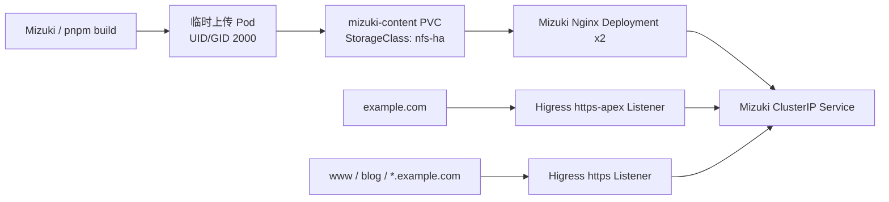

# Mizuki 静态博客部署到 Kubernetes：NFS 动态卷与 Higress 根域、通配域路由

# 结论先行

Mizuki 是 Astro 生成的静态站点，构建产物可直接由 Nginx 提供。本文将它部署为两个 Kubernetes 副本，站点文件放在由 `nfs-subdir-external-provisioner` 动态创建的 RWX PVC 中，并用 Higress Gateway API 统一路由。

最终入口分为两类：根域 `example.com` 使用专用 HTTPS Listener；`www.example.com`、`blog.example.com` 和 `*.example.com` 使用通配 HTTPS Listener。这里的根域必须单独处理：DNS 通配符和 Gateway 的 `*.example.com` 都不匹配 `example.com` 本身。

# 架构与前提



前提是 NFS Provisioner 已提供支持 `ReadWriteMany` 的 `nfs-ha` StorageClass，且上传 Pod 与 NFS 目录账户采用相同 UID/GID。不要把 NFS 服务端的 root 身份直接带进业务容器；`root_squash` 启用时，这会造成目录权限混乱。

# 使用动态 PVC 保存构建产物

静态站点不需要 PV/PVC 的预绑定。声明一个动态 PVC 即可由 Provisioner 创建独立子目录：

```yaml
apiVersion: v1
kind: PersistentVolumeClaim
metadata:
  name: mizuki-content
  namespace: mizuki
  annotations:
    k8s-sigs.io/nfs-directory-mode: "0775"
spec:
  accessModes: [ReadWriteMany]
  storageClassName: nfs-ha
  resources:
    requests:
      storage: 5Gi
```

Nginx Deployment 将该 PVC 挂载到 `/usr/share/nginx/html`。构建在源码工作区执行：

```bash
pnpm check
pnpm build
```

随后使用一次性的上传 Pod 挂载同一 PVC，将 `dist/` 同步进去。上传 Pod 的 `securityContext` 应使用共享账户的固定 UID/GID。发布前先确认 Deployment 两个副本均 Ready，再在容器内检查新文章路径，而不是只检查 Pod 状态。

# Higress Gateway 的关键：绑定公网数据面

启用 Higress Gateway API 的 Deployment Controller 后，如果 Gateway 没有明确 `addresses`，控制器会创建一套私有的 Deployment/Service。HTTPRoute 可能显示 `Accepted=True`，但公网 VIP 仍然进入旧的 Higress Gateway，页面只会显示欢迎页。

共享公网 Gateway 要显式绑定到既有、暴露在 VIP/NodePort 后面的 Service：

```yaml
spec:
  gatewayClassName: higress
  addresses:
    - type: Hostname
      value: higress-gateway.higress-system.svc.cluster.local
```

这是“资源已接受”与“用户实际访问到正确数据面”之间最容易被忽略的差异。验证必须带 Host/SNI 请求公网入口并检查正文，例如页面的 `<title>`，不能仅以 HTTP 200 为依据。

# 根域与通配子域需要两条路由

通配 Listener 负责一级子域：

```yaml
- name: https
  protocol: HTTPS
  port: 443
  hostname: "*.example.com"
```

根域使用不同的精确 Listener：

```yaml
- name: https-apex
  protocol: HTTPS
  port: 443
  hostname: example.com
```

对应的 HTTPRoute 也分别绑定各自的 `sectionName`。通配路由包含 `www.example.com`、`blog.example.com`、`*.example.com`；根域路由只包含 `example.com`。现有 Grafana、监控等精确域名路由可继续保留，精确匹配不会被博客通配路由抢占。

# 排障复盘

本次最初看到 `200`，但响应正文是 `Welcome to Higress!`。这排除了博客 Pod、Service 和 NFS 内容故障，说明请求没有命中博客路由。继续对比 Gateway API 自动创建的 Service 和公网入口后，确认公网仍指向旧数据面；补上 `spec.addresses` 后，VIP 返回了 Mizuki 的真实 HTML。

另一个问题是把根域直接塞进 `*.example.com` 的 HTTPRoute。路由对象可以被控制器接受，但 TLS Listener 的主机名仍不匹配根域。最终通过专用 `https-apex` Listener 与独立 HTTPRoute 解决，并使用实际 TLS 请求确认根域页面与证书均正确。

# 验证清单

部署完成后至少检查：

- `kubectl get pvc -n mizuki` 显示 `Bound`；
- `kubectl get deployment -n mizuki` 显示两个可用副本；
- 两条 HTTPRoute 的 `Accepted` 与 `ResolvedRefs` 为 `True`；
- 从公网 VIP 或实际域名访问时，响应正文包含博客标题，而不是 Higress 欢迎页；
- 根域证书 SAN 包含根域，通配证书覆盖需要的一级子域。

# 总结

静态博客放进 Kubernetes 并不复杂，容易出错的是存储权限、Gateway API 数据面绑定和域名匹配边界。把动态 PVC、固定 UID/GID、共享公网 Higress Service、根域精确 Listener 与子域通配 Listener 分开建模，部署结果才会同时具备可维护性与可验证性。
