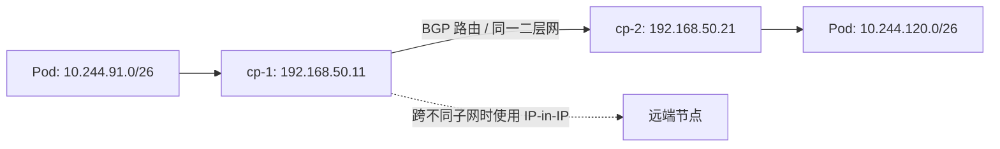

# Calico 从 VXLAN 迁移到 BGP 与 IP-in-IP CrossSubnet 实践

这次迁移的目标很明确：三台 Kubernetes 节点在同一个二层局域网时，让 Pod 流量直接按 BGP 学到的下一跳转发；将来节点跨三层子网时，再使用 IP-in-IP 封装兜底。最终运行状态为 `BGP Enabled`、`ipipMode: CrossSubnet`、`vxlanMode: Never`。

本文基于 Kubernetes `v1.36.4`、Calico/Tigera Operator `v3.28.2` 和 Debian 节点完成。为避免泄露环境信息，节点地址使用示例网段 `192.168.50.0/24`，Pod 网段为 `10.244.0.0/16`。

# 为什么不继续使用 VXLAN

原配置为 VXLAN 全封装。它对底层网络要求低，但同一局域网节点之间的 Pod 流量仍要额外经过 VXLAN 封装、解封装和 FDB 查找。对于节点数量不多、节点管理网可以互通 TCP/179 的裸机局域网，Calico 默认的 node-to-node BGP full mesh 更直接：每个节点发布本机 Pod CIDR block，其他节点将路由指向节点管理地址。

目标链路如下：



这里的关键不是“完全取消封装”，而是选择 `IPIPCrossSubnet`：同一子网走原生路由，跨子网才封装。跨子网的底层设备必须允许 IP 协议号 `4`，节点间还必须允许 TCP/179。

# 最终配置

在 Ansible 公共变量中启用 BGP，并将期望封装模式设为 `IPIPCrossSubnet`：

```yaml
# group_vars/all/main.yml
calico_bgp: "Enabled"
calico_encapsulation: "IPIPCrossSubnet"
calico_ip_pool_name: "default-ipv4-ippool"
```

Operator 管理的 `Installation` 资源使用 Kubernetes `NodeInternalIP` 作为 Calico 节点地址，避免错误选中 VPN、Docker 或其他覆盖网络接口：

```yaml
apiVersion: operator.tigera.io/v1
kind: Installation
metadata:
  name: default
spec:
  calicoNetwork:
    bgp: Enabled
    nodeAddressAutodetectionV4:
      kubernetes: NodeInternalIP
    ipPools:
      - name: default-ipv4-ippool
        blockSize: 26
        cidr: 10.244.0.0/16
        encapsulation: IPIPCrossSubnet
        natOutgoing: Enabled
        nodeSelector: all()
```

# 迁移前检查

先确认节点管理地址在同一子网、三台节点均可用，并保留带外控制台或 SSH 入口。网络切换期间，既有连接可能短暂中断。

```bash
kubectl get nodes -o wide
kubectl get installation default -o yaml
kubectl get ippool -o yaml
calicoctl node status
```

如果 BGP 还未开启，`calicoctl node status` 会显示 BIRD 未运行。不要在这个状态下直接宣称迁移完成。

# 第一个坑：地址自动探测字段互斥

旧 Installation 中残留了 `firstFound: true`，而新配置同时声明了 `kubernetes: NodeInternalIP`。Operator 会拒绝同一 IPv4 地址族同时启用两个自动探测方法，状态中可见：

```text
Invalid Installation provided: no more than one node address autodetection method can be specified per-family
```

先读取现有字段，只在确实存在时移除它：

```bash
kubectl get installation default \
  -o jsonpath='{.spec.calicoNetwork.nodeAddressAutodetectionV4.firstFound}'

kubectl patch installation default --type=json \
  --patch='[{"op":"remove","path":"/spec/calicoNetwork/nodeAddressAutodetectionV4/firstFound"}]'
```

这一步不会修改节点管理 IP；它只是消除 Operator 的互斥配置错误。随后确认 `Installation` 不再 `Degraded`，再继续后面的迁移。

# 第二个坑：从 BGP 关闭切换到开启时的滚动死锁

集群原本运行 VXLAN 且 BGP 关闭。启用 BGP 后，Calico node 的 readiness 探针会等待 BIRD 邻居建立；但 Operator 默认 `maxUnavailable: 1`，只会先替换一台 calico-node。第一台新 Pod 找不到仍在旧模式的 BGP 邻居，始终无法 Ready，滚动更新也就无法继续。

典型探针错误如下：

```text
calico/node is not ready: BIRD is not ready:
BGP not established with 192.168.50.11,192.168.50.21
```

处理方式是在维护窗口内保留已切换的节点，同时重建其余旧模式的 calico-node，使三台节点同时具备 BIRD。待所有邻居建立后，再等待 DaemonSet Ready。这个动作会造成短暂网络抖动，不能在没有维护窗口时照搬。

```bash
kubectl -n calico-system get pods -l k8s-app=calico-node -o wide
calicoctl node status
```

当每台节点均显示两个 `Established` IPv4 BGP 邻居，才能进入 IPPool 切换阶段。

# 第三个坑：当前 Operator 不允许同一 CIDR 的双 IPPool

曾尝试以“旧 VXLAN 池停止分配、新 IP-in-IP 池接管”的方式平滑迁移，并让两个池都声明 `10.244.0.0/16`。在当前 Tigera Operator `v3.28.2` 中，该配置会被明确拒绝：

```text
IP pool 10.244.0.0/16 is specified more than once
```

因此，不应在这个版本的 `Installation.spec.calicoNetwork.ipPools` 中声明两个相同 CIDR 的池。即使旧池的 `nodeSelector` 已设置为 `!all()`，Operator 也会在校验阶段失败。出现此错误时，应立即恢复为单池声明，避免让 Operator 长期处于无效期望状态。

# 最终做法：原地切换唯一 IPPool

在 BGP 邻居已经建立、所有 Calico node 都 Ready 的前提下，保留唯一的 `default-ipv4-ippool`，将实际 IPPool 从 VXLAN 原地改为 IP-in-IP CrossSubnet：

```bash
kubectl patch ippool default-ipv4-ippool --type=merge \
  --patch='{"spec":{"ipipMode":"CrossSubnet","vxlanMode":"Never"}}'
```

对于 Operator 托管集群，`Installation` 仍必须保持与目标一致的 `encapsulation: IPIPCrossSubnet`。本环境中还将上述操作加入 Ansible：先读取实际池的 `ipipMode` 和 `vxlanMode`，只有尚未处于 `CrossSubnet Never` 时才 patch，保证重复执行幂等。

```yaml
- name: Switch the managed Calico IPv4 IPPool to IP-in-IP cross-subnet mode
  ansible.builtin.command:
    argv:
      - kubectl
      - --kubeconfig=/etc/kubernetes/admin.conf
      - patch
      - ippool/default-ipv4-ippool
      - --type=merge
      - --patch={"spec":{"ipipMode":"CrossSubnet","vxlanMode":"Never"}}
```

# 验证结果

先验证 Operator、IPPool、BGP 和 Kubernetes 节点：

```bash
kubectl get installation default \
  -o jsonpath='bgp={.spec.calicoNetwork.bgp}{"\n"}ready={.status.conditions[?(@.type=="Ready")].status}{"\n"}'

kubectl get ippool default-ipv4-ippool \
  -o jsonpath='ipip={.spec.ipipMode}{"\n"}vxlan={.spec.vxlanMode}{"\n"}'

calicoctl node status
kubectl get nodes
```

本次得到的关键结果如下：

```text
bgp=Enabled
ready=True
ipip=CrossSubnet
vxlan=Never

IPv4 BGP status
192.168.50.21  node-to-node mesh  Established
192.168.50.51  node-to-node mesh  Established
```

再从一个节点检查到其他节点 Pod block 的实际路由。以下输出说明流量通过 `br0` 以节点管理地址为下一跳转发，而不是经过 `vxlan.calico`：

```text
10.244.120.64/26 via 192.168.50.21 dev br0
10.244.194.192/26 via 192.168.50.51 dev br0
```

最后确认 VXLAN 设备已不存在：

```bash
ip -d link show vxlan.calico
```

预期输出为：

```text
Device "vxlan.calico" does not exist.
```

# 回滚与注意事项

如果切换后 BGP 邻居无法建立，先恢复工作负载可用性，而不是继续叠加配置。回滚目标是将唯一 IPPool 改回 VXLAN 并关闭 BGP；完成后等待所有 calico-node Ready，再排查 TCP/179、防火墙、节点地址自动探测和子网掩码。

```bash
kubectl patch ippool default-ipv4-ippool --type=merge \
  --patch='{"spec":{"ipipMode":"Never","vxlanMode":"Always"}}'
```

回滚后还应让 `Installation` 的期望状态与实际池一致，否则 Operator 的后续 reconcile 可能重新引入不一致。

对于更多节点的生产集群，默认 BGP full mesh 的连接数按节点数平方增长。规模扩大后应规划 route reflector，而不是无限维持 node-to-node full mesh。

# 总结

这次迁移的结论不是“把 VXLAN 参数改成 BGP”这么简单。可靠的顺序是：先解决地址自动探测冲突，再让所有节点建立 BGP 邻居，随后在唯一 IPPool 上原地切换到 `IPIPCrossSubnet`，最后用 `ip route` 证明局域网 Pod 流量已走原生 BGP 下一跳。

最重要的避坑结论有两条：当前 Operator 版本不接受同一 CIDR 的双 IPPool；而从 BGP 关闭切换到开启时，默认单节点滚动可能因 BIRD readiness 形成死锁。把这两个条件提前纳入变更计划，能显著降低网络迁移的风险。
