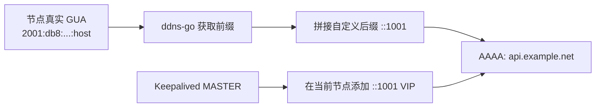

# ddns-go 二开：为漂移 IPv6 VIP 提供非主机地址 DDNS

把域名更新到“某台机器当前的 IPv6 地址”是普通 DDNS 的典型用法；但有时真正需要发布的是一个**不固定属于任何一台主机**的地址。例如 Kubernetes API 的 Keepalived VIP：它会随主备切换在节点之间漂移，却仍要有稳定的 AAAA 记录。

本文记录一个基于 [ddns-go](https://github.com/jeessy2/ddns-go) 的二开实践。二开的核心目标不是把 DDNS 强行做成集群，而是提供“IPv6 前缀 + 自定义主机后缀”的 DDNS 支持；集群同步、竞争执行和前缀协作是建立在这个目标上的附加能力。该二开在 GPT-6.0 的协作支持下完成。

文中 IP、域名和主机名均为脱敏示例。

# 目标与边界

有三台控制平面节点，IPv4 VRRP 使用一个固定 VIP：

```text
cp-1  192.168.50.11
cp-2  192.168.50.21
cp-3  192.168.50.51

IPv4 API VIP: 192.168.50.100
```

节点通过路由通告获得同一变化域内的 IPv6 GUA，例如 `2001:db8:1234:5678:xxxx:xxxx:xxxx:xxxx/64`。当某节点成为 Keepalived MASTER 时，脚本取有线接口上有效期最长的 GUA 的 `/64` 前缀，添加：

```text
2001:db8:1234:5678::1001/64
```

这个 `::1001` 是漂移 IPv6 VIP。DNS 的 AAAA 记录应始终指向它，而不是指向某个节点的 SLAAC 地址。

本文不讨论把 IPv6 VIP 绑定到 API 端口的 HAProxy 监听策略；它只讨论 VIP 的地址漂移和 DNS 地址生成。若业务需要通过 AAAA 访问服务，还必须确认代理或服务本身监听 IPv6。

# 为什么需要二开的 ddns-go

上游 DDNS 工具通常更新“当前网卡上的地址”。这不适合 `::1001` 这种地址：它的意义来自前缀和约定后缀，不应依赖某台固定机器拥有它。

本 fork 在 IPv6 配置区提供独立的“自定义 IP 后缀”与域名映射。只要至少有一个节点提供同一前缀变化域中的 IPv6 地址，ddns-go 就可以：

1. 获取节点的真实 GUA，识别其 `/64`（也可配置其他前缀长度）。
2. 将前缀与 `::1001` 等自定义后缀拼接。
3. 更新这个拼接地址对应的 AAAA 记录。

这就是“非主机地址 DDNS”：DNS 可以表示网关地址、VRRP VIP 或其他由网络协议管理的地址，不必把记录误认为某个网卡的永久身份地址。单节点配置也可使用自定义后缀；集群不是前置条件。



# ddns-go 集群能力放在什么位置

这个 fork 的集群功能服务于多节点场景，但不替代 Keepalived：

- 各节点独立执行定时任务，没有中心调度器。
- 多节点同时触发时，通过短期执行权和随机票据降低重复 DNS 更新。
- 配置、IPv6 前缀状态和前缀防抖可在存活成员间协作。
- 网络分区仍可能导致重复更新，因此 DNS 服务商或回调必须接受幂等写入。

集群内同一 DDNS 配置的节点必须属于同一个 IPv6 前缀变化域；如果不同出口、不同运营商前缀的节点混在同一配置，DNS 会互相覆盖。应拆成多个 DDNS 配置。

# Keepalived notify：让 IPv6 VIP 与 IPv4 VIP 一起漂移

Keepalived 的 `notify_master` 适合做“IPv4 VRRP 选举已经完成后”的附加操作。实现中会在 MASTER 时添加动态 IPv6 VIP，在 BACKUP、FAULT、STOP 时删除。

```conf
global_defs {
  enable_script_security
  script_user root
}

vrrp_instance VI_API {
  # ... IPv4 virtual_ipaddress、unicast_peer、health check ...
  notify_master "/usr/local/libexec/keepalived/k8s-api-ipv6-vip.py master"
  notify_backup "/usr/local/libexec/keepalived/k8s-api-ipv6-vip.py backup"
  notify_fault  "/usr/local/libexec/keepalived/k8s-api-ipv6-vip.py fault"
  notify_stop   "/usr/local/libexec/keepalived/k8s-api-ipv6-vip.py stop"
}
```

`enable_script_security` 不是可选的装饰。启用 notify 脚本后，Keepalived 会检查脚本路径及权限；脚本及路径目录必须由 root 管理，且不能被 group/world 写入。部分发行版不存在默认的 `keepalived_script` 用户，显式 `script_user root` 可以避免健康检查脚本被忽略，但也意味着脚本必须保持最小权限、不可接受未校验的外部输入。

部署时使用以下文件约定：

```text
/usr/local/libexec/keepalived/k8s-api-ipv6-vip.py  # Keepalived notify hook
/usr/local/bin/k8s-ddns-source-ip                  # 供 ddns-go 命令方式调用
```

# 踩坑复盘：`valid_lft` 让 DDNS 把 VIP 当成主机地址

**触发条件。** Linux 的 IPv6 地址选择会参考 `valid_lft`。真实 SLAAC GUA 的有效期通常随路由通告递减；而 notify 脚本通过 `ip -6 addr replace` 手动添加的 VIP，常表现为极长或 `forever` 的有效期。

**错误做法。** ddns-go 按“候选网卡上有效期最长的 IPv6 地址”自动选择地址。这个默认逻辑对多条 SLAAC 地址很合理，但在同一接口上存在 `::1001` VIP 时，VIP 的有效期最大，因此被误选为节点自己的 IPv6 地址。

**可观察证据。** 使用下面命令可以看到同一网卡上的真实 GUA 和 `::1001` VIP；后者的 `valid_life_time` 往往显著更大：

```bash
ip -j -6 addr show dev br0
```

这不是 ddns-go 的 DNS 更新算法错误，而是输入地址选择缺少“这个地址是漂移 VIP”的上下文。仅靠有效期排序无法区分身份地址和服务地址。

**最终修复。** 不再让 ddns-go 直接扫描接口全部地址，而是为它配置“命令方式获取 IP”。命令调用一个只输出真实 GUA 的小脚本；脚本沿用有效期排序，但跳过任意 `/64` 中 host part 为 `::1001` 的地址。

```python
VIP_HOST_PART = 0x1001
HOST_PART_MASK = (1 << 64) - 1

def is_ddns_source(address: ipaddress.IPv6Address) -> bool:
    return (
        address in ipaddress.IPv6Network("2000::/3")
        and (int(address) & HOST_PART_MASK) != VIP_HOST_PART
    )
```

脚本还会过滤非 `global` 地址和非 GUA 地址，并在没有合格地址时以非零状态退出。这样故障不会悄悄把空地址或链路本地地址写入 DNS。

# 配置 DDNS 的命令获取方式

在本 fork 的 DDNS 配置页面中，对每个节点的 IPv6 获取方式选择“命令”，填写：

```bash
/usr/local/bin/k8s-ddns-source-ip
```

脚本通过 shebang 使用 `/usr/bin/python3`，也可以显式写成：

```bash
/usr/bin/python3 /usr/local/bin/k8s-ddns-source-ip
```

正常情况下它只输出一行 IPv6 地址，例如：

```text
2001:db8:1234:5678:5c51:43ff:feb1:fb93
```

ddns-go 随后从该地址取得前缀，并用配置页的自定义后缀 `::1001` 生成 AAAA 记录。不要把 `::1001` 再配置为节点自身 IPv6 域名；它应只属于自定义后缀域名，否则同一域名可能被两个更新路径竞争。

# 部署与验证

先检查配置语法，再分批重启 Keepalived。网络切换前必须保留控制台或带外访问；不要同时停止全部 VRRP 节点。

```bash
keepalived -t -f /etc/keepalived/keepalived.conf
systemctl restart keepalived
```

验证必须同时覆盖地址、脚本和故障切换：

```bash
# 在每个节点执行：只有 MASTER 应显示两个 VIP
ip -o -4 addr show | grep '192.168.50.100'
ip -o -6 addr show | grep '::1001/64'

# DDNS 输入必须是主机 GUA，不能是 ::1001
/usr/local/bin/k8s-ddns-source-ip

# 检查 notify 脚本错误
journalctl -u keepalived --since '10 minutes ago' --no-pager \
  | grep 'k8s IPv6 VIP notify hook'
```

实际演练应至少做一次受控切换：先滚动重启备机，再重启当前 MASTER。预期结果是 IPv4 VIP、IPv6 VIP 和 `/run/keepalived/` 下的状态记录只在新 MASTER 存在；旧 MASTER 的 IPv6 VIP 必须被删除。随后确认 API 健康检查和 DDNS 更新记录均正常。

# 后缀约定必须前后一致

本文部署使用 `::1001`。如果你的 VIP 约定改成 `::1`，不能只改 Keepalived notify 脚本：DDNS 自定义后缀和源地址选择器的 `VIP_HOST_PART` 也必须同步改为 `0x1`。否则选择器会继续排除 `::1001`，而新的 `::1` VIP 又会重新参与有效期排序。

这是这套方案最容易遗漏的配置契约：**VIP 后缀只能有一个权威来源，所有生成、过滤和 DNS 配置都必须使用同一个值。** 长期来看，可将该值做成 Ansible 变量，同时渲染 notify 脚本、DDNS 选择器和 ddns-go 配置，避免人工同步。

# 总结

这个实践的关键不是“让 DDNS 选择有效期最长的 IPv6”，而是先明确地址角色：真实 GUA 用来提供前缀，`::1001` 用来承载服务 VIP。将两者混在同一个排序集合里，`forever` 有效期会必然让 VIP 胜出。

通过 ddns-go 的自定义 IPv6 后缀能力、Keepalived notify 钩子，以及一个排除 VIP 的命令式 GUA 选择器，可以把“变化的网络前缀”“漂移的服务地址”和“节点身份地址”分开处理。这样既能让 DNS 稳定指向不属于任何固定主机的 VIP，也保留了多节点协作、前缀防抖与审计带来的运维能力。
