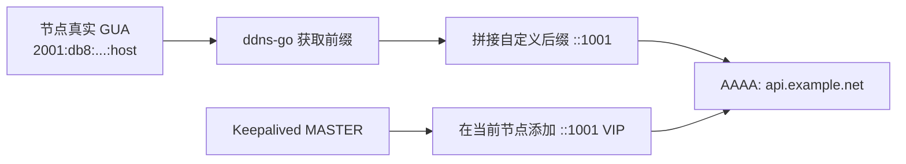

# ddns-go 二开：为漂移 IPv6 VIP 提供非主机地址 DDNS

把域名更新到“某台机器当前的 IPv6 地址”是普通 DDNS 的典型用法；但有时真正需要发布的是一个**不固定属于任何一台主机**的地址。例如 Kubernetes API 的 Keepalived VIP：它会随主备切换在节点之间漂移，却仍要有稳定的 AAAA 记录。

本文记录一个基于 [ddns-go](https://github.com/jeessy2/ddns-go) 的二开实践。二开的核心目标不是把 DDNS 强行做成集群，而是提供“IPv6 前缀 + 自定义主机后缀”的 DDNS 支持；集群同步、竞争执行和前缀协作是建立在这个目标上的附加能力。该二开在 GPT-6.0 的协作支持下完成。

文中 IP、域名和主机名均为脱敏示例。

# 目标与边界

有三台控制平面节点，IPv4 VRRP 使用一个固定 VIP：

```text
cp-1  192.168.50.11
cp-2  192.168.50.21
cp-3  192.168.50.51

IPv4 API VIP: 192.168.50.100
```

节点通过路由通告获得同一变化域内的 IPv6 GUA，例如 `2001:db8:1234:5678:xxxx:xxxx:xxxx:xxxx/64`。当某节点成为 Keepalived MASTER 时，脚本检查配置的有线接口，为每个仍有效的 `/64` 前缀添加对应的 `::1001` VIP：

```text
2001:db8:1234:5678::1001/64
```

这个 `::1001` 是漂移 IPv6 VIP。DNS 的 AAAA 记录应始终指向它，而不是指向某个节点的 SLAAC 地址。

本文不讨论把 IPv6 VIP 绑定到 API 端口的 HAProxy 监听策略；它只讨论 VIP 的地址漂移和 DNS 地址生成。若业务需要通过 AAAA 访问服务，还必须确认代理或服务本身监听 IPv6。

# 为什么需要二开的 ddns-go

上游 DDNS 工具通常更新“当前网卡上的地址”。这不适合 `::1001` 这种地址：它的意义来自前缀和约定后缀，不应依赖某台固定机器拥有它。

本 fork 在 IPv6 配置区提供独立的“自定义 IP 后缀”与域名映射。只要至少有一个节点提供同一前缀变化域中的 IPv6 地址，ddns-go 就可以：

1. 获取节点的真实 GUA，识别其 `/64`（也可配置其他前缀长度）。
2. 将前缀与 `::1001` 等自定义后缀拼接。
3. 更新这个拼接地址对应的 AAAA 记录。

这就是“非主机地址 DDNS”：DNS 可以表示网关地址、VRRP VIP 或其他由网络协议管理的地址，不必把记录误认为某个网卡的永久身份地址。单节点配置也可使用自定义后缀；集群不是前置条件。


```mermaid
flowchart LR
  A[节点真实 GUA\n2001:db8:...:host] --> B[ddns-go 获取前缀]
  B --> C[拼接自定义后缀 ::1001]
  C --> D[AAAA: api.example.net]
  E[Keepalived MASTER] --> F[在当前节点添加 ::1001 VIP]
  F --> D
```

# ddns-go 集群能力放在什么位置

这个 fork 的集群功能服务于多节点场景，但不替代 Keepalived：

- 各节点独立执行定时任务，没有中心调度器。
- 多节点同时触发时，通过短期执行权和随机票据降低重复 DNS 更新。
- 配置、IPv6 前缀状态和前缀防抖可在存活成员间协作。
- 网络分区仍可能导致重复更新，因此 DNS 服务商或回调必须接受幂等写入。

集群内同一 DDNS 配置的节点必须属于同一个 IPv6 前缀变化域；如果不同出口、不同运营商前缀的节点混在同一配置，DNS 会互相覆盖。应拆成多个 DDNS 配置。

# Keepalived notify：让 IPv6 VIP 与 IPv4 VIP 一起漂移

Keepalived 的 `notify_master` 适合做“IPv4 VRRP 选举已经完成后”的附加操作。成为 MASTER 时，notify 脚本为当前接口上每个仍有效的 GUA 前缀添加 `::1001` VIP；进入 BACKUP、FAULT 或 STOP 时则立即清理本机的这些 VIP。

```conf
global_defs {
  enable_script_security
  script_user root
}

vrrp_instance VI_API {
  # ... IPv4 virtual_ipaddress、unicast_peer、health check ...
  notify_master "/usr/local/libexec/keepalived/k8s-api-ipv6-vip.py master"
  notify_backup "/usr/local/libexec/keepalived/k8s-api-ipv6-vip.py backup"
  notify_fault  "/usr/local/libexec/keepalived/k8s-api-ipv6-vip.py fault"
  notify_stop   "/usr/local/libexec/keepalived/k8s-api-ipv6-vip.py stop"
}
```

`enable_script_security` 不是可选的装饰。启用 notify 脚本后，Keepalived 会检查脚本路径及权限；脚本及路径目录必须由 root 管理，且不能被 group/world 写入。部分发行版不存在默认的 `keepalived_script` 用户，显式 `script_user root` 可以避免健康检查脚本被忽略，但也意味着脚本必须保持最小权限、不可接受未校验的外部输入。

部署时使用以下文件约定：

```text
/usr/local/libexec/keepalived/k8s-api-ipv6-vip.py  # Keepalived notify hook
/etc/systemd/system/k8s-api-ipv6-vip.timer         # MASTER 状态下的周期协调入口
/usr/local/bin/k8s-ddns-source-ip                  # 供 ddns-go 命令方式调用
```

# 前缀变化时让新旧 VIP 按运营商有效期共存

仅使用 `notify_master` 不够：IPv4 VIP 的 MASTER 身份可能一直不变，运营商却可以在这段时间内通告新的 IPv6 前缀。Keepalived 不会因为前缀变化再次触发 `notify_master`，因此另部署一个 systemd timer，每 15 秒运行一次协调脚本。

协调脚本在本机仍持有 IPv4 API VIP 时，重新读取候选接口上的 GUA，并按 `/64` 前缀分组。每个前缀选择 `valid_lft` 最长的 GUA，把对应 VIP 的 `valid_lft` 和 `preferred_lft` 设置为源 GUA 当前剩余的生命周期：

```text
新前缀 GUA  2001:db8:1234:5678::2/64        valid_lft  7200
新前缀 VIP  2001:db8:1234:5678::1001/64    valid_lft  7200

旧前缀 GUA  2001:db8:1234:1111::2/64        valid_lft  3600
旧前缀 VIP  2001:db8:1234:1111::1001/64    valid_lft  3600
```

这样旧 GUA 尚在运营商通告的有效期内时，旧 VIP 保持可用；新前缀的 VIP 同时添加，DNS 有时间将 AAAA 记录更新到新地址。旧 VIP 的地址生命周期由 Linux 内核倒计时，到期后自动移除。若协调时旧前缀的 GUA 已经消失，已有的有限期 VIP 保持原定到期时间；旧版本留下、有效期为 `forever` 且找不到对应 GUA 的孤立 VIP 会被清理，避免永久残留。

timer 在所有节点启用，但只有本机持有 IPv4 API VIP 的节点会协调或添加 IPv6 VIP。备机每轮确认自身不是 MASTER 后清理本机 VIP。节点收到 Keepalived 的 BACKUP、FAULT 或 STOP 事件时也会立即清理，因此 VRRP 角色切换后不会由旧 MASTER 继续持有这些地址。

需要区分两个时间尺度：前缀变化被 timer 发现的延迟最多约 15 秒；发现以后旧 VIP 的保留时间取自该前缀 GUA 的**当前剩余 `valid_lft`**，并非额外再等待一个固定时长。`preferred_lft` 同步后，已弃用的旧前缀地址也会保持弃用状态。

# 踩坑复盘：`valid_lft` 让 DDNS 把 VIP 当成主机地址

**触发条件。** 初版 notify 脚本通过 `ip -6 addr replace` 手动添加 VIP，没有给它设置运营商 GUA 的生命周期，因此内核将其视为长期有效地址。Linux 的 IPv6 地址选择会参考 `valid_lft`，真实 SLAAC GUA 的有效期则随路由通告递减。

**错误做法。** ddns-go 按“候选网卡上有效期最长的 IPv6 地址”自动选择地址。这个默认逻辑对多条 SLAAC 地址很合理，但在同一接口上存在 `::1001` VIP 时，VIP 的有效期最大，因此被误选为节点自己的 IPv6 地址。

**可观察证据。** 使用下面命令可以看到同一网卡上的真实 GUA 和 `::1001` VIP；在初版实现中，VIP 的 `valid_life_time` 往往显著大于真实 GUA：

```bash
ip -j -6 addr show dev br0
```

这不是 ddns-go 的 DNS 更新算法错误，而是输入地址选择缺少“这个地址是漂移 VIP”的上下文。仅靠有效期排序无法区分身份地址和服务地址。解决方案分两层：DDNS 命令选择器始终排除 `::1001`；VIP 协调器则让新旧服务地址继承各自运营商通告的生命周期。

**最终修复。** 不再让 ddns-go 直接扫描接口全部地址，而是为它配置“命令方式获取 IP”。命令调用一个只输出真实 GUA 的小脚本；脚本沿用有效期排序，但跳过任意 `/64` 中 host part 为 `::1001` 的地址。

```python
VIP_HOST_PART = 0x1001
HOST_PART_MASK = (1 << 64) - 1

def is_ddns_source(address: ipaddress.IPv6Address) -> bool:
    return (
        address in ipaddress.IPv6Network("2000::/3")
        and (int(address) & HOST_PART_MASK) != VIP_HOST_PART
    )
```

脚本还会过滤非 `global` 地址和非 GUA 地址，并在没有合格地址时以非零状态退出。这样故障不会悄悄把空地址或链路本地地址写入 DNS。

# 配置 DDNS 的命令获取方式

在本 fork 的 DDNS 配置页面中，对每个节点的 IPv6 获取方式选择“命令”，填写：

```bash
/usr/local/bin/k8s-ddns-source-ip
```

脚本通过 shebang 使用 `/usr/bin/python3`，也可以显式写成：

```bash
/usr/bin/python3 /usr/local/bin/k8s-ddns-source-ip
```

正常情况下它只输出一行 IPv6 地址，例如：

```text
2001:db8:1234:5678:5c51:43ff:feb1:fb93
```

ddns-go 随后从该地址取得前缀，并用配置页的自定义后缀 `::1001` 生成 AAAA 记录。不要把 `::1001` 再配置为节点自身 IPv6 域名；它应只属于自定义后缀域名，否则同一域名可能被两个更新路径竞争。

# 部署与验证

先检查配置语法和 systemd 单元，再分批重启 Keepalived。网络切换前必须保留控制台或带外访问；不要同时停止全部 VRRP 节点。启用周期协调器：

```bash
keepalived -t -f /etc/keepalived/keepalived.conf
systemd-analyze verify /etc/systemd/system/k8s-api-ipv6-vip.service \
  /etc/systemd/system/k8s-api-ipv6-vip.timer
systemctl enable --now k8s-api-ipv6-vip.timer
systemctl restart keepalived
```

验证必须同时覆盖地址、脚本和故障切换：

```bash
# 在每个节点执行：MASTER 应持有有效前缀对应的 VIP，备机不应持有 VIP
ip -o -4 addr show | grep '192.168.50.100'
ip -o -6 addr show | grep '::1001/64'
systemctl is-active k8s-api-ipv6-vip.timer
systemctl show -p Result k8s-api-ipv6-vip.service

# 查看 GUA 和 VIP 的剩余生命周期；同一前缀下两者的值应接近
ip -j -6 addr show dev br0

# DDNS 输入必须是主机 GUA，不能是 ::1001
/usr/local/bin/k8s-ddns-source-ip

# 检查 notify 脚本错误
journalctl -u keepalived --since '10 minutes ago' --no-pager \
  | grep 'k8s IPv6 VIP notify hook'
```

实际演练应至少做一次受控切换：先滚动重启备机，再重启当前 MASTER。预期结果是 IPv4 VIP 和所有有效前缀下的 IPv6 VIP 只在新 MASTER 存在；旧 MASTER 上的 VIP 应删除。还应确认 timer active、协调服务最近一次结果为 `success`，API 健康检查和 DDNS 更新记录正常。

本次部署已观察到一个 MASTER 同时持有两个前缀下的 VIP；每个 VIP 的 `valid_lft` 和 `preferred_lft` 均与同前缀 GUA 一致，备机没有持有 VIP，三台 timer active。该验证确认了多前缀协调和生命周期复制；真实运营商生命周期自然归零后的内核自动清理仍应在前缀实际退役时继续观察。

# 后缀约定必须前后一致

本文部署使用 `::1001`。如果你的 VIP 约定改成 `::1`，不能只改 Keepalived notify 脚本：DDNS 自定义后缀和源地址选择器的 `VIP_HOST_PART` 也必须同步改为 `0x1`。否则选择器会继续排除 `::1001`，而新的 `::1` VIP 又会重新参与有效期排序。

这是这套方案最容易遗漏的配置契约：**VIP 后缀只能有一个权威来源，所有生成、过滤和 DNS 配置都必须使用同一个值。** 长期来看，可将该值做成 Ansible 变量，同时渲染 notify 脚本、DDNS 选择器和 ddns-go 配置，避免人工同步。

# 总结

这个实践的关键是明确地址角色：真实 GUA 用来提供前缀，`::1001` 用来承载服务 VIP。DDNS 输入过滤 VIP；Keepalived 侧则为每个当前有效前缀生成服务地址，并让新旧 VIP 按运营商剩余 `valid_lft` 共存。

通过 ddns-go 的自定义 IPv6 后缀能力、Keepalived notify 钩子，以及一个排除 VIP 的命令式 GUA 选择器，可以把“变化的网络前缀”“漂移的服务地址”和“节点身份地址”分开处理。这样既能让 DNS 稳定指向不属于任何固定主机的 VIP，也保留了多节点协作、前缀防抖与审计带来的运维能力。
