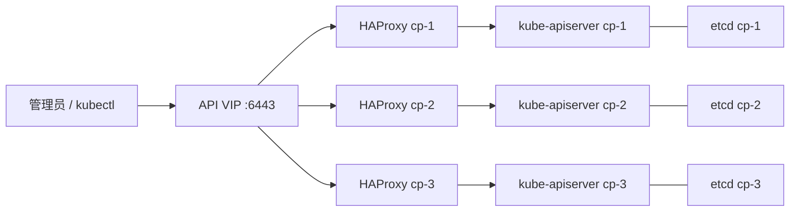

# Debian 三控制面 kubeadm 高可用集群部署与证书自动化复盘

> **归档说明（2026-09-11）**：本文与《Debian 三控制面 kubeadm 高可用集群部署复盘》记录的是同一次基础集群建设，内容高度重叠。后者为本目录的基础设施主文；本文保留作部署过程与故障证据的归档，不再作为独立的当前实施入口。网络最终状态以《Calico 从 VXLAN 迁移到 BGP 与 IP-in-IP CrossSubnet 实践》为准。

本文记录一次从零部署并反复修复的 Kubernetes 高可用实践。目标是三台 Debian 控制面节点采用 kubeadm stacked etcd 拓扑，通过 HAProxy + Keepalived 提供稳定 API VIP，使用 Calico 网络，并为公网域名启用 cert-manager 自动续期。

文中的用户名、域名、内网地址、密码、Cloudflare Token 和证书材料均已脱敏。示例地址使用 `192.168.50.0/24`，不应直接照搬到生产环境。

# 目标与最终状态

最终集群为 Kubernetes `v1.36.4`，控制面为三节点 stacked etcd：

```text
cp-1  192.168.50.11  控制面 + 可调度工作负载
cp-2  192.168.50.21  控制面 + 可调度工作负载
cp-3  192.168.50.51  控制面专用

API VIP: 192.168.50.100:6443
Pod CIDR: 10.244.0.0/16
Service CIDR: 10.96.0.0/12
```

交付时的验证标准如下：

- 三个 Node 都为 `Ready`。
- 三个 etcd、kube-apiserver、controller-manager、scheduler 静态 Pod 都是 `Running`。
- Calico、CoreDNS、kube-proxy 与 cert-manager 全部就绪。
- VIP 仅由一个节点持有；三个节点访问 `https://VIP:6443/readyz` 都返回 `ok`。
- `cp-1`、`cp-2` 无控制面 NoSchedule 污点；`cp-3` 保留污点。
- 临时镜像代理在部署结束后彻底移除。

# 架构与关键决策



**运行时选择。** 使用发行版 containerd，并将 CRI 的 runc cgroup 驱动固定为 `systemd`。kubelet 与运行时若 cgroup 驱动不一致，常表现为节点注册或资源管理异常，因此这不是可选优化。

**控制面入口。** kubeadm 的 `controlPlaneEndpoint` 必须指向 VIP，而不是某一个控制面 IP。否则第一个节点故障后，已有 kubeconfig 与新节点 join 都可能失去入口。

**版本选择。** 本次采用已验证的 `v1.36.4`，kubeadm 配置 API 使用 `kubeadm.k8s.io/v1beta4`。升级版本时应先核对 kubeadm 配置 API，而不是只替换二进制版本号。

# 部署顺序

Ansible 将流程拆成可重入的阶段：

1. 小写化并固定节点名，写入节点解析。
2. 加载 `overlay`、`br_netfilter`，持久化 sysctl，禁用 swap 与 zram swap。
3. 安装 containerd，生成默认配置后将 `SystemdCgroup=true` 和 CNI 目录设为 `/opt/cni/bin`。
4. 安装并校验 kubeadm、kubelet、kubectl、crictl；安装与 Calico 匹配的 calicoctl。
5. 安装 HAProxy、Keepalived，先验证 VIP 才执行 kubeadm。
6. 初始化首控制面，生成短期 join token 与 upload-certs 证书密钥。
7. 串行加入另两个 stacked etcd 控制面。
8. 安装 Calico，等待所有节点与系统 Pod Ready。
9. 移除临时 containerd systemd proxy drop-in。

# 临时代理如何安全使用

受限网络下，镜像拉取需要代理。临时代理只放在 containerd 的 systemd drop-in：

```ini
[Service]
Environment="HTTP_PROXY=http://proxy.example:7897"
Environment="HTTPS_PROXY=http://proxy.example:7897"
Environment="NO_PROXY=127.0.0.1,localhost,192.168.50.0/24,10.244.0.0/16,10.96.0.0/12,.svc,.cluster.local"
```

关键点是把节点网段、VIP、Pod/Service CIDR 和集群域名放进 `NO_PROXY`。否则 API、etcd 或服务流量可能被错误送到外部代理。

最终验证所有 Pod Ready 后，删除 `/etc/systemd/system/containerd.service.d/proxy.conf`，执行 `daemon-reload` 并重启 containerd。最后用 `systemctl show containerd --property=Environment` 确认没有代理残留。

# 踩坑复盘：旧二进制没有被升级

**现象。** 配置已改为新版本，但节点仍报告旧 kubeadm 版本。

**根因。** 安装任务仅依据 `/usr/local/bin/kubeadm` 是否存在决定跳过下载。文件存在不代表版本正确。

**修复。** 下载任务使用固定版本 URL 与上游 SHA256 文件校验，并允许目标文件更新。crictl 同样不能仅用 `creates` 判断存在性。

**结论。** 版本管理的幂等性应基于“期望版本”，不是“路径是否存在”。

# 踩坑复盘：控制面 join 在复制 kubeconfig 时中断

**现象。** 首控制面已健康，但两个待加入节点没有 `/etc/kubernetes/kubelet.conf`，也没有新 etcd 成员。

**根因。** join 角色在 `kubeadm join` 之前复制 `/etc/kubernetes/admin.conf` 到 `/root/.kube/config`。该文件只有 join 成功后才存在。

**修复。** 将 root kubeconfig 安装移动到 join 成功之后。首控制面用自己的 admin.conf，后续控制面用本机 join 后生成的 admin.conf。

**结论。** 不要把“加入后才产生的文件”作为 join 前任务的输入。检查 `kubelet.conf` 是否存在是更可靠的 join 幂等标志。

# 踩坑复盘：kubeadm token 命令等待

**现象。** `kubectl --kubeconfig=/etc/kubernetes/admin.conf get --raw=/readyz` 为 `ok`，但生成 join token 的 kubeadm 任务等待。

**根因。** kubeadm 命令执行时没有显式指定 kubeconfig，执行环境可能选择了不适用的默认上下文。

**修复。** 对 `kubeadm token create` 与 `kubeadm init phase upload-certs` 显式设置：

```yaml
environment:
  KUBECONFIG: /etc/kubernetes/admin.conf
```

凭据文件只保存在引导节点，权限为 `0600`，并在所有声明的控制面加入后撤销或清理。

# Calico 与节点地址自动探测

Calico 已经运行并让所有节点 Ready，但使用 `calicoctl get nodes -o wide` 时发现 BGP IPv4 自动探测地址可能与 Kubernetes Node InternalIP 不一致。例如有节点选中了 VPN 网卡或相邻地址，而不是管理网 IP。

如果节点同时存在 LAN、VPN、Overlay 等多块网卡，建议在 Tigera `Installation` 中明确自动探测规则：

```yaml
spec:
  calicoNetwork:
    nodeAddressAutodetectionV4:
      kubernetes: NodeInternalIP
```

应用前应保留控制台入口，并逐节点观察 Calico DaemonSet 与跨节点 Pod 连通性；改变节点地址探测会重建网络路径，不应在没有验证窗口时盲目修改。

# 证书体系：三类证书，三种责任边界

**kubelet 证书。** kubelet 客户端证书属于 Kubernetes CSR 体系，不应由 cert-manager 接管。确认 kubelet 配置中：

```yaml
rotateCertificates: true
```

并通过以下命令确认 CSR 已被签发：

```bash
kubectl get csr
```

**kubeadm 控制面 PKI。** API Server、etcd、front-proxy 等证书位于每个控制面节点的 `/etc/kubernetes/pki`。默认叶子证书约一年有效，CA 约十年有效。检查命令：

```bash
sudo kubeadm certs check-expiration
```

续期应使用 kubeadm 的 `kubeadm certs renew`，并以 HA 滚动方式逐台执行：备份、续期、重启该节点静态控制面组件、验证 VIP/API/etcd，再处理下一台。cert-manager 不管理这些宿主机文件。

**公网业务证书。** cert-manager 负责 `Certificate` CR。通配符证书必须使用 ACME DNS-01；本次使用 Cloudflare API Token 的 Kubernetes Secret，不把 Token 写进 Git 或 Ansible 普通变量。

```yaml
apiVersion: cert-manager.io/v1
kind: Certificate
metadata:
  name: example-com-wildcard
  namespace: infrastructure
spec:
  secretName: example-com-tls
  issuerRef:
    name: letsencrypt-cloudflare-prod
    kind: ClusterIssuer
  dnsNames:
    - example.com
    - "*.example.com"
  duration: 2160h
  renewBefore: 720h
```

签发完成后应检查 `Certificate` 为 Ready，TLS Secret 类型为 `kubernetes.io/tls`，并记录 `.status.notAfter` 与 `.status.renewalTime`。

# 普通用户访问与 calicoctl

部署后通常需要给日常管理员使用 kubectl 与 calicoctl。这里存在权限取舍：

- 最小权限方案：创建单独 ServiceAccount、RBAC 和 kubeconfig，仅授予观察或网络策略管理权限。
- 高权限方案：复制 `admin.conf` 到普通用户的 `~/.kube/config`，即 cluster-admin。

本次在明确授权后采用第二种方案，目录权限为 `0700`，配置文件权限为 `0600`：

```bash
kubectl get nodes -o wide
calicoctl get nodes -o wide
```

旧 kubeconfig 如果来自重建前的集群，会因为 CA 不匹配出现 `x509: certificate signed by unknown authority`。不要忽略该错误或用 `--insecure-skip-tls-verify` 绕过；应在获得授权后用当前 admin.conf 覆盖并备份旧文件，或改用最小权限新配置。

# 最终验收命令

```bash
kubectl get nodes -o wide
kubectl get pods -A -o wide
kubectl get --raw=/readyz
kubectl -n infrastructure get certificate,secret
sudo kubeadm certs check-expiration
calicoctl get nodes -o wide
```

VIP 持有者可在每个控制面执行：

```bash
ip -4 -o addr show | grep '192.168.50.100'
curl --noproxy '*' -sk https://192.168.50.100:6443/readyz
```

# 总结

高可用 kubeadm 部署的难点不只是 `kubeadm init`：入口 VIP、CRI cgroup、节点地址选择、join 凭据生命周期、临时代理清理和证书责任边界都会决定集群是否真的可维护。

最值得复用的经验有三条：把幂等性建立在版本和状态上；把控制面 join 设计为可中断、可恢复的串行流程；把 kubelet、kubeadm PKI 与公网业务证书交给各自正确的管理机制。
