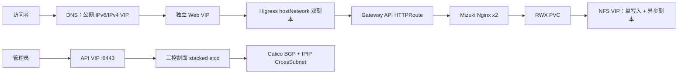

# 面向静态博客的 Kubernetes 高可用架构：从集群基座到业务发布

# 最终目标

本文是本目录的导航与架构判定基线。最终交付不是若干独立的 Kubernetes 组件，而是一条可验证的静态博客发布链路：三控制面集群在单节点故障后仍可管理；公网请求能抵达健康的 Higress 数据面；博客的静态内容可由两个 Web 副本读取；域名、证书、监控和备份边界明确。

当前架构的核心链路如下：

这里有三个不能混淆的 VIP：`API VIP` 只承载 Kubernetes API 的 `6443`；`Web VIP` 承载公网 `80/443` 并应随健康 Gateway 故障切换；`NFS VIP` 只承载共享静态资源。数据库的 `5432/6379` 则经独立的 HAProxy VIP 与独立 TCP Gateway 暴露，不能复用 Web 入口的职责。

# 按技术演进重排的阅读路线

**阶段一：建立可恢复的集群基座。** 先阅读《Debian 三控制面 kubeadm 高可用集群部署复盘》。这一阶段确定三控制面 stacked etcd、HAProxy + Keepalived API VIP、containerd `systemd` cgroup、证书边界和可重入的控制面 join。Rootless containerd 是随后可选的运维隔离能力，见《Kubernetes 节点上部署 Rootless containerd 与 nerdctl 的实践》；它不参与 Kubernetes CRI。

**阶段二：把底层网络从“可用”演进为“符合裸机局域网拓扑”。** 初始集群可使用 VXLAN 让 CNI 工作，但当前方案以《Calico 从 VXLAN 迁移到 BGP 与 IP-in-IP CrossSubnet 实践》为准：同子网 Pod 流量走 BGP 原生下一跳，跨子网才使用 IP-in-IP。必须先固定 `NodeInternalIP` 地址探测、建立全部 BGP 邻居，再原地切换唯一 IPPool。

**阶段三：构建高可用公网入口与域名能力。** 《ddns-go 二开：为漂移 IPv6 VIP 提供非主机地址 DDNS》解决动态 IPv6 前缀下 DNS 应指向服务 VIP 而不是某个节点 GUA 的问题。随后阅读《Kubernetes 高可用集群部署 Higress Gateway API、WAF 观察模式与 VRRP 亲和》：Web Gateway 使用两个 `hostNetwork` 副本直绑节点 `80/443`，需要独立可漂移的 Web IPv6 VIP；WAF 从 `DetectionOnly` 起步。对于节点本地服务，使用《使用 Higress Gateway API 将本地 HTTP 服务经 VIP 发布到 HTTPS 域名》的无 selector Service + EndpointSlice + 服务 VIP 模式，绝不让 Gateway 后端指向 Pod 的 `127.0.0.1`。

**阶段四：按数据一致性要求选择持久化。** 数据库使用《三节点 Kubernetes 上以 Local PV 部署 PostgreSQL 18 与 Valkey 9 高可用集群》：每个副本保有 Local PV，借助 CNPG 同步复制和 Valkey Sentinel 取得业务级高可用。静态资源使用《三节点 Kubernetes 集群以 Keepalived、lsyncd 和 NFS Provisioner 部署静态资源共享》：NFS VIP 与单写入端提供入口高可用，lsyncd 仅提供异步镜像，不能宣称零 RPO。

**阶段五：让业务与运维能力落地。** 《Kubernetes 上部署 Loki、Prometheus、Grafana 与 Alertmanager，并排查 Higress WAF 登录与前端加载故障》建立可观测性；其组件配置和排障结论有效，但入口以阶段三的 hostNetwork Web Gateway 为准。最后阅读《Mizuki 静态博客部署到 Kubernetes：NFS 动态卷与 Higress 根域、通配域路由》：使用 `nfs-ha` RWX PVC、两个 Nginx 副本，并为根域和通配子域分别配置 Gateway Listener 与 HTTPRoute。

# 当前方案与已归档方案

| 主题 | 已归档或仅适用于过渡的做法 | 当前最终方案 | 转变原因 |
| --- | --- | --- | --- |
| 集群主文 | 两篇 kubeadm 复盘并列作为入口 | 《Debian 三控制面 kubeadm 高可用集群部署复盘》为主文；另一篇保留故障证据 | 内容高度重叠会让读者误以为是两套基础架构 |
| Calico | VXLAN 全封装、BGP 关闭 | BGP Enabled + `IPIPCrossSubnet` + 唯一 IPPool | 同子网裸机流量无需封装，跨子网仍保留封装兜底 |
| Web 入口 | HAProxy 将公网 `80/443` 转到共享 Gateway NodePort | 两个 Higress `hostNetwork` 副本直绑 `80/443`，DNS 指向独立 Web VIP | IPv6 单栈 NodePort 不能替代宿主机双栈监听；API 负载均衡器不应兼任 Web 入口 |
| WAF 缓冲 | 仅为 Grafana、Prometheus、Alertmanager 逐域名增加缓冲 | 对 Higress Gateway 全部虚拟主机统一 `4 MiB` 上限 | 新增域名会重现 `response_payload_too_large`，全局响应体检查需要统一策略 |
| 节点本地服务 | Gateway 后端使用 `127.0.0.1` 或固定节点 IP | 无 selector Service + EndpointSlice 指向 Keepalived 服务 VIP | Pod localhost 不等于宿主机；固定节点地址不具备故障切换语义 |
| 静态资源 | 双向文件同步或把 lsyncd 当同步存储 | 单写入 NFS VIP + 单向 lsyncd/rsync + 灾备副本 | 避免双写循环；明确异步复制的 RPO 边界 |
| 数据库持久化 | 将数据库置于共享 NFS 或期待 Local PV 自动漂移 | Local PV + 数据库原生复制 + 独立备份 | 数据库复制协议提供副本与选主；Local PV 提供性能但不提供跨节点卷迁移 |

# 文档去重与维护规则

`kubeadm-ha-kubernetes-deployment-postmortem.md` 是高重叠归档稿，读者应从《Debian 三控制面 kubeadm 高可用集群部署复盘》进入基础集群。`三节点Kubernetes集群以Keepalived、lsyncd和NFS部署静态资源共享.md` 与 `three-node-nfs-ha-lsyncd-kubernetes-provisioner.md` 为字节级重复，后者是唯一维护入口。

后续新增文章应直接描述一个明确阶段目标，例如“为静态站点提供可故障切换的 RWX 卷”或“将节点本地服务安全接入 Gateway API”。不要用“第 X 篇”或依赖发布日期表达先后关系；应在开头写清前置阶段、当前决策和被替代的方案。

# 最终验收顺序

1. API VIP 任一时刻只在一个控制面节点持有，三个控制面与 etcd 健康。
2. Calico BGP 邻居全部 `Established`，唯一 IPPool 为 `ipipMode: CrossSubnet`、`vxlanMode: Never`。
3. 两个 Higress Web Gateway 分布在不同节点，Web VIP 故障切换后仍能经 IPv4/IPv6 访问 `80/443`。
4. NFS VIP 只由一个候选节点导出，NFS Provisioner 可创建 `nfs-ha` PVC；承认并监控复制延迟。
5. Mizuki 的两个副本均可读取 RWX PVC；根域和通配域 HTTPS 请求均返回实际博客内容而非 Higress 欢迎页。
6. Grafana、Prometheus、Alertmanager 的前端资源完整下载，Gateway 日志不再出现 `response_payload_too_large`。

# 总结

最终架构并非所有组件都使用同一种“高可用”。控制面依赖三成员 etcd 与 API VIP；网络依赖 BGP 与跨子网封装；Web 入口依赖双数据面与独立公网 VIP；数据库依赖原生复制；静态内容接受异步副本的 RPO。先明确每一层的故障语义，再选择组件，才能让博客发布链路既可用又不夸大一致性承诺。
