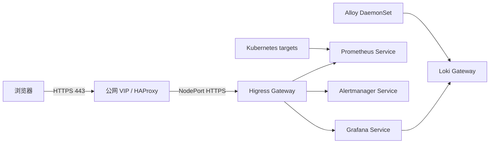

# 前言

本文记录在一个已有 Higress Gateway API 的 Kubernetes 集群中部署 Prometheus、Grafana、Loki、Alertmanager 与 Alloy 的实践。目标不是“把 Pod 跑起来”，而是获得一套可以通过 HTTPS 实际访问、能采集日志、可以登录 Grafana、并且后续 Ansible 重跑不会破坏入口的监控系统。

最终对外仅发布三个受 TLS 保护的 UI/API 入口：Grafana、Prometheus 与 Alertmanager。Loki 作为日志后端只由 Grafana 和集群内部组件访问，避免把原始日志查询接口直接暴露到公网。

# 环境与架构

以下版本与地址均应按实际环境替换；示例中不包含真实密码、内网 IP 或证书私钥。

```text
Kubernetes: v1.36.x
Higress: 2.2.4
Gateway API: v1.6.2
kube-prometheus-stack: 87.21.0
Loki: 3.7.x（Helm Chart 18.5.0）
Alloy: 1.19.x（Helm Chart 1.12.1）
存储: 静态 Local PV
```



**边界。** Grafana 负责统一认证与日志查询；Prometheus 和 Alertmanager 是否需要额外认证取决于组织的网络边界与访问策略。公网部署前应评估是否只允许 VPN、零信任代理或身份网关访问。

# 存储与组件部署

Prometheus、Loki、Grafana 和 Alertmanager 分别使用独立 StorageClass 与静态 Local PV。这样可以明确数据落盘位置与容量，但也意味着 PVC 绑定的节点发生永久磁盘损坏时，不能像网络存储一样自动迁移。

```yaml
apiVersion: storage.k8s.io/v1
kind: StorageClass
metadata:
  name: monitoring-grafana-local
provisioner: kubernetes.io/no-provisioner
volumeBindingMode: WaitForFirstConsumer
reclaimPolicy: Retain
```

Grafana 不把管理员密码写进 Git。部署任务先检查 Secret 是否已存在；仅在首次部署时生成随机密码，并让 Helm values 通过 `admin.existingSecret` 引用它。

```yaml
grafana:
  admin:
    existingSecret: monitoring-grafana-admin
  service:
    type: ClusterIP
  persistence:
    enabled: true
    storageClassName: monitoring-grafana-local
```

Loki 使用单体模式与本地文件系统存储，适合小型集群或先行验证。生产环境若要求高吞吐、跨节点容灾或更长留存周期，应评估对象存储和分布式读写组件，而不是简单扩大本地盘。

Alloy 以 DaemonSet 部署，从各节点 `/var/log/pods` 采集容器日志，并附加 Pod、Namespace、Container 等 Kubernetes 标签。部署后应检查 Alloy 没有 `failed to tail file` 或 `level=error`，并从 Loki 标签 API 确认确实存在日志流。

```bash
kubectl -n monitoring get pods
kubectl -n monitoring get pvc
kubectl -n monitoring get pv
```

预期所有状态型 PVC 为 `Bound`，Prometheus、Grafana、Loki、Alertmanager 与 Alloy Pod 均为 `Running`。

# 通过 Higress 发布 HTTPS

证书由 cert-manager 管理的通配符证书提供。由于 Higress 的 TLS Secret 引用需要位于 Gateway 命名空间，部署任务将证书 Secret 同步到 `higress-system`，Gateway HTTPS listener 在 `443` 引用该本地 Secret。

```yaml
apiVersion: gateway.networking.k8s.io/v1
kind: HTTPRoute
metadata:
  name: grafana
  namespace: monitoring
spec:
  parentRefs:
    - name: higress-gateway
      namespace: higress-system
      sectionName: https
  hostnames:
    - grafana.example.com
  rules:
    - backendRefs:
        - name: prometheus-grafana
          port: 80
```

Prometheus 和 Alertmanager 以相同方式路由到各自 ClusterIP Service。外部负载均衡器将标准 `443` 转发到 Higress HTTPS NodePort；这样用户不需要在 URL 中附带 NodePort。

应用路由后，不应只检查 `Gateway` 已创建，还要检查 `Accepted`、`ResolvedRefs` 和 `Programmed` 条件：

```bash
kubectl -n higress-system get gateway higress-gateway -o yaml
kubectl -n monitoring get httproute
```

# 验证不能只看 HTTP 状态码

最初的验证只检查了首页返回 `200` 或 `302`、证书 SAN 和 Gateway 条件。这不足以证明浏览器可用：现代 Grafana、Prometheus 与 Alertmanager 都依赖大体积 JavaScript 入口文件。

应从外部网络完整下载实际脚本，而不是只请求响应头或首页 HTML：

```bash
curl --ipv6 --fail --silent --show-error -o /dev/null \
  -w '%{http_code} %{size_download}\n' \
  https://grafana.example.com/public/build/<grafana-app>.js

curl --ipv6 --fail --silent --show-error -o /dev/null \
  -w '%{http_code} %{size_download}\n' \
  https://prometheus.example.com/assets/<prometheus-app>.js
```

同时检查服务 API：

```bash
curl --fail https://grafana.example.com/api/health
curl --fail https://prometheus.example.com/api/v1/status/buildinfo
curl --fail https://alertmanager.example.com/api/v2/status
```

首页返回成功但 JS 下载为零字节或不完整时，浏览器仍可能显示空白页、持续加载或登录页异常；这种情况不能判定入口正常。

# 踩坑一：WAF DetectionOnly 仍导致前端资源被截断

**触发条件。** Higress 全局启用了 go-waf，规则引擎为 `SecRuleEngine DetectionOnly`，并加载 OWASP CRS。Grafana、Prometheus、Alertmanager 的首页 HTML 可以返回，但较大的前端脚本加载失败。

**现象与证据。** 浏览器无法稳定完成页面渲染；通过公网下载 JS 时获得 `HTTP/2 200`，但下载量为 `0`，curl 报错：

```text
curl: (18) end of response with ... bytes missing
```

Higress Gateway access log 则给出关键证据：

```text
response_code_details="response_payload_too_large"
```

将同一文件直接请求 Grafana ClusterIP 可以完整下载，因此可以排除 Grafana、TLS 证书、HAProxy 和后端 Service 本身。

**为什么 DetectionOnly 仍会造成失败。** DetectionOnly 仅表示 WAF 规则命中不会执行 `deny` 或 `block`。go-waf/Coraza 仍会为了进行响应体阶段检测而暂停 Envoy filter chain，并缓存完整响应。触发的是 Envoy 缓冲水位，不是某条安全规则将 JavaScript 判为恶意。

**无效尝试。** 仅提高 Gateway Listener 或 Upstream Cluster 的 `per_connection_buffer_limit_bytes` 没有解决问题。该项影响连接层读取与流控，而实际报错来自 HTTP FilterManager 对暂停响应的缓冲。

**最终修复。** Envoy 的 `request_body_buffer_limit` 名称容易造成误解：它不仅用于请求重试缓冲，HTTP Connection Manager 也用该值提高 FilterManager 缓冲上限。对 scoped RDS 场景，应以 `VIRTUAL_HOST` 补丁精确命中三个监控域名。

```yaml
apiVersion: networking.istio.io/v1alpha3
kind: EnvoyFilter
metadata:
  name: higress-gateway-response-buffer
  namespace: higress-system
spec:
  workloadSelector:
    labels:
      ansible.kubernetes.io/higress-gateway: "true"
  configPatches:
    - applyTo: VIRTUAL_HOST
      match:
        context: GATEWAY
        routeConfiguration:
          name: higress-rds-443.grafana.example.com
          vhost:
            name: grafana.example.com:443
      patch:
        operation: MERGE
        value:
          request_body_buffer_limit: 4194304
```

Prometheus 与 Alertmanager 各使用一条同样的补丁。`4 MiB` 高于当前最大前端资源，但仍为每个被暂停的响应设定边界；不要无上限增大该值。

Coraza 层也应有明确的响应体策略：

```yaml
secRules:
  - "SecRuleEngine DetectionOnly"
  - "SecResponseBodyLimit 4194304"
  - "SecResponseBodyLimitAction ProcessPartial"
```

这保留请求侧 OWASP CRS 检测；响应超过 4 MiB 时只检查可缓冲部分后继续转发。它的取舍是超大响应不再进行完整的响应体检测，因此应把该参数纳入 WAF 风险评审与容量规划。

**最终验证。** 配置生效后，在 Envoy config dump 中确认三个 virtual host 都出现：

```text
request_body_buffer_limit: "4194304"
```

随后完整下载三个前端入口文件，并检查 Gateway 近期日志不再出现 `response_payload_too_large`。

# 踩坑二：Grafana 账号密码正确但表单登录返回 500

**现象。** 使用 Kubernetes Secret 中的 `admin` 凭据，通过 Basic Auth 调用 `/api/user` 能得到 `200`；浏览器表单提交 `/login` 却返回：

```text
Login failed
Internal Server Error
```

**证据。** Grafana 日志包含：

```text
Failed to create session ... attempt to write a readonly database
```

因此问题不在密码、HTTPS、Cookie 或 Gateway，而在 Grafana SQLite 无法创建 session。

**根因。** Grafana 进程使用 UID/GID `472`。SQLite 数据库文件自身属于该用户，但 Local PV 的父目录是 `root:root` 且模式为 `750`。Local PV 的既有宿主机目录不一定会被 Pod 的 `fsGroup` 自动递归修正，导致 Grafana 能读取数据库但无法在目录内创建 WAL、journal 或 session 相关文件。

**修复。** 在创建 Local PV 目录的自动化中显式设置 Grafana 目录的 UID/GID 与权限：

```yaml
- name: Grant Grafana ownership of its Local PV directory
  ansible.builtin.file:
    path: "{{ monitoring_local_pv_root }}/grafana"
    state: directory
    owner: "472"
    group: "472"
    mode: "0770"
```

对已部署环境，先确认当前 PV 路径仅属于 Grafana，再修正目录权限并滚动重启 Grafana：

```bash
chown 472:472 /var/lib/kubernetes-monitoring/grafana
chmod 0770 /var/lib/kubernetes-monitoring/grafana
kubectl -n monitoring rollout restart deployment/prometheus-grafana
kubectl -n monitoring rollout status deployment/prometheus-grafana --timeout=5m
```

路径、Deployment 名称必须以实际环境为准。不要对整个监控数据根目录执行递归 `chown`，否则可能改变 Prometheus、Loki 或 Alertmanager 数据目录的权限。

修复后的验收应使用与浏览器相同的表单登录 API，确认响应包含 `Logged in` 和 session Cookie；不要在文档、终端历史或日志中输出管理员密码。

# Loki 的访问边界

Loki 的内部标签 API 返回 `container`、`namespace`、`pod`、`filename`、`stream` 等标签，说明 Alloy 已写入日志流。推荐访问路径是：Grafana 登录后进入 Explore，数据源选择 Loki。

不建议直接发布 `loki.example.com`，因为 Loki HTTP API 可以直接查询原始日志。确有 API 集成需求时，应在单独 HTTPRoute 前增加明确的认证、授权、审计和网络限制，而不是将内部 Loki Gateway 直接暴露为公网匿名接口。

# 验收清单

```bash
# 组件、卷和路由
kubectl -n monitoring get pods,pvc
kubectl -n monitoring get httproute
kubectl -n higress-system get gateway,envoyfilter

# 从外网检查 HTTPS、前端资源与服务 API
curl -I https://grafana.example.com/login
curl --fail -o /dev/null https://grafana.example.com/public/build/<app>.js
curl --fail https://grafana.example.com/api/health

# Gateway 是否仍有响应体截断
kubectl -n higress-system logs -l app=higress-gateway --since=10m \
  | grep response_payload_too_large
```

最后一条命令没有输出，才说明近期验证流量没有再触发该错误。对于 Grafana，还要进行一次真实表单登录；Basic Auth 可用不能证明 SQLite session 写入正常。

# 总结

这次部署最重要的经验不是某一份 Helm values，而是把可用性验证延伸到真实用户链路：证书与 HTTP 状态码正确，只代表入口的一小部分正常；必须验证前端静态资源、应用 API、持久卷写入和真实登录 session。

面对 `response_payload_too_large`，先用“后端直连成功、Gateway 路径失败”的对照实验证实故障位置，再检查 Envoy config dump 中实际生效的虚拟主机配置。面对 Grafana `500 Login failed`，先区分凭据认证与 session 持久化；日志中的 SQLite 错误通常比反复重置密码更接近根因。
