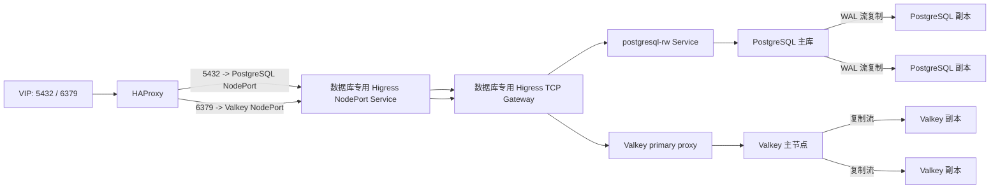

# 三节点 Kubernetes 上以 Local PV 部署 PostgreSQL 18 与 Valkey 9 高可用集群

# 目标与边界

本文记录一个三节点 Kubernetes 集群上的数据库部署实践：PostgreSQL 使用 CloudNativePG（CNPG）运行三个实例，Valkey 使用一主两从和三个 Sentinel。每个数据库实例都落在本机 Local PV 上，副本之间由数据库协议复制数据，而不是让多个节点共享同一块数据卷。

目标是承受单节点故障，并通过外部 VIP 暴露 PostgreSQL 的 `5432` 与 Valkey 的 `6379`。本文中的地址、密码和 NodePort 都使用占位符；不要把真实凭据或内网拓扑直接放进博客。

这里的“高可用”指服务层和数据副本层的高可用，不代表 Local PV 自身可以跨节点漂移。节点磁盘永久损坏时，需要替换节点或磁盘，并让数据库从健康副本重新同步；备份仍是独立必需项。

# 环境与拓扑

实际环境使用 Kubernetes `v1.36.4`、PostgreSQL `18.4`、Valkey `9.1.2`、CloudNativePG `1.30.0` 和 Higress `2.2.4`。三个节点中两个可调度工作负载，另一个保留 control-plane `NoSchedule` 污点。数据库 Pod 通过 Toleration 允许落到该节点，但都设置资源 requests/limits，避免无边界抢占控制面资源。



每台节点准备两块逻辑 Local PV 路径：一块给 PostgreSQL，一块给 Valkey。StorageClass 使用 `kubernetes.io/no-provisioner`、`WaitForFirstConsumer` 和 `Retain`：前者明确声明静态 Local PV，第二项确保卷会结合调度节点再绑定，最后一项避免删除 PVC 时误删数据目录。

```yaml
apiVersion: storage.k8s.io/v1
kind: StorageClass
metadata:
  name: postgresql-local
provisioner: kubernetes.io/no-provisioner
volumeBindingMode: WaitForFirstConsumer
reclaimPolicy: Retain
```

# 为什么 Local PV 仍然能做数据库高可用

Local PV 不能跨节点挂载，但数据库副本不是共享同一个数据目录。正常运行时，三个 PostgreSQL 实例各自把数据写入本节点的 Local PV；主库通过 WAL 流复制把变更同步给两个副本。CNPG 配置 `minSyncReplicas: 1` 和 `maxSyncReplicas: 2`，因此至少有一个同步副本确认后，主库才确认提交。

Valkey 同理：主节点写入自己的 AOF，两个副本分别复制并落到各自 Local PV。三个 Sentinel 监测主库并在故障时提升副本。这个组合适合三节点、小规模、重视本地盘性能的集群；它不替代异机备份、对象存储备份或异地容灾。

# PostgreSQL 部署

CNPG Cluster 的关键是三实例、同步复制、强制 Pod 反亲和和对 control-plane 污点的容忍：

```yaml
apiVersion: postgresql.cnpg.io/v1
kind: Cluster
metadata:
  name: postgresql
  namespace: databases
spec:
  instances: 3
  imageName: ghcr.io/cloudnative-pg/postgresql:18.4-system-trixie
  minSyncReplicas: 1
  maxSyncReplicas: 2
  storage:
    storageClass: postgresql-local
    size: 50Gi
  affinity:
    enablePodAntiAffinity: true
    topologyKey: kubernetes.io/hostname
    podAntiAffinityType: required
    tolerations:
      - key: node-role.kubernetes.io/control-plane
        operator: Exists
        effect: NoSchedule
```

CNPG 默认会创建一个非特权的 `app` 初始数据库和角色，这是 CNPG 的 convention-over-configuration 行为，不是测试数据，也不是应用应直接复用的生产账户。业务数据库、业务角色与最小权限授权应由独立且受版本控制的清单创建。

CNPG 会维护三个 Service：`postgresql-rw` 始终指向当前主库，`postgresql-ro` 指向副本，`postgresql-r` 指向全部实例。对外写入必须指向 `postgresql-rw`。

# Valkey 与 Sentinel 部署

Valkey StatefulSet 使用三个数据 Pod；序号 `0` 初始为主节点，`1` 和 `2` 初始为副本。每个 Pod 都包含一个 Sentinel sidecar，因此 Sentinel 数量也是三个。数据 Pod 通过 required PodAntiAffinity 分别调度到不同节点。

```yaml
affinity:
  podAntiAffinity:
    requiredDuringSchedulingIgnoredDuringExecution:
      - labelSelector:
          matchLabels:
            app.kubernetes.io/name: valkey
        topologyKey: kubernetes.io/hostname
```

应用不应把一个普通 Service 随机负载到三台 Valkey 数据 Pod：故障切换后，其中两台是只读副本，写请求会收到 `READONLY`。本实践增加了两个 HAProxy 副本。它们使用 TCP health check 执行认证和 `INFO replication`，只把新连接转发给报告 `role:master` 的实例；Higress 的 `6379` TCPRoute 后端引用这个稳定的代理 Service。

这意味着主从切换时已有长连接仍可能断开，客户端必须实现标准的重连逻辑；新连接会被代理导向新主库。

# 通过 Higress Gateway API 暴露 TCP

HTTPRoute 不适用于 PostgreSQL 或 Valkey。需要在 Gateway 上建立两个 `TCP` Listener，并分别绑定 TCPRoute。Gateway API 的 TCPRoute 是 L4 透传资源；同一个 TCP Listener 端口只能挂一条 TCPRoute。[Gateway API TCP routing 文档](https://gateway-api.sigs.k8s.io/guides/user-guides/tcp/) 与 [Higress TCPRoute 配置文档](https://higress.ai/docs/latest/ops/how-tos/tcp-route/) 都说明了这一模式。

最终架构不让数据库流量复用原来承载 `80/443` 的共享 Higress Pod。开启 Higress 的 `enableGatewayAPIDeploymentController` 后，为数据库创建独立的 `database-tcp-gateway`。控制器会自动创建对应的 Higress/Envoy Deployment 与 Service；共享 Web Gateway 则显式绑定回原 Service，继续只负责 HTTP/HTTPS。

```yaml
apiVersion: gateway.networking.k8s.io/v1
kind: Gateway
metadata:
  name: database-tcp-gateway
  namespace: higress-system
spec:
  gatewayClassName: higress
  listeners:
    - name: postgresql
      protocol: TCP
      port: 5432
    - name: valkey
      protocol: TCP
      port: 6379
---
apiVersion: gateway.networking.k8s.io/v1alpha2
kind: TCPRoute
metadata:
  name: postgresql-external
  namespace: databases
spec:
  parentRefs:
    - name: database-tcp-gateway
      namespace: higress-system
      sectionName: postgresql
  rules:
    - backendRefs:
        - name: postgresql-rw
          port: 5432
```

数据库专用 Gateway 的 Service 使用固定 `NodePort`，并通过 node affinity 与 required PodAntiAffinity 使两个副本分别位于两个 VIP 后端节点。VIP 本机 HAProxy 再监听标准端口，并负载到两个 NodePort 后端：

```text
<VIP>:5432 -> HAProxy -> <Gateway 节点 A>:<POSTGRES_NODEPORT>
                       -> <Gateway 节点 B>:<POSTGRES_NODEPORT>
<VIP>:6379 -> HAProxy -> <Gateway 节点 A>:<VALKEY_NODEPORT>
                       -> <Gateway 节点 B>:<VALKEY_NODEPORT>
```

HAProxy 的核心配置如下。`check` 是 TCP 存活检查；PostgreSQL 主库选择由后端 `postgresql-rw` Service 完成，Valkey 主库选择仍由集群内 HAProxy 的 `INFO replication` 检查完成。

```haproxy
frontend postgresql_database
  bind <VIP>:5432
  default_backend postgresql_database_backends

backend postgresql_database_backends
  option tcp-check
  balance leastconn
  server gateway_a <NODE_A_IP>:<POSTGRES_NODEPORT> check
  server gateway_b <NODE_B_IP>:<POSTGRES_NODEPORT> check
```

Valkey 使用同样的结构，仅将前端端口和后端 NodePort 换为 `6379` 与 `<VALKEY_NODEPORT>`。先验证两个节点 NodePort 都打开，再扫描 `<VIP>:5432,6379`；只有两步都成功，才说明“数据库 → 专用 Gateway → HAProxy VIP”链路完整。

# 部署凭据与执行方式

密码不进入 Git，也不通过 `--extra-vars` 传入以避免落入 Shell 历史。使用 Ansible Vault 文件：

```yaml
---
database_postgresql_superuser_password: "<POSTGRES_PASSWORD>"
database_valkey_password: "<VALKEY_PASSWORD>"
```

将其保存为 `group_vars/all/vault.yml` 并加密后执行：

```bash
ansible-playbook -b -i inventory/hosts.yml \
  --ask-vault-pass deploy_databases.yml
```

此次实践中，仓库共享变量位于 playbook 根目录的 `group_vars/`，而 Ansible 同时会从 inventory 邻近目录寻找变量。为了避免变量未加载，部署 playbook 显式声明了 `vars_files`，加载 `group_vars/all.yml` 和加密的 `group_vars/all/vault.yml`。

# 验证清单

首先验证副本数量、PVC 绑定和节点分布：

```bash
kubectl -n databases get pods,pvc -o wide
kubectl get pv
kubectl -n databases get cluster postgresql \
  -o jsonpath='primary={.status.currentPrimary} ready={.status.readyInstances}{"\n"}'
```

预期 PostgreSQL 三个实例与 Valkey 三个数据 Pod 分别位于三台节点，且每个 PVC 绑定到同名节点的 Local PV。

再确认同步复制和 Sentinel 仲裁：

```bash
kubectl -n databases exec postgresql-2 -- \
  psql -U postgres -d postgres -Atc 'show synchronous_standby_names'

kubectl -n databases exec valkey-0 -c sentinel -- \
  valkey-cli -p 26379 SENTINEL master mymaster
```

PostgreSQL 输出应包含同步副本集合；Sentinel 输出应包含 `flags master`、至少两个 `num-slaves`、`num-other-sentinels 2` 与 `quorum 2`。必要时再分别对三个数据 Pod 执行 `INFO replication`，确认恰有一个 `role:master`。

最后检查 Gateway API 状态。不要用通用的 `kubectl wait --for=condition=Accepted tcproute/...` 作为唯一判断：本次 Gateway API 实现把 Route 条件放在 `status.parents[].conditions`，通用 wait 可能一直等到超时。应直接读取路由状态：

```bash
kubectl -n databases get tcproute postgresql-external -o yaml
kubectl -n databases get tcproute valkey-external -o yaml
```

两个资源都应显示 `Accepted=True` 和 `ResolvedRefs=True`。

# 受控故障切换测试

仅在没有业务写入、已确认备份策略且获得变更授权时，才测试真实故障切换。以下示例会短暂中断 PostgreSQL 写入：

```bash
kubectl -n databases delete pod <当前 PostgreSQL 主 Pod> --wait=false
```

本次测试删除了初始主库 Pod，CNPG 随后提升一个副本为新主库；原 Pod 在原节点重建并回归副本角色，最终 `readyInstances=3`。测试后必须重新检查主库名、三个 Pod Ready 状态和同步复制状态。

# 集群内外连接方式

集群内应用可使用：

```bash
psql "host=postgresql-rw.databases.svc.cluster.local port=5432 dbname=postgres user=postgres sslmode=require"
```

外部客户端使用 VIP 的标准端口：

```bash
psql "host=<VIP> port=5432 dbname=postgres user=postgres sslmode=require"
```

Valkey 外部连接经主库代理：

```bash
read -rs VALKEYCLI_AUTH
export VALKEYCLI_AUTH
valkey-cli -h <VIP> -p 6379 ping
unset VALKEYCLI_AUTH
```

返回 `PONG` 表示 VIP、NodePort、Higress TCPRoute、HAProxy 主库识别和 Valkey 认证均正常。不要使用 `-a <password>` 把密码直接写进命令行；它会出现在 Shell 历史或进程参数中。

# 实际踩坑与排查结论

**把共享 hostNetwork Higress 当作能自动监听任意 Gateway Listener。** 触发条件是共享 Higress Pod 仅以 hostNetwork 监听 `80/443`，但给同一个 Gateway 增加 `5432/6379` TCPRoute。Gateway 与 TCPRoute 可以显示 `Accepted=True`，但节点的 Envoy listener 实际仍只有 `80/443`，外部 `psql` 会得到 `Connection refused`。这说明 Gateway API 的控制面状态不是宿主机端口监听的充分证据。

排查中先确认了共享 Envoy 的 listener 列表，随后启用了 Higress Gateway API Deployment Controller。第一次尝试让自动创建的数据库 Gateway 也使用 hostNetwork，Pod 却一直 `Pending`；调度事件明确指出两台目标节点没有空闲端口。已证实的根因不是 `5432/6379` 被占用，而是两套 Envoy 都会使用固定的管理端口，例如 `15020`、`15090`、`15021`，不能与现有 hostNetwork Web Gateway 共置。

最终修复是保留独立 Higress 数据面与独立 Service，但取消数据库 Gateway 的 hostNetwork，改为两个固定 NodePort；再由现有 VIP 节点的 HAProxy 在标准 `5432/6379` 接入并转发。验证顺序是：两个 Gateway Pod Ready 且位于指定节点 → 两个 NodePort 在两个节点均为 `open` → VIP 的 `5432/6379` 也为 `open`。这比只看 TCPRoute Accepted 更能证明端到端可用。

**把 API VIP 当成已经映射数据库端口的 VIP。** Kubernetes API VIP 默认只服务控制面端口，不会自动监听 `5432/6379`。配置 HAProxy 前，VIP 的两端口扫描为 `closed`；专用 NodePort 已打开并不代表 VIP 已可达。将 HAProxy 配置部署到全部 VRRP 成员并重载后，VIP 的标准端口才变为 `open`。遇到 `Connection refused` 时，按“节点 NodePort → HAProxy backend 健康状态 → VIP 标准端口”顺序检查。

**使用 UDP 扫描 PostgreSQL 端口。** PostgreSQL 使用 TCP；`nmap -sU` 扫描 UDP 得到 `closed` 并不能说明 PostgreSQL、Higress 或 TCPRoute 异常。应使用 `nc -vz <host> <port>`、`nmap -sT -p <port> <host>` 或实际 `psql` 连接验证。

**将 TCPRoute 直接指向全部 Valkey Pod。** 这会在 Sentinel 切换后随机命中副本，导致写入失败。必须引入主库感知的代理，或者让外部客户端具备能访问所有 Sentinel 和所有数据节点的完整 Sentinel 拓扑。

**把 Gateway API Route 条件当作顶层 status.conditions。** Gateway 与 TCPRoute 的 Accepted 状态位置不同；应按实际 CRD 的 `status.parents[].conditions` 读取，避免错误的超时告警。

# 安全与运维建议

- PostgreSQL 外部连接已使用 TLS；生产客户端应进一步配置受信任 CA，并使用 `sslmode=verify-full`。
- Valkey 的本次外部 TCP 代理是明文链路。跨不可信网络前应启用 Valkey TLS，并限制 VIP 防火墙来源地址。
- `postgres` 是维护账户，不应作为业务应用账户；为每个应用创建独立数据库、角色、最小权限和轮换策略。
- `Retain` 不等于备份。应将 PostgreSQL 物理备份和 WAL 归档到独立对象存储，并定期演练恢复。
- CNPG、Valkey、Higress 或 Gateway API 升级后，重新运行 `deploy_databases.yml` 并检查 TCPRoute 与外部连接。

# 总结

三节点环境中，Local PV 与数据库原生复制并不冲突：Local PV 提供本地持久化，PostgreSQL WAL 复制和 Valkey 主从复制提供副本数据，CNPG 与 Sentinel 提供自动选主。对外暴露时，PostgreSQL 可以直接路由到动态 `postgresql-rw` Service；Valkey 则必须显式解决“当前主库是谁”的问题。把 VIP、NodePort、Gateway TCPRoute 和主库感知代理分层验证，能比只检查 Pod 是否 Running 更快定位真实故障。
