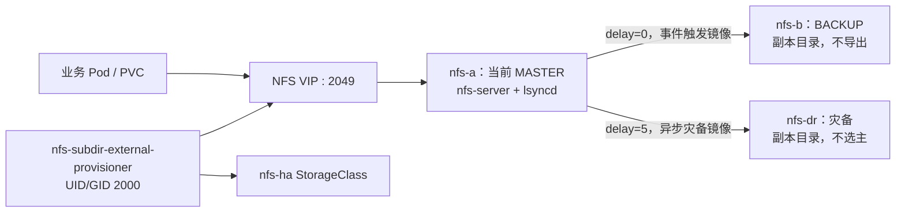

# 三节点 Kubernetes 集群以 Keepalived、lsyncd 和 NFS Provisioner 部署静态资源共享

# 结论先行

这套方案适合**业务静态资源**：两个 NFS 节点使用一个独立 VIP 提供单写入端服务，`lsyncd + rsync` 将变更近实时镜像到备用节点和一个不参与选主的灾备节点；Kubernetes 通过 `nfs-subdir-external-provisioner` 动态创建 PVC 子目录。

它提供的是“入口高可用 + 异步副本”，**不是同步复制，也不能承诺零 RPO**。如果业务不能接受最后一小段已确认写入丢失，必须使用具备同步确认、仲裁和 fencing 的分布式存储，而不是把文件级镜像包装成强一致存储。

# 环境、角色与边界

本文基于一个 Kubernetes `v1.36.4` 三控制面集群。为避免泄露生产拓扑，以下使用脱敏名称和文档网段：

```text
nfs-a     192.168.50.11   NFS 首选主节点，可提供服务
nfs-b     192.168.50.21   NFS 备用节点，可接管服务
nfs-dr    192.168.50.51   仅灾备复制，不参加选主、不导出 NFS

NFS VIP: 192.168.50.101
共享目录: /data/nfs-share
共享账户: nfsuser (UID/GID 2000)
StorageClass: nfs-ha
```

三个节点都只有本地系统盘，因此没有采用 DRBD 或共享块设备。`/data/nfs-share` 位于每台节点的本地文件系统；复制由用户态文件同步完成。Kubernetes provisioner 和共享目录使用相同 UID/GID，避免 NFS `root_squash` 下由 root 创建子目录造成业务容器无法写入。

# 架构与数据流



写入路径只有一个：持有 VIP 的节点运行 `nfs-server`。当 VRRP 状态变为 `MASTER` 时，notify 脚本先做一轮 rsync，再启动 NFS 与 lsyncd；切回 `BACKUP`、`FAULT` 或停止时会停止两者。这样备用节点不会在正常状态对外暴露一个可能已过时的目录。

`nfs-dr` 只接受来自当前主节点的复制，不拥有 VIP，也不启动 NFS 服务。它适合作为离线恢复源或后续备份链路的来源，不能被当作第三个自动接管节点。

# 为什么不把 lsyncd 当作同步复制

lsyncd 通过 inotify 观察文件系统事件，再调用 rsync 传输；`delay=0` 只表示尽快调度同步，不意味着 NFS 服务会等待远端 fsync 后才向客户端确认写入。[lsyncd 的 rsyncssh 配置说明](https://lsyncd.github.io/lsyncd/manual/config/layer4/)也表明它是同步目录树的工具，而不是分布式一致性协议。

因此，下面三个条件中任意一个发生时，都可能丢失尚未镜像的最后变更：

- 当前主节点掉电或本地盘损坏；
- 主备间链路短暂中断；
- 网络分区导致两个节点都误以为自己可以服务。

VRRP 负责漂移地址，不提供 STONITH 或存储 fencing。生产操作中应保留带外管理通道；怀疑网络分区时，先确认旧主已停止 NFS 与写入，再允许备用节点承担业务。静态资源通常可以通过重新上传或从对象存储恢复，这正是本方案的适用前提。

# 固定共享账户与 NFS 导出

Ansible 变量将共享账户、路径和客户端网段集中定义。实际网段、VIP 和 VRRP 口令必须改为自身环境的值，口令应放到 Vault。

```yaml
nfs_ha_vip: "192.168.50.101"
nfs_share_path: "/data/nfs-share"
nfs_share_user: "nfsuser"
nfs_share_uid: 2000
nfs_share_gid: 2000
nfs_export_clients: "192.168.50.0/24"
```

账户与目录任务的关键点如下：

```yaml
- name: Create the fixed NFS share user
  ansible.builtin.user:
    name: "{{ nfs_share_user }}"
    uid: "{{ nfs_share_uid }}"
    group: "{{ nfs_share_user }}"
    system: true
    create_home: true
    shell: /bin/sh
    password_lock: true

- name: Create the shared directory with fixed ownership
  ansible.builtin.file:
    path: "{{ nfs_share_path }}"
    state: directory
    owner: "{{ nfs_share_uid }}"
    group: "{{ nfs_share_gid }}"
    mode: "2770"
```

NFSv4 导出保留 `sync`，以确保服务端在本地稳定存储后再确认 NFS 写入；这与跨节点同步复制是两件事。`root_squash` 保持启用，依靠 UID/GID 对齐授权 provisioner 写入。

```text
/data/nfs-share 192.168.50.0/24(rw,sync,no_subtree_check,root_squash,fsid=0)
```

# Keepalived：复用一个进程，增加第二个 VRRP 实例

集群原本已经使用 Keepalived 管理 Kubernetes API VIP。第一次设计为 NFS 再启动一个 `keepalived-nfs-ha.service`，配置虽能通过静态检查，运行时却失败：已有 Keepalived 的 VRRP 子进程已经锁住 `/run/vrrp.pid`。

**现象与证据。** provisioner Pod 一直处于 `ContainerCreating`，事件显示：

```text
MountVolume.SetUp failed for volume "nfs-client-root"
mount.nfs: No route to host for <NFS_VIP>:/data/nfs-share
```

同时，专用服务日志出现“another process has pid file ... locked”和“daemon is already running”。这证明问题不是镜像或 Pod 安全上下文，而是 NFS VIP 根本没有被任一节点绑定。

**最终做法。** 不启动第二个 Keepalived 守护进程，而是在既有 `/etc/keepalived/keepalived.conf` 中按条件 include 一个 NFS VRRP 配置文件：

```text
include /etc/keepalived/nfs-ha.conf
```

该 include 仅出现在 `nfs-a`、`nfs-b` 两台节点上。NFS 实例使用与 API VIP 不同的 `virtual_router_id`、独立 VIP、独立优先级以及仅包含对方的 unicast peer。`nfs-dr` 不读取该实例，因此不会被选为 MASTER。

```text
vrrp_instance VI_NFS_HA {
  state BACKUP
  virtual_router_id <NFS_VRID>
  priority <NFS_PRIORITY>
  unicast_peer {
    <PEER_NODE_IP>
  }
  virtual_ipaddress {
    <NFS_VIP>/<PREFIX> dev <INTERFACE> label <INTERFACE>:nfs-ha
  }
  notify_master "/usr/local/libexec/nfs-ha/transition master"
  notify_backup "/usr/local/libexec/nfs-ha/transition backup"
}
```

这样既避免了同机 VRRP PID 冲突，也让 API VIP 和 NFS VIP 在同一 Keepalived 生命周期内受管。它们仍然是两个独立选举域：API VIP 有三节点成员，NFS VIP 只有两个成员。

# lsyncd 的单向复制与 SSH 授权

两个可能成为主节点的机器各自拥有一把 `nfsuser` 的 SSH 密钥；其公钥被写入另外两个副本节点的 `authorized_keys`。复制始终由当前主节点发起：

```text
nfs-a MASTER -> nfs-b、nfs-dr
nfs-b MASTER -> nfs-a、nfs-dr
nfs-dr       -> 不向任何节点复制
```

这样避免了双向 lsyncd 对同一目录写入而产生的覆盖和循环。主备目标使用 `delay=0`，灾备目标使用较长的 `delay=5`。每次角色切换先执行全量 rsync，再让 lsyncd 接手后续事件，减少“新主刚接管、旧副本尚未完全追平”的窗口。

首次部署应确认节点间允许 SSH TCP/22、NFS TCP/2049 与 VRRP 单播（IP 协议 112）。限制 SSH 密钥用途和在网络层限制复制源地址，仍然是比“内部网络默认可信”更稳妥的做法。

# 部署 Kubernetes 动态供给器

[`nfs-subdir-external-provisioner`](https://github.com/kubernetes-sigs/nfs-subdir-external-provisioner) 会在共享根目录下按 PVC 创建子目录，再创建对应 PV。其 `PROVISIONER_NAME` 必须与 StorageClass 的 `provisioner` 完全一致。

本次清单显式将容器和新建目录都固定为 UID/GID `2000`：

```yaml
spec:
  securityContext:
    runAsNonRoot: true
    runAsUser: 2000
    runAsGroup: 2000
    fsGroup: 2000
  containers:
    - name: nfs-subdir-external-provisioner
      env:
        - name: NFS_SERVER
          value: "<NFS_VIP>"
        - name: NFS_PATH
          value: "/data/nfs-share"
        - name: NFS_DEFAULT_MODE
          value: "0770"
        - name: NFS_DEFAULT_UID
          value: "2000"
        - name: NFS_DEFAULT_GID
          value: "2000"
```

StorageClass 使用 `Delete` 回收策略和 `allowVolumeExpansion: true`：删除 PVC 时 provisioner 会删除其子目录。静态资源若需要保留误删恢复窗口，应将策略改为 `Retain`，或在应用层、快照系统、对象存储中另外保留副本。

```yaml
apiVersion: storage.k8s.io/v1
kind: StorageClass
metadata:
  name: nfs-ha
provisioner: cluster.local/nfs-subdir-external-provisioner
reclaimPolicy: Delete
volumeBindingMode: Immediate
allowVolumeExpansion: true
```

# 部署命令与验收顺序

敏感变量放入加密 Vault 文件，执行时交互输入 Vault 密码；不要把密码置于命令行、文章或 Shell 历史中。

```bash
ansible-playbook -b -i inventory/hosts.yml \
  --ask-vault-pass deploy_nfs.yml
```

部署过程应按下列层次验收，而不是只看 provisioner Pod：

```bash
# 在两个 NFS 候选节点检查：NFS VIP 必须恰好出现一次
ip -4 -o address show | grep '<NFS_VIP>'

# 在三个 NFS 节点检查：只有 VIP 持有者应为 active
systemctl show nfs-server --property=ActiveState

# 在 Kubernetes 控制面检查 provisioner 与 StorageClass
kubectl -n nfs-provisioner get pods -o wide
kubectl get storageclass nfs-ha
```

成功状态应是：一台候选节点持有 `nfs-ha` VIP 且 `nfs-server=active`；另一候选和灾备节点的 NFS 服务均为 inactive；provisioner 为 `1/1 Running`；`nfs-ha` StorageClass 的 provisioner 名称正确。

# 踩坑复盘与避坑清单

**Debian 包不一定创建配置目录。** 初次执行时，`/etc/exports.d` 和 `/etc/lsyncd` 在目标节点不存在，模板任务直接失败。修复不是手工登录建目录，而是在 role 中明确声明目录资源，让重跑保持幂等。任何依赖“发行版包应该顺手创建的目录”的角色，都应在首次部署环境中验证。

**不要在已有 Keepalived 节点上再启动一个默认实例。** 失败的直接信号是 NFS VIP 缺失、provisioner 报 `No route to host`，以及 Keepalived 日志报告 VRRP PID 被锁。应先确认是否已经有 Keepalived 进程，再选择 include 第二个 `vrrp_instance`、使用完全隔离的 network namespace，或采用不同的高可用工具。

**Keepalived 参数要以目标版本为准。** 初始 systemd 单元使用了目标版本不支持的长参数 `--config`，日志明确报告 unknown option。改用该环境支持的短参数后，问题才进入下一阶段。配置文件静态校验只能证明语法正确，不能替代真实的 service start 与 journal 检查。

**Pod 的 `Running` 不是唯一验收项。** provisioner 最初无法挂载 NFS，Pod 长时间停在 `ContainerCreating`。查看 `kubectl describe pod` 中的 `FailedMount` 事件，比盲等 rollout 更快定位到 NFS VIP 链路。

# 总结

在单盘三节点环境中，NFS VIP、单写入端和 lsyncd 可以为静态资源提供实用的高可用入口与近实时灾备副本。关键不是把 `delay=0` 称作同步，而是明确其异步边界；关键也不是额外启动更多守护进程，而是把 NFS VRRP 作为既有 Keepalived 的独立实例纳入同一进程管理。

可复用的判断顺序是：先确认 VIP 是否存在，再确认仅一台 NFS 服务端处于 active，随后检查复制与 provisioner 挂载，最后才验证 PVC 动态供给。把链路分层验证，能让“Pod 起不来”这类现象快速收敛到网络、VIP、NFS 或 Kubernetes 配置中的正确层次。
