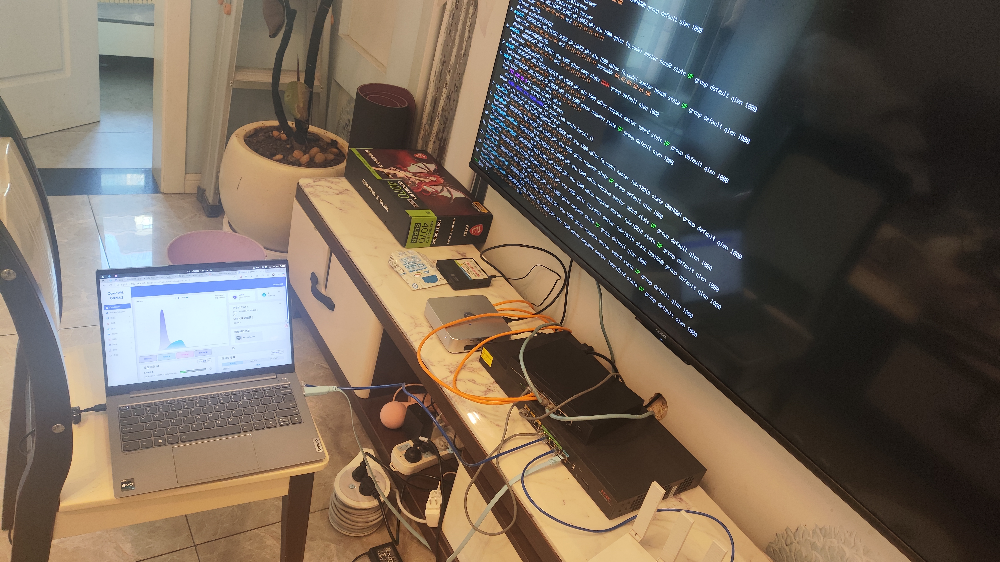
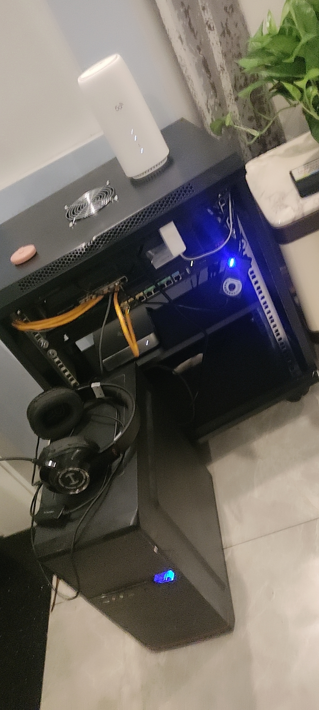
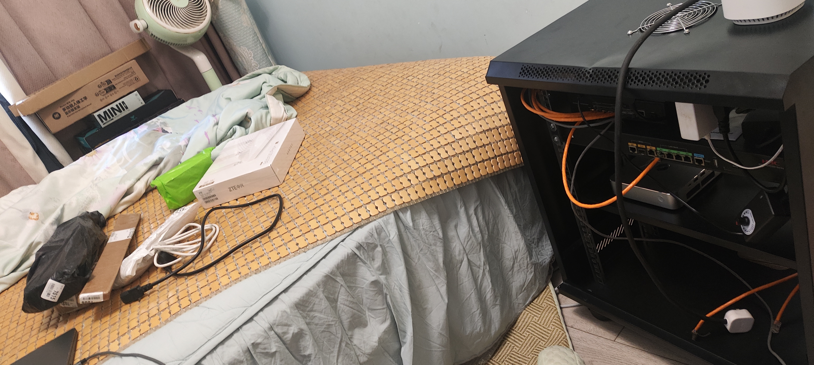
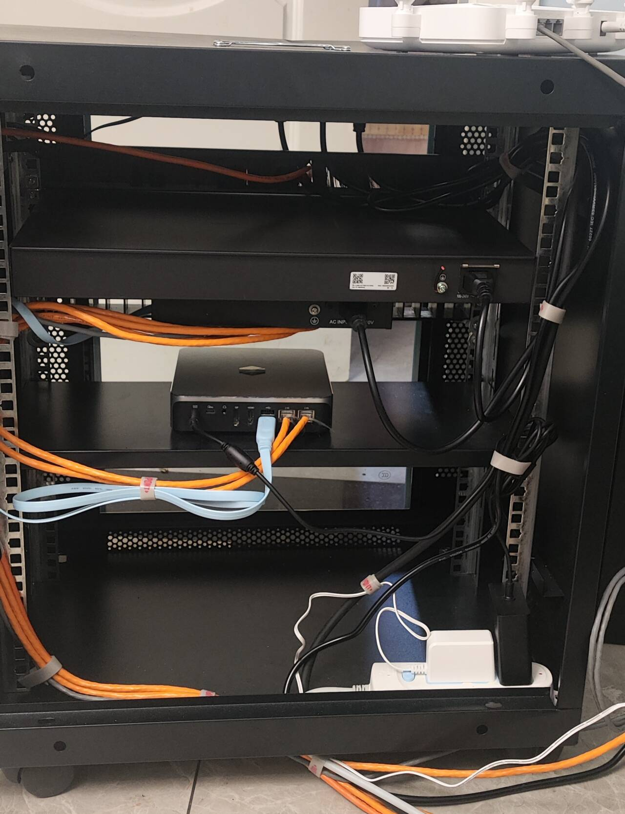
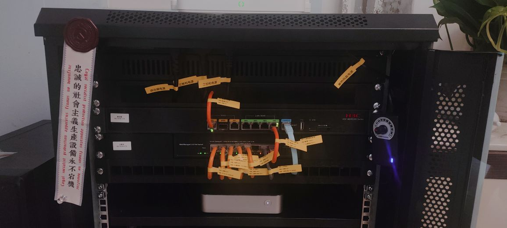
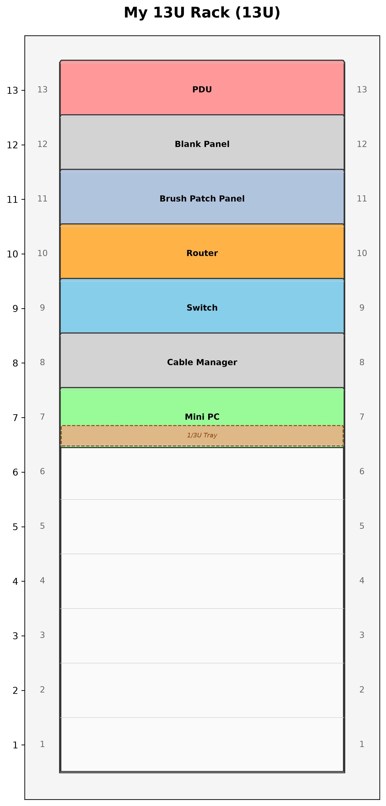

> 主角设备: H3C MER5200(Release 6749P2102 / version 7.1.064)
> 全文基于真实配置 `H3C-MER5200-startup.cfg` 与真实排障过程整理。

---

## 一、背景

家里从一台旧家用路由器升级到了 H3C MER5200 企业级路由器。本以为是"降维打击"式的提升,结果接踵而来的是一连串的 IPv6 玄学问题: 前缀下不来、图片偶发打不开……本文把这一路踩坑、定位、验证的过程完整记录下来,供遇到类似问题的朋友参考。

顺便,新设备上架之后,原来的"电视柜乱摊"终于升级成了较为正式的机柜,过程也一并留档。

---

## 二、IPv6 接入: 为什么只有 SLAAC,没有 DHCPv6 下发公网?

### 2.1 现象

宽带本身支持 IPv6,但给局域网内设备下发 IPv6 地址这件事,在 MER5200 上怎么配置都绕不开一个结论:

> **该型号路由器疑似不支持通过 DHCPv6 向 LAN 侧下发公网 IPv6 前缀,只能使用 SLAAC(RA 通告)让终端自行生成地址。**

### 2.2 我最终落地的配置

折腾到最后,稳定能用的方案就是这套 —— WAN 侧从运营商申请前缀,LAN 侧通过 SLAAC 通告给内网,整体工作正常:

WAN 侧(PPPoE,Dialer0)通过 DHCPv6-PD 从运营商申请前缀:

```text
interface Dialer0
  ipv6 address auto
  ipv6 dhcp client pd 1          # 向 ISP 申请前缀委派 (Prefix Delegation)
```

LAN 侧(Vlan-interface1)把申请到的前缀拼成 /64 通告给内网:

```text
interface Vlan-interface1
  ipv6 address 1 ::1/64          # 用第 1 条委派前缀 + 接口 ID ::1 构造地址
  ipv6 dhcp select server
  ipv6 dhcp server apply pool lan1
  ipv6 nd autoconfig other-flag  # RA 中 O=1,M=0 -> 地址走 SLAAC
  undo ipv6 nd ra halt           # 允许发送 RA
```

IPv6 DHCP 地址池则只负责下发 DNS(无状态 DHCPv6):

```text
ipv6 dhcp pool lan1
  dns-server 2400:3200:BABA::1
  dns-server 2001:4860:4860::8888
```

### 2.3 为什么最终只能走 SLAAC

- 这套配置里,**地址分配只靠 RA 通告(M=0、O=1)**,终端用 SLAAC 自己生成地址,DHCPv6 仅负责下发 DNS,即"纯无状态 DHCPv6 + SLAAC"的典型组合;
- 之前尝试让这台设备把 ISP 委派的前缀,通过 DHCPv6 状态化地分配给内网终端,一直没成功 —— 这台型号**不支持相关的 IPv6 前缀下发命令**(缺少类似配合前缀池做地址分配的指令),命令层面就做不了;
- 因此结论是:**该型号疑似不支持 DHCPv6 下发公网 IPv6,只能使用 SLAAC。** 我干脆就用上面这套配置,内网终端靠 SLAAC 拿公网 IPv6,稳定可用。

---

## 三、IPv6 静态资源偶发断连排障(MTU / ICMPv6 疑云)

### 3.1 现象

IPv6 地址拿到之后,出现一个"小概率断连"的怪病:

- 通过 IPv6 加载**静态资源(图片、视频)**时,偶尔加载不出来;
- 按 F12 打开开发者工具,在 Network 面板**重新发送(replay)一次请求,又能正常**。

特征非常像: 小包(握手、控制面)没问题,大包(图片/视频数据)偶尔被丢弃。

### 3.2 定位: curl 单条复现

用 curl 直接抓一条 B 站 CDN 静态资源进行复现分析:

```bash
curl -v -o /dev/null "https://i1.hdslb.com/bfs/archive/ce5f865c0adaa219c42e9acfa17c35c6c0aaf1f9.jpg@672w_378h_1c.webp"
```

从 verbose 输出 + 失败率规律,初步推测:

> **链路 MTU 过大 + ICMPv6 报文被拦截**。
> IPv6 不像 IPv4 那样允许路由器分片,路径 MTU 发现完全依赖 ICMPv6 "Packet Too Big"。一旦 ICMPv6 被防火墙拦截,超过链路 MTU 的大包就会被静默丢弃,表现就是"大资源偶发断连、重试可恢复"。

### 3.3 第一次修复尝试: Dialer0 → 无效

按直觉先调 WAN 口(PPPoE 有 8 字节开销: PPPoE 头 6B + PPP 头 2B,MTU 应降到 1492):

```text
interface Dialer0
  mtu 1492
  ipv6 mtu 1492
  tcp mss 1280
```

**结果: 问题依旧。** 观察一段时间,断连照常出现。

### 3.4 关键修复: Vlan-interface1 → 问题消失

在反复尝试了一天之后,注意到一个之前忽略的细节——**终端学到 MTU 的来源是 RA 通告,而 RA 是 LAN 口发出去的,不是 WAN 口**。于是把 LAN 口的 IPv6 MTU 也一并改为 1492:

```text
interface Vlan-interface1
  ipv6 mtu 1492
  tcp mss 1280
```

**之后问题疑似消失,观察一周未再复发。**

### 3.5 根因复盘

- WAN 口(Dialer0)的 `ipv6 mtu` 只管 WAN 侧报文分片/封装,**管不到内网终端的认知**;
- 终端是通过 **LAN 口(Vlan-interface1)发出的 RA** 里的 MTU 选项来感知链路 MTU 的;
- 只改 WAN 不改 LAN,内网终端依旧按 1500 甚至更大的 MTU 发包 → 超过 PPPoE 实际 1492 上限的大包被静默丢弃(ICMPv6 PTB 又被拦)→ 偶发断连;
- 把 LAN 口 IPv6 MTU 同步改成 1492 后,RA 通告的 MTU 正确,终端不再发出超限大包,问题根除。

> 一句话经验:**IPv6 MTU 必须"LAN 口与 WAN 口双侧一致"才生效,只改 WAN 侧是无效的。**

---

## 四、机柜整理: 从电视柜到机柜,再到理线打标签

新设备到手后,顺带把网络设备的存放空间彻底规范了一轮,整个过程按"惨不忍睹 → 勉强能看 → 井井有条"分四个阶段存档。

### 阶段一: 电视柜乱摆

升级前的状态,所有设备一股脑堆在电视柜上。



### 阶段二: 上机柜(乱摆)

采购机柜后,设备算是上了架,但内部走线依旧随心所欲,只解决了"堆在一起"没解决"摆放规范"。





### 阶段三: 机柜理线

开始动真格: 理线器(brush patch panel)、理线架(cable manager)全部用上,网线按长度与路径重新整理,正反面对齐,清爽了不少。



### 阶段四: 打好标签(最终效果)

最后一公里: 每一根线、每一个设备都打上标签,一眼就能定位链路走向。至此"从乱摆到规范"的改造闭环完成。



### 逻辑图: test.py 自动生成

机柜规划阶段先用 `test.py` 生成逻辑拓扑/机柜面板图,确认每台设备占几 U、螺丝孔对齐与否,再动手上架。

> 下图即由脚本生成的当前 13U 机柜逻辑图(300 DPI)。脚本基于 `matplotlib` 的 `RackDiagramGenerator`,按 EIA-310 标准从下往上数 U 位(1U 在底部),支持 `add_device(name, start_u, height, color)` 逐个摆位;完整脚本见附录 A。

**机柜逻辑图(由 `test.py` 自动生成):**



生成命令:

```bash
python3 test.py   # 输出 My_13U_Rack.png(300 DPI)
```

当前 13U 机柜的逻辑布局

| U 位 | 设备              |
| ---- | ----------------- |
| 13U  | PDU               |
| 12U  | Blank Panel       |
| 11U  | Brush Patch Panel |
| 10U  | Router            |
| 9U   | Switch            |
| 8U   | Cable Manager     |
| 7U   | Mini PC           |

---

## 五、经验小结

1. **IPv6 前缀下发**: H3C MER5200 在 LAN 侧做不了 DHCPv6 状态化地址分配,`ipv6 dhcp pool` 只能放 DNS,终端地址全靠 **SLAAC(RA)** 生成;
2. **IPv6 偶发断连**: 大包静默丢失 + F12 重发可恢复 ≈ MTU / ICMPv6 问题;IPv6 的 MTU 必须 **WAN/LAN 双侧一致**,只有 `Dialer0` 改 1492 没用,把 **`Vlan-interface1` 的 `ipv6 mtu` 也改成 1492** 后一周无复发;
3. **机柜改造**: 逻辑图先行(test.py),再上架、理线、打标签,四步走完才算"规范"。

> 旧路由器的路由带宽排查方法(iperf3 跨网段测试)已单独成篇,见《iperf3 跨网段路由带宽测试法》。

---

## 附录 A: 机柜逻辑图生成脚本

- 依赖: `matplotlib`
- 用法: `python3 test.py`,输出 `My_13U_Rack.png`(300 DPI)
- 说明: 按 EIA-310 标准从下往上数 U 位(1U 在底部),`add_device(name, start_u, height, color)` 逐个摆位;`RackDiagramGenerator(..., tray=(start_u, label))` 可绘制可选的 1/3U 托盘;运行后还需手动执行 `plt.show()` 弹窗确认,图形同时保存到 `My_13U_Rack.png`。

完整脚本内容:

```python
import matplotlib.pyplot as plt
import matplotlib.patches as patches


class RackDiagramGenerator:
    def __init__(self, rack_height=12, rack_name="RACK-01", tray=None):
        self.rack_height = rack_height
        self.rack_name = rack_name
        self.devices = []
        self.tray = tray  # (start_u, label)，如 (6, "1/3U Tray")

    def add_device(self, name, start_u, height=1, color="#ADD8E6"):
        if start_u + height - 1 > self.rack_height:
            print(f"⚠️ Warning: Device '{name}' exceeds {self.rack_height}U rack!")
            return
        self.devices.append({
            'name': name,
            'start_u': start_u,
            'height': height,
            'color': color,
        })

    def draw(self, save_path="rack_layout.png"):
        fig_height = self.rack_height * 0.8 + 2
        fig, ax = plt.subplots(figsize=(6, fig_height))

        ax.set_facecolor('#f5f5f5')
        ax.set_xlim(0, 10)
        ax.set_ylim(0, self.rack_height + 1)
        ax.set_xticks([])
        ax.set_yticks(range(1, self.rack_height + 1))

        rack_border = patches.FancyBboxPatch(
            (1, 0.5), 8, self.rack_height,
            linewidth=2.5, edgecolor='#333333', facecolor='#FAFAFA',
            boxstyle="square,pad=0"
        )
        ax.add_patch(rack_border)

        plt.title(f"{self.rack_name} ({self.rack_height}U)", fontsize=16, pad=20, fontweight='bold')

        for u in range(self.rack_height + 1):
            y = u + 0.5
            ax.plot([1, 9], [y, y], color='#CCCCCC', linewidth=0.5, linestyle='-')
            if u > 0:
                ax.text(0.5, u, str(u), va='center', ha='center', fontsize=9, color='#666666')
                ax.text(9.5, u, str(u), va='center', ha='center', fontsize=9, color='#666666')

        for device in self.devices:
            y_pos = device['start_u'] - 1 + 0.5
            rect = patches.FancyBboxPatch(
                (1.05, y_pos), 7.9, device['height'],
                linewidth=1.2, edgecolor='#333333', facecolor=device['color'],
                boxstyle="round,pad=0.05"
            )
            ax.add_patch(rect)
            ax.text(5, y_pos + device['height'] / 2, device['name'],
                    color='black', ha='center', va='center', fontsize=9, fontweight='bold')

        if self.tray is not None:
            tray_u, tray_label = self.tray
            tray_h = 1 / 3
            tray_y = tray_u - 0.5
            tray_rect = patches.FancyBboxPatch(
                (1.05, tray_y), 7.9, tray_h,
                linewidth=1, edgecolor='#8B4513', facecolor='#DEB887',
                boxstyle="round,pad=0.02", linestyle='--'
            )
            ax.add_patch(tray_rect)
            ax.text(5, tray_y + tray_h / 2, tray_label,
                    color='#8B4513', ha='center', va='center', fontsize=7, fontstyle='italic')

        plt.tight_layout()
        plt.savefig(save_path, dpi=300, bbox_inches='tight')
        print(f"✅ Rack diagram saved as: {save_path}")
        plt.show()


if __name__ == "__main__":
    rack = RackDiagramGenerator(
        rack_height=13,
        rack_name="My 13U Rack",
        tray=(6, "1/3U Tray"),
    )

    offset = 0  # 整体偏移：设备 U 位全部加上 offset，用于整体上下移动
    rack.add_device("PDU",               start_u=13 + offset, height=1, color="#FF9999")
    rack.add_device("Blank Panel",       start_u=12 + offset, height=1, color="#D3D3D3")
    rack.add_device("Brush Patch Panel", start_u=11 + offset, height=1, color="#B0C4DE")
    rack.add_device("Router",            start_u=10 + offset, height=1, color="#FFB347")
    rack.add_device("Switch",            start_u=9  + offset, height=1, color="#87CEEB")
    rack.add_device("Cable Manager",     start_u=8  + offset, height=1, color="#D3D3D3")
    rack.add_device("Mini PC",           start_u=7  + offset, height=1, color="#98FB98")

    rack.draw("My_13U_Rack.png")
```

## 附录 B: 完整配置(脱敏)

以下为 `H3C-MER5200-startup.cfg` 完整内容,其中 PPPoE 账号、口令及绑定 MAC 已做脱敏处理:

```text
#
 version 7.1.064, Release 6749P2102
#
 sysname H3C
#
 clock protocol ntp
#
 telnet server enable
#
 security-zone intra-zone default permit
#
 dialer-group 1 rule ip permit
#
 ip load-sharing mode per-flow src-ip global
#
 undo nat alg dns
 nat mapping-behavior endpoint-independent
#
 dhcp enable
 dhcp server always-broadcast
#
 ipv6 redirects enable
 ipv6 unreachables enable
#
 password-recovery enable
#
vlan 1
#
dhcp server ip-pool lan1
 gateway-list 192.168.86.1
 network 192.168.86.0 mask 255.255.255.0
 address range 192.168.86.21 192.168.86.200
 dns-list 223.5.5.5 8.8.8.8
 forbidden-ip-range 192.168.86.1 192.168.86.1
 static-bind ip-address 192.168.86.9 mask 255.255.255.0 hardware-address **-****-**** description Hyperbola-Laptop
 static-bind ip-address 192.168.86.10 mask 255.255.255.0 hardware-address **-****-**** description Hyperbola-PC
 static-bind ip-address 192.168.86.254 mask 255.255.255.0 hardware-address **-****-**** description AP
#
ipv6 dhcp pool lan1
 dns-server 2400:3200:BABA::1
 dns-server 2001:4860:4860::8888
#
controller Cellular0/0
#
interface Dialer0
 bandwidth 400000
 mtu 1492
 ppp chap password cipher $c$3$********************
 ppp chap user ***********
 ppp ipcp dns admit-any
 ppp ipcp dns request
 ppp pap local-user *********** password cipher $c$3$********************
 dialer bundle enable
 dialer-group 1
 dialer timer idle 0
 dialer timer autodial 5
 ip address ppp-negotiate
 tcp mss 1280
 ipv6 mtu 1492
 qos reserved-bandwidth pct 100
 qos lr outbound cir 400000 cbs 25000000 ebs 0
 nat outbound
 ipv6 address auto
 ipv6 dhcp client pd 1
#
interface NULL0
#
interface Vlan-interface1
 description LAN-interface
 ip address 192.168.86.1 255.255.255.0
 tcp mss 1280
 ipv6 mtu 1492
 ipv6 dhcp select server
 ipv6 dhcp server apply pool lan1
 ipv6 address 1 ::1/64
 ipv6 nd autoconfig other-flag
 undo ipv6 nd ra halt
#
interface GigabitEthernet0/0
 port link-mode route
 description Single_Line1
 combo enable copper
 pppoe-client dial-bundle-number 0
#
interface GigabitEthernet0/1
 port link-mode route
#
interface GigabitEthernet0/2
 port link-mode bridge
#
interface GigabitEthernet0/3
 port link-mode bridge
#
interface GigabitEthernet0/4
 port link-mode bridge
#
interface GigabitEthernet0/5
 port link-mode bridge
#
 scheduler logfile size 16
#
line class console
 user-role network-admin
#
line class tty
 user-role network-operator
#
line class vty
 user-role network-operator
#
line con 0
 user-role network-admin
#
line vty 0 63
 authentication-mode scheme
 user-role network-operator
#
 ip route-static 0.0.0.0 0 Dialer0
#
performance-management
#
 ssh server enable
 sftp server enable
 scp server enable
#
 ntp-service enable
 ntp-service unicast-server s1d.time.edu.cn
 ntp-service unicast-server s2c.time.edu.cn
 ntp-service unicast-server s2f.time.edu.cn
 ntp-service unicast-server s2g.time.edu.cn
 ntp-service unicast-server time-a.nist.gov
 ntp-service unicast-server time-b.nist.gov
 ntp-service unicast-server time.nist.gov
#
 password-control enable
 undo password-control aging enable
 undo password-control history enable
 password-control length 6
 password-control login-attempt 3 exceed lock-time 10
 password-control update-interval 0
 password-control login idle-time 0
#
domain ipoeenabledomain
 authorization-attribute idle-cut 5 1
 authentication ipoe none
 authorization ipoe none
 accounting ipoe none
#
domain system
#
 domain default enable system
#
role name level-0
 description Predefined level-0 role
#
role name level-1
 description Predefined level-1 role
#
role name level-2
 description Predefined level-2 role
#
role name level-3
 description Predefined level-3 role
#
role name level-4
 description Predefined level-4 role
#
role name level-5
 description Predefined level-5 role
#
role name level-6
 description Predefined level-6 role
#
role name level-7
 description Predefined level-7 role
#
role name level-8
 description Predefined level-8 role
#
role name level-9
 description Predefined level-9 role
#
role name level-10
 description Predefined level-10 role
#
role name level-11
 description Predefined level-11 role
#
role name level-12
 description Predefined level-12 role
#
role name level-13
 description Predefined level-13 role
#
role name level-14
 description Predefined level-14 role
#
user-group system
#
local-user admin class manage
 service-type telnet http https
 authorization-attribute user-role network-admin
#
 security-enhanced level 1
#
 ssl version gm-tls1.1 disable
 undo ssl renegotiation disable
 undo ssl version ssl3.0 disable
 undo ssl version tls1.0 disable
 undo ssl version tls1.1 disable
 undo ssl version tls1.2 disable
 undo ssl version tls1.3 disable
#
 ip http enable
 ip https enable
 web idle-timeout 999
#
url-filter category custom severity 65535
#
undo dac log-collect service dpi audit enable
undo dac log-collect service dpi url-filter enable
#
 cloud-management server domain cloudnet.h3c.com
#
return
```
